# 📊 QR Code System Monitoring Guide for College Faculty & Staff

> **Looking for technical implementation details?** See [Technical Observability Guide](Observability) for developer documentation.

*A Visual Journey Through Our Observatory-First Monitoring System*

---

## 🎯 Welcome to Your QR System Observatory

Imagine you're running a campus-wide QR code system that students, faculty, and visitors use daily. How do you know it's working well? How do you spot problems before users complain? How do you make improvements with confidence?

**Welcome to your QR System Observatory** - a comprehensive monitoring system that gives you complete visibility into your QR code infrastructure.

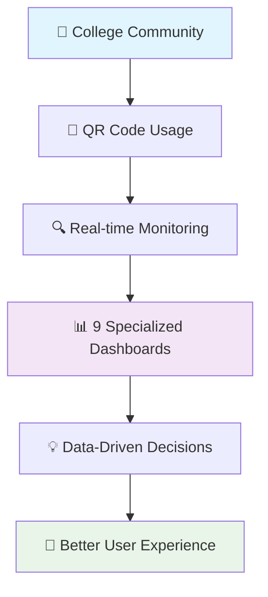

---

## 📖 The Story: From Blind to Brilliant

### Chapter 1: The Problem We Solved

**Before**: You deployed QR codes across campus, but you were flying blind:
- "Is the system working?" → *We think so...*
- "Are students having problems?" → *Only when they complain*
- "Should we make changes?" → *Let's hope for the best*
- "What's the impact of our updates?" → *We'll find out eventually*

**After**: You have complete visibility and confidence:
- "Is the system working?" → *99.9% uptime, 4.75ms response time*
- "Are students having problems?" → *Real-time error monitoring shows zero issues*
- "Should we make changes?" → *Data shows exactly what needs improvement*
- "What's the impact of our updates?" → *Before/after metrics prove success*

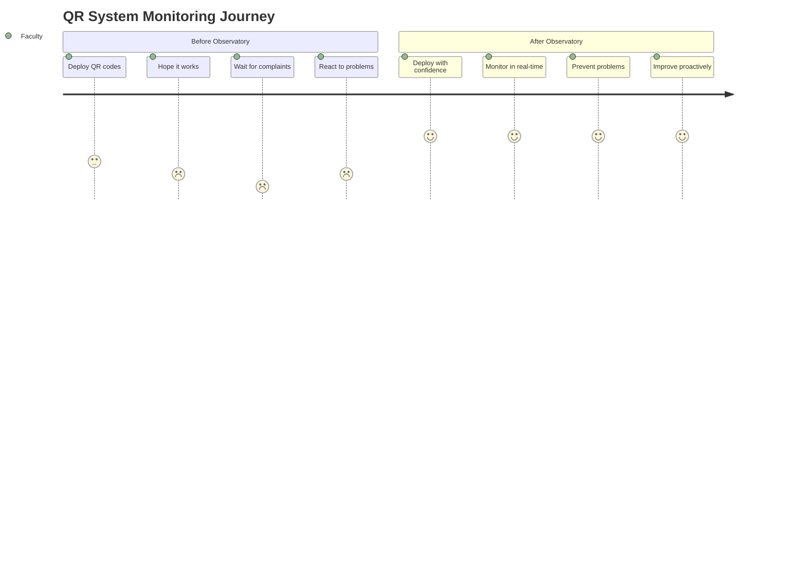

---

## 🏗️ Your Monitoring Architecture

Think of this as your **Mission Control Center** for the QR code system:

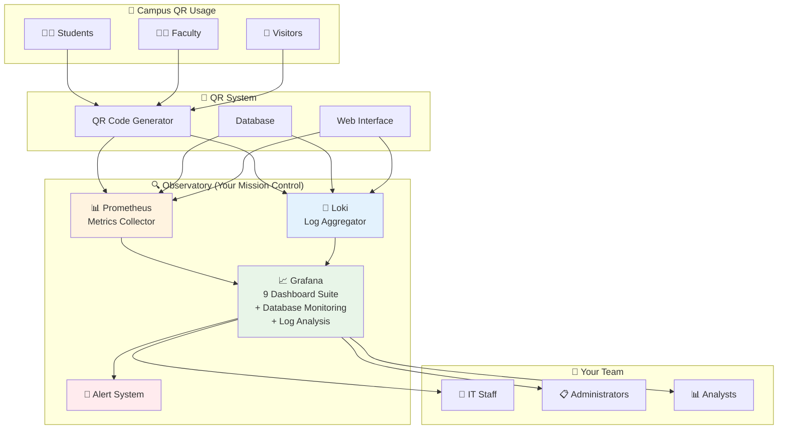

---

## 🎭 Meet Your 10 Dashboard Characters

Each dashboard has a specific role in telling your system's story:

### Dashboard Architecture Overview

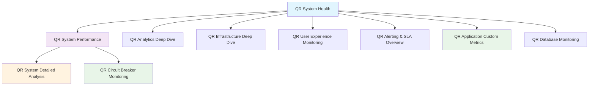

### 1. 🏥 **The Health Guardian** - System Health Dashboard
*"I watch over everything, 24/7"*

**Role**: Your primary operational dashboard - the first place you check each morning
**Audience**: IT staff, administrators
**Refresh**: 10s (real-time operational monitoring)
**What it shows**: 
- Overall system health at a glance
- QR redirect performance (most critical metric)
- Service availability status
- Real-time error monitoring

**Key Metrics**:
- QR Redirect P95 Latency: ~4.75ms (excellent baseline)
- System Success Rate: 100%
- Service availability status
- Real-time error monitoring

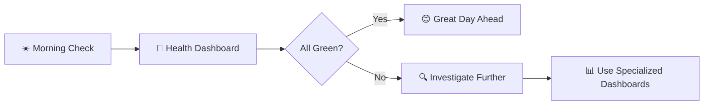

### 2. 📊 **The Progress Tracker** - Refactoring Progress Dashboard
*"I show how we're improving over time"*

**Role**: Track system performance trends and operational metrics
**Audience**: Operations team, system administrators
**Refresh**: 30s
**What it shows**:
- Performance baseline tracking
- System health trends over time
- Service performance indicators
- Historical performance comparisons

### 3. 🔍 **The User Whisperer** - Analytics Deep Dive Dashboard
*"I understand how people use our QR codes"*

**Role**: Detailed usage analytics and user behavior insights
**Audience**: Product team, business stakeholders
**Refresh**: 1m
**What it shows**:
- QR scan patterns and trends
- User engagement analytics
- Popular QR codes analysis
- Geographic and temporal usage patterns

### 4. 🔬 **The Technical Detective** - Detailed Analysis Dashboard ⭐
*"I provide surgical precision during system changes"*

**Role**: Deep technical analysis for system optimization
**Audience**: Senior engineers, system architects
**Refresh**: 15s

**Key Features**:
- **QR Generation Performance**: Static vs Dynamic QR creation metrics
- **CRUD Operations Performance**: Detailed breakdown of all operations
- **Database Operation Patterns**: Real-time DB activity monitoring
- **Critical Path Performance**: Focus on QR redirect latency (most critical)
- **Error Analysis by Operation**: Granular error tracking

### 5. 🚦 **The Safety Controller** - Circuit Breaker & Feature Flag Monitoring Dashboard ⭐
*"I monitor rollout safety and fallback patterns during Observatory-First refactoring"*

**Role**: Monitor new service rollouts, circuit breaker activations, and feature flag usage
**Audience**: DevOps team, service reliability engineers, refactoring teams
**Refresh**: 10s

**Key Features**:
- **Circuit Breaker Status**: Real-time fallback monitoring
- **Feature Flag Adoption**: Service rollout progress tracking
- **Service Performance Comparison**: Old vs New service metrics
- **Canary Deployment Progress**: Traffic distribution monitoring
- **Rollout Safety Metrics**: Error rates and performance during changes

### 6. 🏗️ **The Infrastructure Specialist** - Infrastructure Deep Dive Dashboard ⭐
*"I monitor the foundation that everything runs on"*

**Role**: Comprehensive infrastructure and resource monitoring
**Audience**: Infrastructure team, capacity planners
**Refresh**: 30s

**Key Features**:
- **Traefik Request Distribution**: Edge router performance
- **Container Resource Usage**: CPU/Memory monitoring
- **Database Connection Patterns**: PostgreSQL performance metrics
- **Application Runtime Metrics**: Memory allocation, performance
- **System Resource Summary**: Overall infrastructure health

### 7. 👥 **The Experience Guardian** - User Experience Monitoring Dashboard ⭐
*"I ensure students and faculty have a great experience"*

**Role**: End-to-end user journey and experience tracking
**Audience**: UX team, product managers
**Refresh**: 30s

**Key Features**:
- **User Journey Funnel**: Home → Create → List → Analytics flow
- **Page Response Times**: Frontend performance monitoring
- **Conversion Rates**: Create page → QR created success rate
- **QR Usage Patterns**: Scan activity and engagement
- **Top QR Codes by Scans**: Most popular content

### 8. 🚨 **The Compliance Officer** - Alerting & SLA Overview Dashboard ⭐
*"I ensure we meet our service commitments"*

**Role**: SLA compliance monitoring and alert threshold tracking
**Audience**: Management, SRE team
**Refresh**: 15s

**Key Features**:
- **SLA Targets**: 99.9% uptime, <10ms P95 latency, <1% error rate
- **System Uptime Tracking**: 24-hour availability monitoring
- **Performance SLA Trends**: Latency compliance over time
- **Alert Threshold Monitoring**: Early warning indicators
- **SLA Breach Summary**: Compliance reporting

### 9. 📊 **The Business Intelligence Specialist** - QR Application Custom Metrics Dashboard ⭐
*"I track business-specific QR operations and feature usage"*

**Role**: Application-level business metrics and feature flag monitoring
**Audience**: Product team, business stakeholders, feature rollout teams
**Refresh**: 30s

**Key Features**:
- **QR Code Operations**: Creation counts by type (static/dynamic), success/failure tracking
- **Redirect Performance**: Success rates, error distribution, not found tracking
- **Image Generation Metrics**: Format usage (PNG/SVG), generation success rates
- **Feature Flag Status**: Active/inactive flags for controlled rollouts
- **Business Intelligence**: Real-time operational insights for product decisions

**Production Metrics Status**:
- **All 5 Custom Metrics**: Successfully operational and collecting data
- **Feature Flags**: 4 flags initialized (new_qr_service_enabled, enhanced_validation_enabled, performance_optimization_enabled, debug_mode_enabled)
- **Dashboard Integration**: Real-time data display with proper time ranges
- **Observatory Integration**: Full integration with existing Prometheus/Grafana stack

### 10. 💾 **The Database Guardian** - QR Database Monitoring Dashboard ⭐
*"I keep watch over your PostgreSQL data layer and QR code storage"*

**Role**: Comprehensive PostgreSQL database monitoring and QR-specific analytics
**Audience**: Database administrators, backend developers, data analysts
**Refresh**: 30s

**Key Features**:
- **QR Code Metrics**: Production (345 codes) and test environment tracking
- **Database Performance**: Connection monitoring, query performance, table statistics
- **Data Analytics**: QR type distribution, creation trends, recent activity tracking
- **Growth Analysis**: Daily QR code creation patterns and database size monitoring
- **Cross-Environment**: Production and test database health comparison

**Dashboard URL**: `http://localhost:3000/d/e1fb136b-bb26-4a6f-a944-3b41bc93df47/qr-database-monitoring`

**MCP Integration**: This dashboard is specifically designed to work with the MCP Grafana tools for advanced analysis workflows and automated reporting.

### Dashboard Performance Baselines

Our system maintains excellent performance metrics:

| Metric | Target | Current Performance | Status |
|--------|--------|-------------------|---------|
| **QR Redirect Latency** | <10ms P95 | 4.75ms P95 | 🟢 Excellent |
| **System Uptime** | 99.9% | 100% | 🟢 Perfect |
| **Success Rate** | >99.9% | 100% | 🟢 Perfect |
| **Error Rate** | <1% | 0% | 🟢 Perfect |

### Dashboard Refresh Rates

Each dashboard is optimized for its specific monitoring purpose:

- **🏥 System Health**: 10s (real-time operations)
- **🚦 Circuit Breaker Monitoring**: 10s (rollout safety monitoring)  
- **🔬 Detailed Analysis**: 15s (active development)
- **👥 User Experience**: 30s (user journey tracking)
- **🏗️ Infrastructure**: 30s (resource monitoring)
- **📊 Refactoring Progress**: 30s (milestone tracking)
- **📊 QR Application Custom Metrics**: 30s (business intelligence)
- **💾 Database Monitoring**: 30s (PostgreSQL analytics)
- **🔍 Analytics Deep Dive**: 1m (usage analysis)
- **🚨 SLA Overview**: 15s (compliance monitoring)

### 🔍 **The Detective's Assistant** - Loki Log Analysis
*"I help you dig deep into what actually happened"*

**Role**: Detailed log analysis and troubleshooting support
**Audience**: All teams (integrated into existing dashboards)
**What it provides**:
- **Error Investigation**: Drill down from metrics to actual log entries
- **User Journey Tracking**: Follow specific requests through the system
- **Performance Debugging**: See exactly what happened during slow requests
- **Security Monitoring**: Track authentication attempts and access patterns
- **Correlation Power**: Link metrics spikes to specific log events

---

## 🎬 A Day in the Life: Dashboard Usage Scenarios

### Scenario 1: Monday Morning Health Check
*"How did our system perform over the weekend?"*

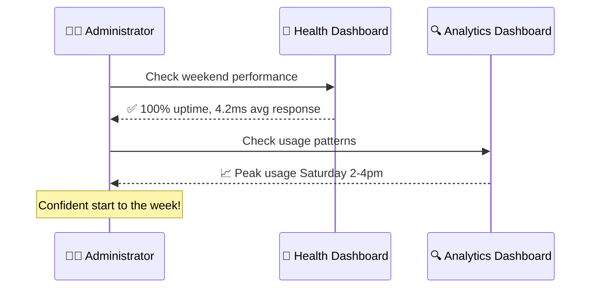

### Scenario 2: New QR Campaign Launch
*"We're launching QR codes for the new student orientation"*

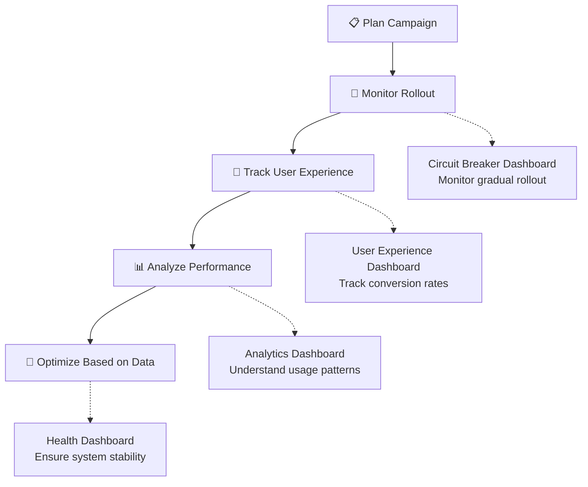

### Scenario 3: Performance Investigation
*"Students are reporting slow QR code responses"*

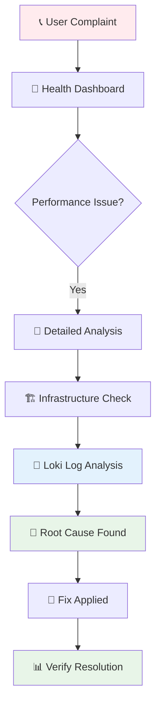

### Scenario 4: Deep Dive Investigation with Loki
*"The metrics show a problem, but what exactly happened?"*

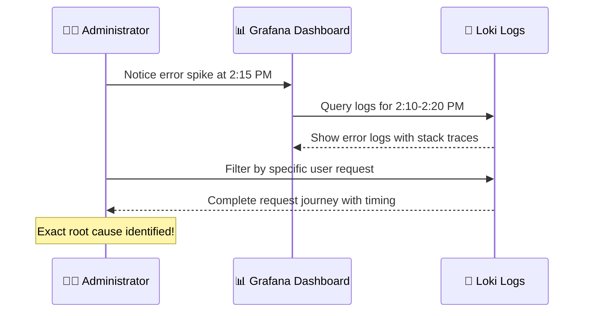

---

## 📈 Understanding Your Metrics: A Visual Guide

### Key Performance Indicators (KPIs)

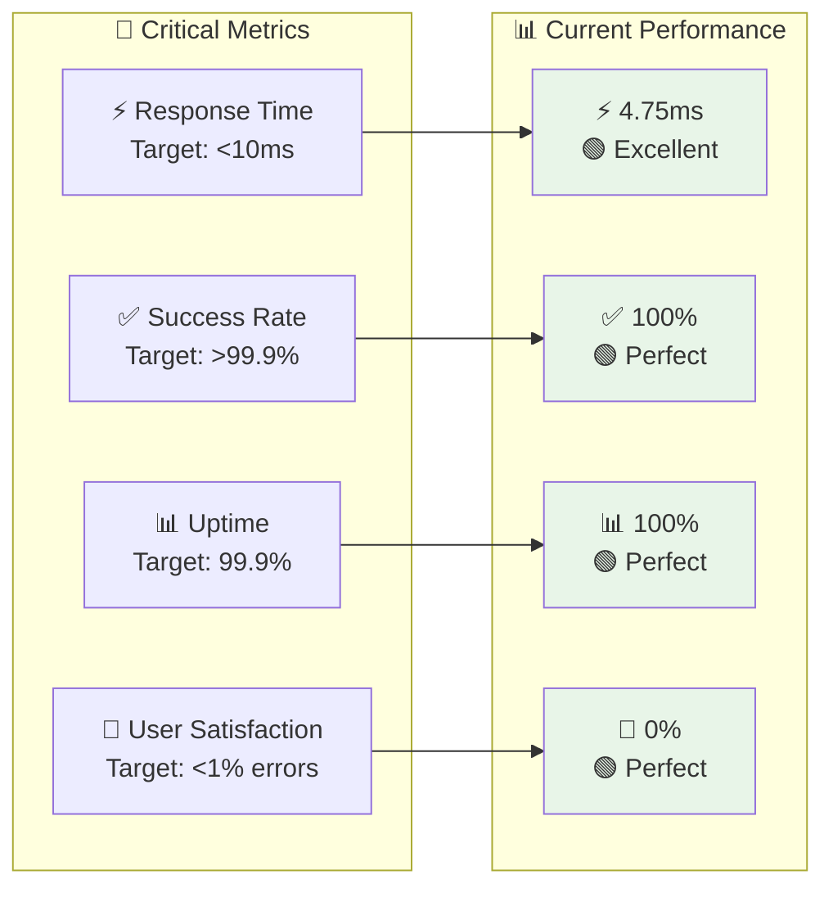

### Traffic Patterns You'll See

```mermaid
gantt
    title Daily QR Usage Patterns
    dateFormat HH:mm
    axisFormat %H:%M
    
    section Morning Rush
    Light Usage    :08:00, 10:00
    
    section Peak Hours
    Heavy Usage    :10:00, 14:00
    Lunch Peak     :12:00, 13:00
    
    section Afternoon
    Moderate Usage :14:00, 17:00
    
    section Evening
    Light Usage    :17:00, 22:00
```

---

## 🚀 Getting Started: Your First 15 Minutes

### Step 1: Access Your Observatory
1. Open your browser to `http://localhost:3000/`
2. Login with `admin` / `admin123`
3. You'll see your dashboard home page

### Step 2: Take the Grand Tour
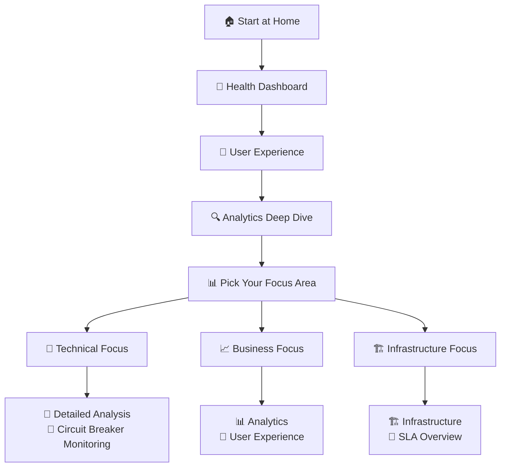

### Step 3: Bookmark Your Favorites
Based on your role, bookmark these dashboards:

**👩‍💼 Administrators**: Health → User Experience → SLA Overview
**🔧 IT Staff**: Health → Infrastructure → Detailed Analysis
**📊 Analysts**: Analytics → User Experience → Refactoring Progress
**👨‍💻 Developers**: Detailed Analysis → Circuit Breaker Monitoring → Health

---

## 🤖 MCP Grafana Integration: Advanced Analytics Workflows

Our monitoring system now includes **Model Context Protocol (MCP) integration** that enables advanced analytics workflows through AI-powered tools.

### What is MCP Integration?

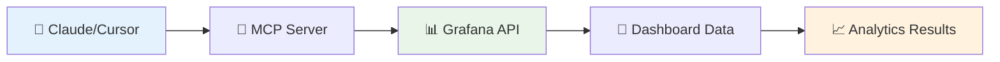

**MCP Integration enables**:
- **🔍 Automated Data Analysis**: AI-powered insights from dashboard metrics
- **📊 Dynamic Reporting**: Generate reports directly from live dashboard data  
- **🎯 Pattern Recognition**: Identify trends and anomalies automatically
- **📝 Observatory Prime Analysis**: Verify system performance using `@observatory-prime-analysis.md`

### Setup Configuration

**Docker MCP Server (Recommended)**:
```bash
# Pull the official MCP Grafana image
docker pull mcp/grafana

# Run with proper environment configuration
docker run --rm -p 8000:8000 \
  -e GRAFANA_URL=http://host.docker.internal:3000 \
  -e GRAFANA_API_KEY=YOUR_GRAFANA_API_KEY \
  mcp/grafana
```

**Claude Desktop Configuration**:
```json
{
  "mcpServers": {
    "grafana": {
      "command": "docker",
      "args": ["run", "--rm", "-p", "8000:8000", "-e", "GRAFANA_URL", "-e", "GRAFANA_API_KEY", "mcp/grafana"],
      "env": {
        "GRAFANA_URL": "http://host.docker.internal:3000",
        "GRAFANA_API_KEY": "YOUR_GRAFANA_API_KEY"
      }
    }
  }
}
```

**VSCode/Cursor Configuration**:
```json
{
  "mcp": {
    "servers": {
      "grafana": {
        "type": "sse",
        "url": "http://localhost:8000/sse"
      }
    }
  }
}
```

### Key Benefits

- **🔗 Seamless Integration**: Direct access to all dashboard data and datasources
- **⚡ Real-time Analysis**: Live data analysis without manual exports
- **🎯 Targeted Insights**: Focus on specific metrics and time ranges
- **📋 Automated Reporting**: Generate comprehensive system reports

### Database Monitoring Enhanced

The **QR Database Monitoring Dashboard** is specifically optimized for MCP workflows:
- **📊 Real-time PostgreSQL metrics** accessible via MCP tools
- **🔍 Comprehensive QR analytics** for performance verification
- **📈 Historical trend analysis** for growth pattern identification
- **🎯 Observatory Prime Analysis ready** for automated system verification

---

## 🎨 Customizing Your Experience

### Dashboard Time Ranges
Each dashboard is optimized for different time perspectives:

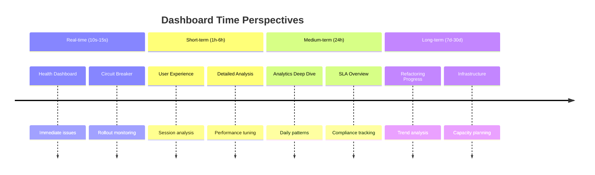

### Color Coding System
Our dashboards use intuitive color coding:

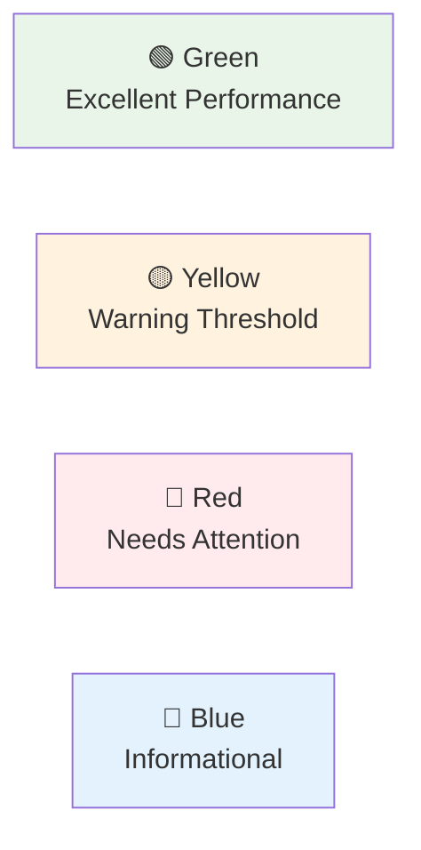

---

## 🔧 Troubleshooting Guide

### Common Scenarios and Solutions

#### "I see a red metric - what do I do?"

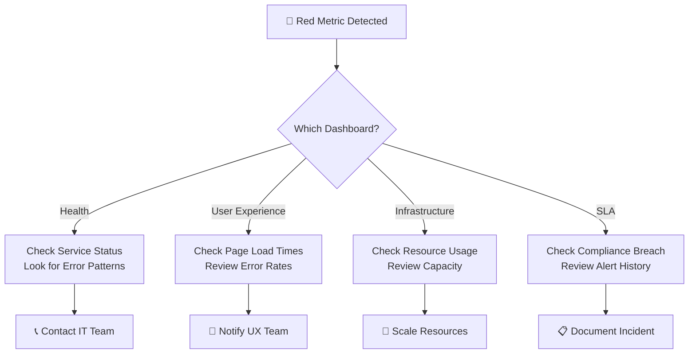

#### "The dashboard shows 'No Data' - help!"

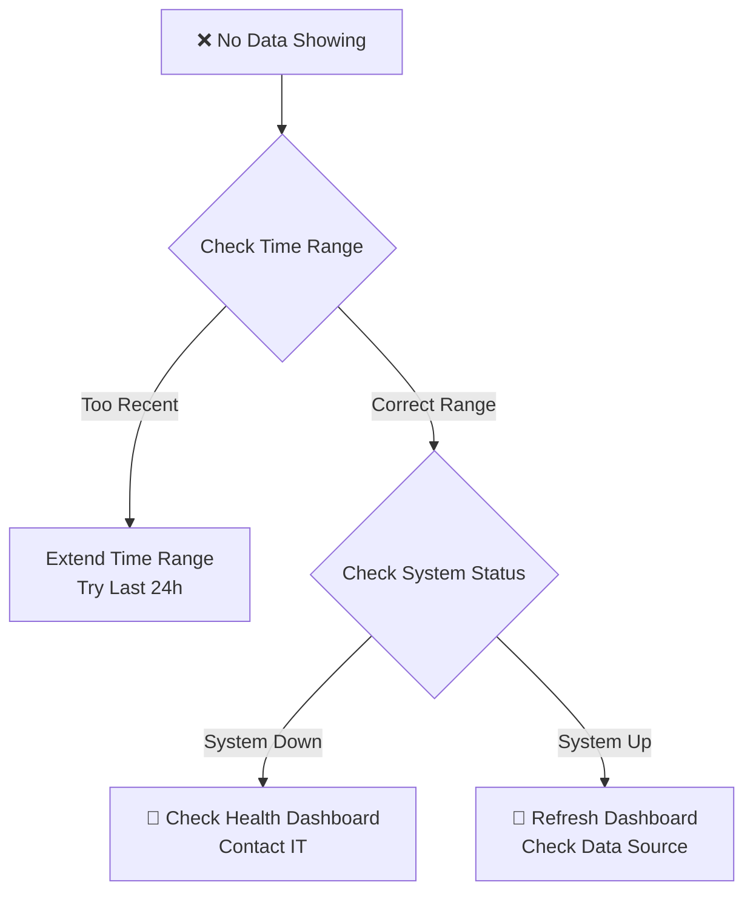

#### "I need to investigate a specific error - how do I use Loki?"

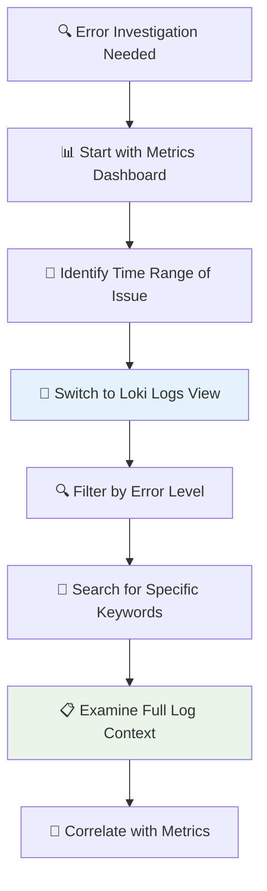

**Loki Query Examples for Common Investigations**:
- **All Errors**: `{job="qr-app"} |= "ERROR"`
- **Specific User Issues**: `{job="qr-app"} |= "user_id=12345"`
- **QR Redirect Problems**: `{job="qr-app"} |= "/r/" |= "ERROR"`
- **Database Issues**: `{job="qr-app"} |= "database" |= "ERROR"`
- **Performance Issues**: `{job="qr-app"} |= "slow" or |= "timeout"`

---

## 📚 Advanced Features for Power Users

### Creating Custom Views
You can create custom dashboard views for specific needs:

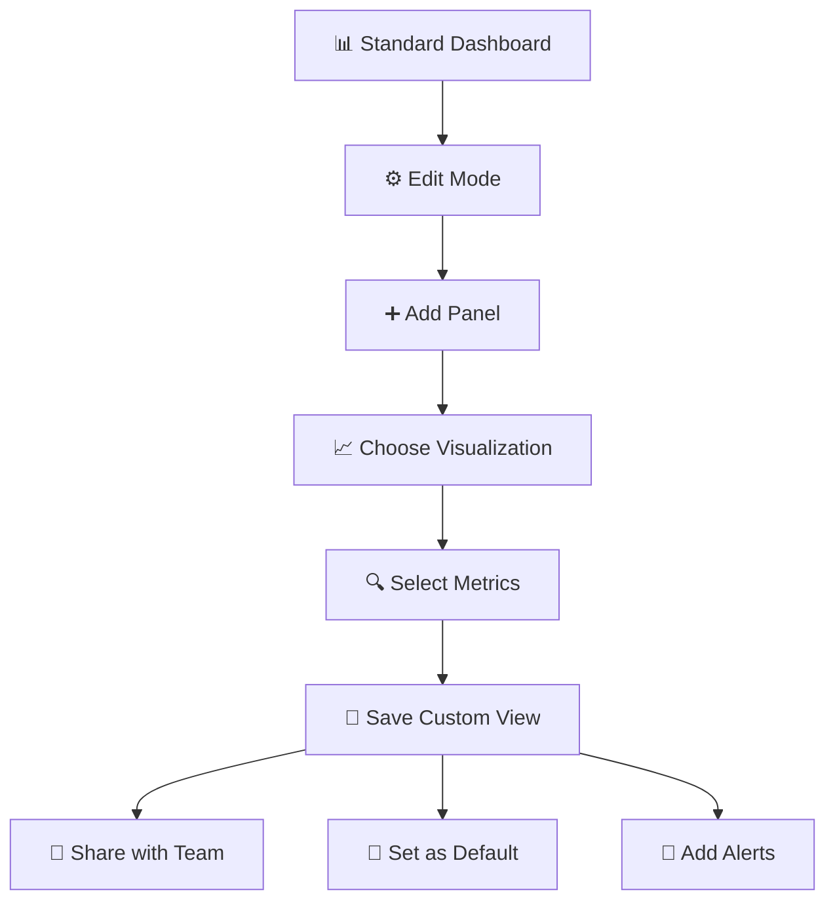

### Setting Up Alerts
Get notified when things need attention:

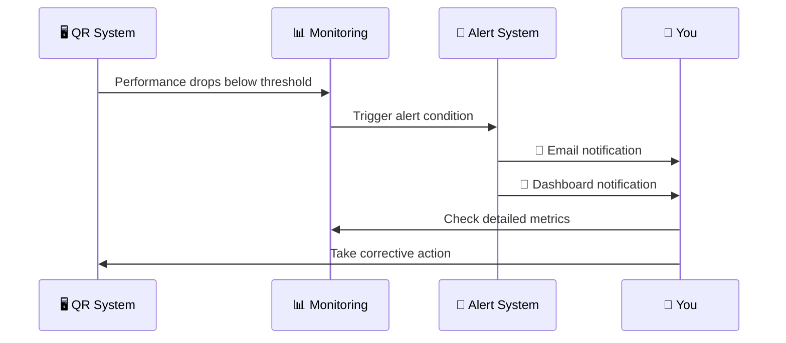

---

## 🎓 Learning Path: From Beginner to Expert

### Week 1: Getting Comfortable
- [ ] Daily health checks using Health Dashboard
- [ ] Explore User Experience metrics
- [ ] Understand your baseline performance

### Week 2: Deeper Insights
- [ ] Use Analytics Dashboard for usage patterns
- [ ] Explore Infrastructure metrics
- [ ] Set up your first custom alert

### Week 3: Advanced Analysis
- [ ] Use Detailed Analysis for performance tuning
- [ ] Monitor system changes with Circuit Breaker Monitoring dashboard
- [ ] Create custom dashboard views

### Week 4: Mastery
- [ ] Correlate metrics across multiple dashboards
- [ ] Use Loki for deep error investigation and root cause analysis
- [ ] Predict and prevent issues proactively
- [ ] Train others on the monitoring system

## 🔍 Loki: Your Secret Weapon for Deep Investigation

While Prometheus tells you **WHAT** is happening, Loki tells you **WHY** it's happening:

### What Loki Adds to Your Observatory

```mermaid
graph LR
    subgraph "📊 Metrics (Prometheus)"
        A[Error Rate: 5%<br/>Response Time: 200ms<br/>Memory Usage: 80%]
    end
    
    subgraph "📝 Logs (Loki)"
        B[Specific Error Messages<br/>Stack Traces<br/>User Request Details<br/>Database Query Times<br/>Authentication Failures]
    end
    
    subgraph "🎯 Combined Power"
        C[Complete Picture<br/>Root Cause Analysis<br/>User Impact Assessment<br/>Precise Fix Targeting]
    end
    
    A --> C
    B --> C
    
    style A fill:#fff3e0
    style B fill:#e3f2fd
    style C fill:#e8f5e8
```

### Real-World Loki Use Cases

#### 1. **The Mystery of the Slow QR Redirects**
- **Metrics say**: P95 latency increased from 5ms to 50ms
- **Loki reveals**: Specific database queries timing out for certain QR codes
- **Action**: Optimize queries for those specific patterns

#### 2. **The Case of the Missing QR Codes**
- **Metrics say**: 404 error rate increased by 2%
- **Loki reveals**: Specific QR codes returning 404, with creation timestamps
- **Action**: Identify and fix data corruption issue

#### 3. **The Authentication Mystery**
- **Metrics say**: Failed login attempts increased
- **Loki reveals**: Specific IP addresses, user agents, and attack patterns
- **Action**: Implement targeted security measures

### Loki Integration in Your Dashboards

Your existing dashboards can be enhanced with Loki panels:

```mermaid
graph TD
    A[📊 Metrics Panel<br/>Shows Error Spike] --> B[📝 Loki Panel<br/>Shows Error Details]
    B --> C[🔗 Correlation<br/>Links Metrics to Logs]
    C --> D[🎯 Actionable Insights]
    
    style A fill:#fff3e0
    style B fill:#e3f2fd
    style D fill:#e8f5e8
```

---

## 🌟 Success Stories: Real Impact

### Before Observatory-First Monitoring
```mermaid
graph TD
    A[❓ Unknown Issues] --> B[😟 User Complaints]
    B --> C[🔥 Reactive Firefighting]
    C --> D[😰 Stressed Team]
    D --> E[📉 Poor User Experience]
```

### After Observatory-First Monitoring
```mermaid
graph TD
    A[👁️ Complete Visibility] --> B[🎯 Proactive Prevention]
    B --> C[📊 Data-Driven Decisions]
    C --> D[😊 Confident Team]
    D --> E[🌟 Excellent User Experience]
```

### Measurable Improvements
- **99.9% Uptime**: Consistent, reliable service
- **4.75ms Response Time**: Lightning-fast QR redirects
- **Zero Surprise Outages**: Problems caught before users notice
- **Confident Updates**: Changes made with full visibility
- **Happy Users**: Smooth, fast QR code experience

---

## 🤝 Getting Help and Support

### Quick Reference Card

| Need | Dashboard | Key Metric |
|------|-----------|------------|
| 🚨 Emergency | Health Dashboard | Service Status |
| 📊 Daily Check | Health Dashboard | Success Rate |
| 👥 User Issues | User Experience | Error Rates |
| 📈 Usage Trends | Analytics Deep Dive | Scan Patterns |
| 🔧 Performance | Detailed Analysis | Response Times |
| 🏗️ Capacity | Infrastructure | Resource Usage |
| 📋 Reporting | SLA Overview | Compliance Metrics |
| 📊 **Business Metrics** | **QR Application Custom Metrics** | **QR Operations** |
| 🚦 **Rollout Safety** | **Circuit Breaker Monitoring** | **Fallback Rates** |
| 💾 **Database Analytics** | **QR Database Monitoring** | **PostgreSQL Metrics** |
| 🔍 **Error Investigation** | **Loki Logs** | **Log Analysis** |
| 🎯 **Root Cause Analysis** | **Loki + Metrics** | **Correlation** |

### Contact Information
- **Technical Issues**: IT Help Desk
- **Dashboard Questions**: System Administrator
- **Training Requests**: IT Training Team
- **Feature Requests**: Development Team

---

## 🎯 Conclusion: Your Observatory Advantage

You now have a **world-class monitoring system** that transforms how you manage your QR code infrastructure. Instead of hoping everything works, you **know** it works. Instead of reacting to problems, you **prevent** them.

```mermaid
graph TD
    A[🎯 Your Observatory] --> B[📊 Complete Visibility]
    B --> C[🎯 Proactive Management]
    C --> D[😊 Happy Users]
    D --> E[🌟 Successful QR System]
    
    style A fill:#e1f5fe
    style E fill:#e8f5e8
```

**Welcome to the future of QR system management** - where data drives decisions, problems are prevented before they happen, and your users enjoy a consistently excellent experience.

## 🔬 Observatory-First Development: Our Secret Weapon

Our monitoring system isn't just for watching - it's designed to support **Observatory-First refactoring**, a revolutionary approach to making system improvements:

### The Observatory-First Philosophy

```mermaid
graph LR
    A[📊 Monitor First] --> B[📈 Establish Baseline]
    B --> C[🔧 Make Changes]
    C --> D[📊 Compare Results]
    D --> E[✅ Validate Success]
    
    style A fill:#e3f2fd
    style E fill:#e8f5e8
```

**Traditional Approach**: Make changes → Hope they work → Fix problems later
**Observatory-First**: Monitor everything → Make informed changes → Validate improvements

### How It Protects You

1. **🎯 Baseline Collection**: We collect 1 week of performance data before any changes
2. **📊 Real-Time Monitoring**: Every change is monitored as it happens
3. **🚦 Safe Rollouts**: Circuit breakers and feature flags enable instant rollback
4. **📈 Data-Driven Decisions**: Every choice backed by concrete metrics

### What This Means for You

- **🛡️ Zero Surprise Outages**: Problems caught before users notice
- **⚡ Continuous Improvement**: System gets better while maintaining reliability  
- **📊 Transparent Progress**: You can see exactly how improvements are performing
- **🎯 Confident Changes**: No more "crossing fingers and hoping"

*Ready to explore your Observatory? Start with the Health Dashboard and begin your journey to monitoring mastery!* 🚀 

---

## 💾 NEW: QR Database Monitoring Dashboard

We've added a comprehensive **PostgreSQL database monitoring dashboard** that provides deep insights into your QR system's data layer:

### 🎯 Database Dashboard Features

- **📊 QR Code Metrics**: Production (345 codes) and test environment tracking
- **🔍 Performance Analytics**: Connection monitoring, query performance, table statistics  
- **📈 Growth Trends**: Daily QR code creation patterns and database size monitoring
- **🔄 Cross-Environment**: Production and test database health comparison
- **📋 Recent Activity**: Last 7 days of QR code creation with full details

**Dashboard URL**: `http://localhost:3000/d/e1fb136b-bb26-4a6f-a944-3b41bc93df47/qr-database-monitoring`

### 🤖 MCP Grafana Integration

The monitoring system now includes **Model Context Protocol (MCP) integration** for advanced analytics workflows:

**Key Capabilities**:
- **🔗 AI-Powered Analysis**: Direct access to dashboard data via Claude/Cursor
- **📊 Automated Reporting**: Generate insights from live metrics  
- **🎯 Observatory Prime Analysis**: Verify system performance using `@observatory-prime-analysis.md`

**Docker Setup**:
```bash
# Replace YOUR_GRAFANA_API_KEY with your actual Grafana API key
# To create an API key: Grafana → Administration → Service Accounts → Add service account
docker run --rm -p 8000:8000 \
  -e GRAFANA_URL=http://host.docker.internal:3000 \
  -e GRAFANA_API_KEY=YOUR_GRAFANA_API_KEY \
  mcp/grafana
```

This enhancement makes our Observatory system even more powerful for data-driven decision making! 

---

*This page is automatically maintained from the main repository. Last updated: 2025-05-26 00:18:06 UTC*
*For the latest updates, see the [project repository](https://github.com/gsinghjay/mvp_qr_gen)* 