# 📊 QR Code System Monitoring Guide for College Faculty & Staff

> **Looking for technical implementation details?** See [Technical Observability Guide](Observability) for developer documentation.

*A Visual Journey Through Our Observatory-First Monitoring System with 7 Streamlined Dashboards*

---

## 🎯 Welcome to Your QR System Observatory

Imagine you're running a campus-wide QR code system that students, faculty, and visitors use daily. How do you know it's working well? How do you spot problems before users complain? How do you make improvements with confidence?

**Welcome to your QR System Observatory** - a comprehensive monitoring system that gives you complete visibility into your QR code infrastructure.

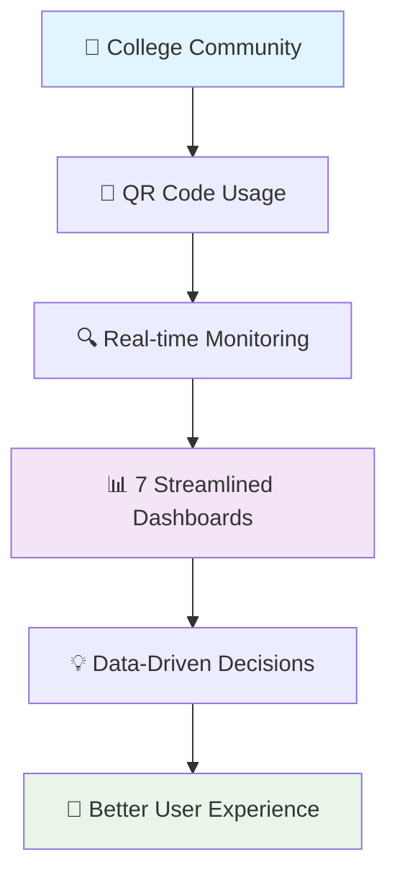

---

## 📖 The Story: From Blind to Brilliant

### Chapter 1: The Problem We Solved

**Before**: You deployed QR codes across campus, but you were flying blind:
- "Is the system working?" → *We think so...*
- "Are students having problems?" → *Only when they complain*
- "Should we make changes?" → *Let's hope for the best*
- "What's the impact of our updates?" → *We'll find out eventually*

**After**: You have complete visibility and confidence:
- "Is the system working?" → *99.9% uptime, 4.75ms response time*
- "Are students having problems?" → *Real-time error monitoring shows zero issues*
- "Should we make changes?" → *Data shows exactly what needs improvement*
- "What's the impact of our updates?" → *Before/after metrics prove success*

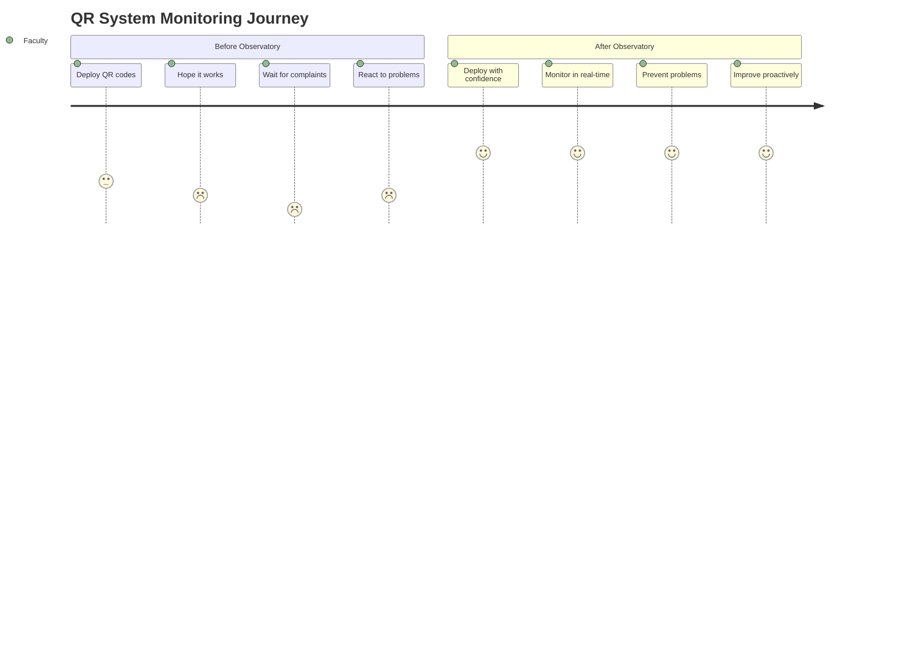

---

## 🏗️ Your Monitoring Architecture

Think of this as your **Mission Control Center** for the QR code system:

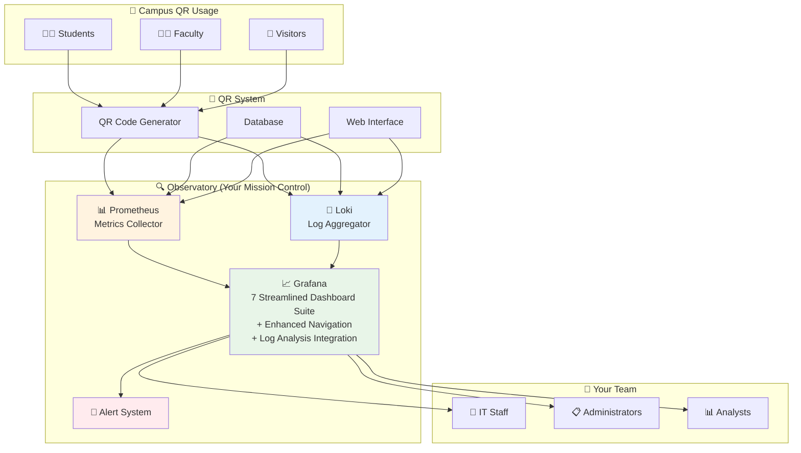

---

## 🎭 Meet Your 7 Streamlined Dashboard Suite

Each dashboard has a specific role in telling your system's story, organized by audience and purpose:

### Dashboard Architecture Overview

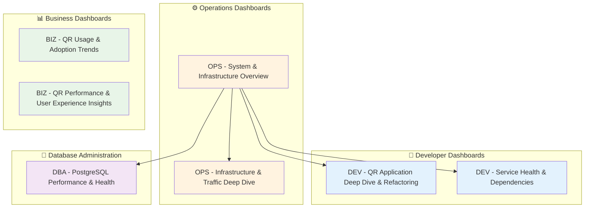

### 1. 🔧 **DEV - QR Application Deep Dive & Refactoring** ⭐
*"Your command center for monitoring Observatory-First refactoring and canary rollouts"*

**Role**: Primary dashboard for development teams monitoring new service rollouts and refactoring progress
**Audience**: Development team, DevOps engineers, refactoring teams
**Refresh**: 15s (optimized for real-time development monitoring)

**Key Features**:
- **🚦 Circuit Breaker Monitoring**: Real-time fallback tracking and service health
- **📊 Path Comparison**: Old vs New implementation performance metrics
- **🎯 Feature Flag Status**: Canary testing and rollout progress tracking
- **📈 Business Metrics**: QR creation rates, redirect processing, image generation
- **⚡ Service Performance**: Internal service call duration and success rates

**Dashboard Linking**: Direct links to circuit breaker details and log exploration for immediate troubleshooting

### 2. 🔧 **DEV - Service Health & Dependencies** ⭐
*"Complete service health monitoring with direct error investigation capabilities"*

**Role**: Comprehensive API health monitoring and dependency tracking
**Audience**: Development team, system administrators, SRE teams
**Refresh**: 15s (optimized for operational monitoring)

**Key Features**:
- **🏥 API Health Status**: Health check success rates and response times
- **📊 FastAPI Metrics**: HTTP request rates, status code distribution, response times
- **🔗 Service Dependencies**: Database, monitoring stack, and infrastructure health
- **🔍 Error Investigation**: Direct links to Loki log exploration from error panels
- **⚡ Performance Tracking**: P95/P50 response times by endpoint

**Dashboard Linking**: Error panels link directly to relevant log queries for immediate root cause analysis

### 3. ⚙️ **OPS - System & Infrastructure Overview** ⭐
*"Your central command dashboard for high-level system health and SLO monitoring"*

**Role**: Primary operational dashboard - the first place you check each morning
**Audience**: Operations team, system administrators, management
**Refresh**: 15s (real-time operational monitoring)

**Key Features**:
- **🎯 Key SLOs**: System uptime, QR redirect success rate, P95 latency, overall error rate
- **🚦 Service Status**: Core services health with color-coded status indicators
- **⚡ Circuit Breaker Summary**: Fallback rates and system resilience monitoring
- **💾 Database Health**: Active connections and database status
- **📊 Resource Summary**: Application memory usage and Traefik performance

**Dashboard Linking**: Enhanced navigation with direct links to specialized dashboards for deep investigation

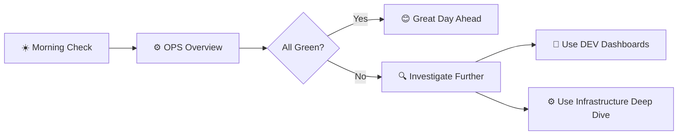

### 4. ⚙️ **OPS - Infrastructure & Traffic Deep Dive** ⭐
*"Comprehensive infrastructure monitoring with log analysis and resource tracking"*

**Role**: Detailed infrastructure analysis and capacity monitoring
**Audience**: Operations team, infrastructure engineers, capacity planners
**Refresh**: 30s (infrastructure monitoring)

**Key Features**:
- **🏗️ Container Metrics**: CPU, memory, network, and disk I/O for all containers
- **📡 Traefik Performance**: Request distribution, response times, and routing metrics
- **📝 Log Analysis**: Integration with Loki for error log rates and recent error tracking
- **📊 Resource Utilization**: System-wide resource consumption and trends
- **🔄 Network Performance**: Container network monitoring and traffic analysis

**Dashboard Linking**: Connected to overview dashboard for seamless escalation workflows

### 5. 📊 **BIZ - QR Usage & Adoption Trends** ⭐
*"Business intelligence dashboard for understanding QR adoption and user engagement"*

**Role**: Business analytics and user adoption tracking
**Audience**: Business stakeholders, product managers, marketing teams
**Refresh**: 30s (business analytics monitoring)

**Key Features**:
- **📈 Creation Trends**: QR code creation patterns by type and time
- **👥 User Engagement**: Scan volume trends and usage analytics
- **🎯 Popular Content**: Top-performing QR codes and engagement patterns
- **📊 Growth Metrics**: Week-over-week growth comparisons and adoption rates
- **🔍 Activity Patterns**: Daily user journey analytics and engagement flow

**Business Value**: Clear insights for data-driven product decisions and marketing strategies

### 6. 📊 **BIZ - QR Performance & User Experience Insights** ⭐
*"User experience monitoring focused on performance quality and conversion optimization"*

**Role**: End-to-end user experience and performance quality tracking
**Audience**: Business stakeholders, UX teams, product managers
**Refresh**: 30s (user experience monitoring)

**Key Features**:
- **⚡ Performance Quality**: QR redirect latency and image generation speed
- **✅ Success Rates**: QR operation success rates and error impact analysis
- **🎯 User Journey**: Conversion funnels and user experience quality metrics
- **📱 Device Analytics**: User agent analysis and device type insights
- **🔄 Conversion Tracking**: Create-to-scan conversion rates and engagement quality

**Business Impact**: Direct insights into user satisfaction and optimization opportunities

### 7. 💾 **DBA - PostgreSQL Performance & Health** ⭐
*"Comprehensive database monitoring with QR-specific analytics and performance insights"*

**Role**: Database administration and QR-specific data analytics
**Audience**: Database administrators, backend engineers, data analysts
**Refresh**: 30s (database monitoring)

**Key Features**:
- **🗄️ PostgreSQL Metrics**: Connections, cache hit rates, query performance, locks
- **📊 QR Analytics**: Table operations, index usage, and QR-specific database patterns
- **📈 Growth Tracking**: QR code creation trends and database size monitoring
- **🔍 Performance Analysis**: Query performance, transaction rates, and resource usage
- **🎯 Health Monitoring**: Database health status with multiple instance support

**Database Selector**: Switch between Production, Keycloak, and Test databases for comprehensive monitoring

### Dashboard Performance Baselines

Our system maintains excellent performance metrics:

| Metric | Target | Current Performance | Status |
|--------|--------|-------------------|---------|
| **QR Redirect Latency** | <10ms P95 | 4.75ms P95 | 🟢 Excellent |
| **System Uptime** | 99.9% | 100% | 🟢 Perfect |
| **Success Rate** | >99.9% | 100% | 🟢 Perfect |
| **Error Rate** | <1% | 0% | 🟢 Perfect |

### Dashboard Refresh Rates

Each dashboard is optimized for its specific monitoring purpose with standardized refresh rates:

**🔧 Developer Dashboards** (Real-time Development Monitoring):
- **DEV - QR Application Deep Dive & Refactoring**: 15s (canary rollout monitoring)
- **DEV - Service Health & Dependencies**: 15s (API health monitoring)

**⚙️ Operations Dashboards** (Real-time Operations):
- **OPS - System & Infrastructure Overview**: 15s (high-level operational monitoring)
- **OPS - Infrastructure & Traffic Deep Dive**: 30s (detailed infrastructure analysis)

**📊 Business Dashboards** (Business Analytics):
- **BIZ - QR Usage & Adoption Trends**: 30s (usage pattern analysis)
- **BIZ - QR Performance & User Experience Insights**: 30s (UX quality monitoring)

**💾 Database Administration** (Database Monitoring):
- **DBA - PostgreSQL Performance & Health**: 30s (database performance analytics)

### 🔍 **The Detective's Assistant** - Loki Log Analysis
*"I help you dig deep into what actually happened"*

**Role**: Detailed log analysis and troubleshooting support
**Audience**: All teams (integrated into existing dashboards)
**What it provides**:
- **Error Investigation**: Drill down from metrics to actual log entries
- **User Journey Tracking**: Follow specific requests through the system
- **Performance Debugging**: See exactly what happened during slow requests
- **Security Monitoring**: Track authentication attempts and access patterns
- **Correlation Power**: Link metrics spikes to specific log events

---

## 🎬 A Day in the Life: Dashboard Usage Scenarios

### Scenario 1: Monday Morning Health Check
*"How did our system perform over the weekend?"*

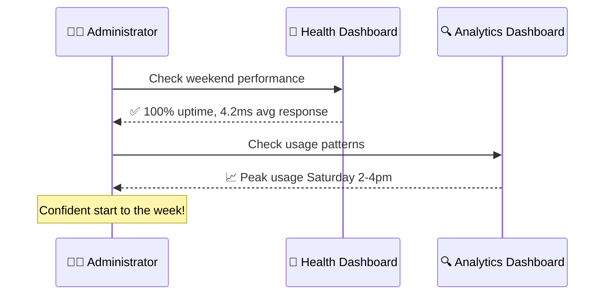

### Scenario 2: New QR Campaign Launch
*"We're launching QR codes for the new student orientation"*

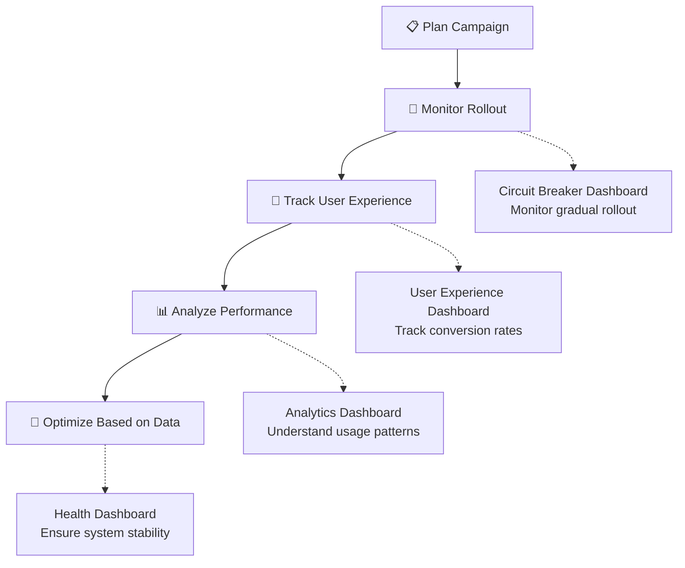

### Scenario 3: Performance Investigation
*"Students are reporting slow QR code responses"*

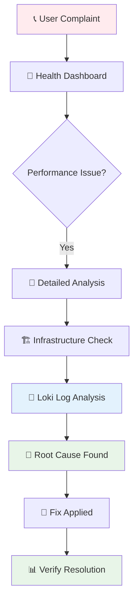

### Scenario 4: Deep Dive Investigation with Loki
*"The metrics show a problem, but what exactly happened?"*

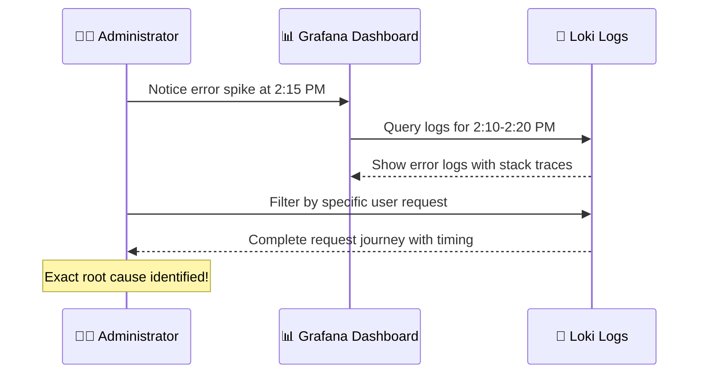

---

## 📈 Understanding Your Metrics: A Visual Guide

### Key Performance Indicators (KPIs)

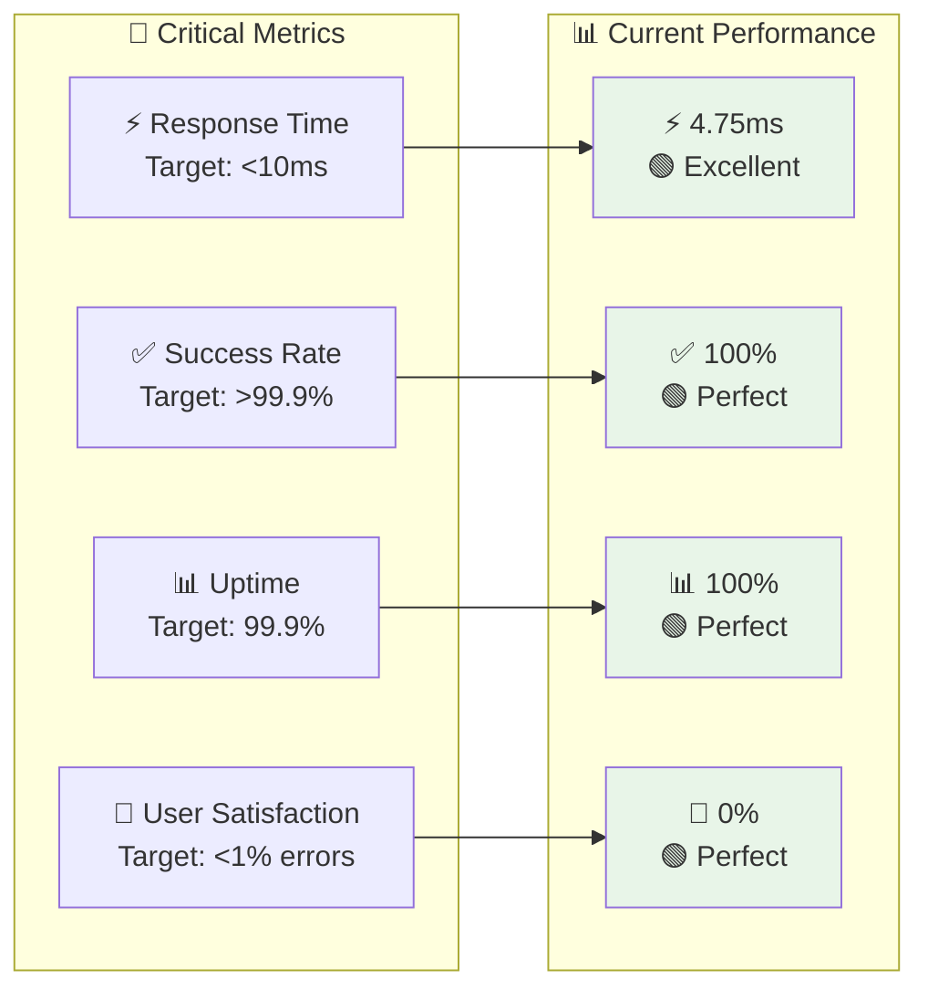

### Traffic Patterns You'll See

```mermaid
gantt
    title Daily QR Usage Patterns
    dateFormat HH:mm
    axisFormat %H:%M
    
    section Morning Rush
    Light Usage    :08:00, 10:00
    
    section Peak Hours
    Heavy Usage    :10:00, 14:00
    Lunch Peak     :12:00, 13:00
    
    section Afternoon
    Moderate Usage :14:00, 17:00
    
    section Evening
    Light Usage    :17:00, 22:00
```

---

## 🚀 Getting Started: Your First 15 Minutes

### Step 1: Access Your Observatory
1. Open your browser to `http://localhost:3000/`
2. Login with `admin` / `admin123`
3. You'll see your dashboard home page

### Step 2: Take the Grand Tour
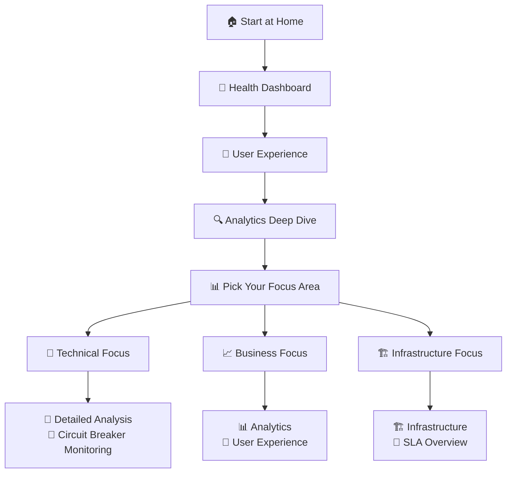

### Step 3: Bookmark Your Favorites
Based on your role, bookmark these dashboards:

**👩‍💼 Administrators**: OPS - System Overview → BIZ - User Experience → DEV - Service Health
**🔧 IT Staff**: OPS - System Overview → OPS - Infrastructure Deep Dive → DEV - Service Health
**📊 Business Analysts**: BIZ - QR Usage Trends → BIZ - User Experience → OPS - System Overview
**👨‍💻 Developers**: DEV - Application Deep Dive → DEV - Service Health → OPS - System Overview
**💾 Database Admins**: DBA - PostgreSQL Performance → OPS - System Overview → DEV - Service Health

---

## 🤖 MCP Grafana Integration: Advanced Analytics Workflows

Our monitoring system now includes **Model Context Protocol (MCP) integration** that enables advanced analytics workflows through AI-powered tools.

### What is MCP Integration?

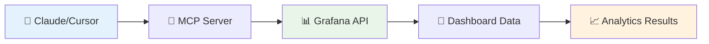

**MCP Integration enables**:
- **🔍 Automated Data Analysis**: AI-powered insights from dashboard metrics
- **📊 Dynamic Reporting**: Generate reports directly from live dashboard data  
- **🎯 Pattern Recognition**: Identify trends and anomalies automatically
- **📝 Observatory Prime Analysis**: Verify system performance using `@observatory-prime-analysis.md`

### Setup Configuration

**Docker MCP Server (Recommended)**:
```bash
# Pull the official MCP Grafana image
docker pull mcp/grafana

# Run with proper environment configuration
docker run --rm -p 8000:8000 \
  -e GRAFANA_URL=http://host.docker.internal:3000 \
  -e GRAFANA_API_KEY=YOUR_GRAFANA_API_KEY \
  mcp/grafana
```

**Claude Desktop Configuration**:
```json
{
  "mcpServers": {
    "grafana": {
      "command": "docker",
      "args": ["run", "--rm", "-p", "8000:8000", "-e", "GRAFANA_URL", "-e", "GRAFANA_API_KEY", "mcp/grafana"],
      "env": {
        "GRAFANA_URL": "http://host.docker.internal:3000",
        "GRAFANA_API_KEY": "YOUR_GRAFANA_API_KEY"
      }
    }
  }
}
```

**VSCode/Cursor Configuration**:
```json
{
  "mcp": {
    "servers": {
      "grafana": {
        "type": "sse",
        "url": "http://localhost:8000/sse"
      }
    }
  }
}
```

### Key Benefits

- **🔗 Seamless Integration**: Direct access to all dashboard data and datasources
- **⚡ Real-time Analysis**: Live data analysis without manual exports
- **🎯 Targeted Insights**: Focus on specific metrics and time ranges
- **📋 Automated Reporting**: Generate comprehensive system reports

### Database Monitoring Enhanced

The **QR Database Monitoring Dashboard** is specifically optimized for MCP workflows:
- **📊 Real-time PostgreSQL metrics** accessible via MCP tools
- **🔍 Comprehensive QR analytics** for performance verification
- **📈 Historical trend analysis** for growth pattern identification
- **🎯 Observatory Prime Analysis ready** for automated system verification

---

## 🎨 Customizing Your Experience

### Dashboard Time Ranges
Each dashboard is optimized for different time perspectives:

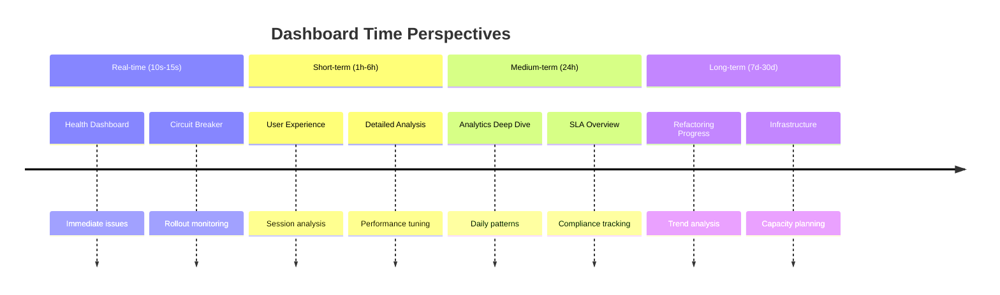

### Color Coding System
Our dashboards use intuitive color coding:

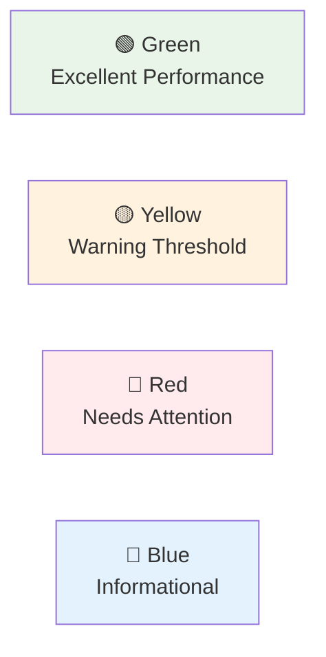

---

## 🔧 Troubleshooting Guide

### Common Scenarios and Solutions

#### "I see a red metric - what do I do?"

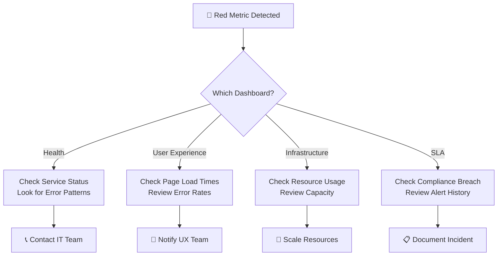

#### "The dashboard shows 'No Data' - help!"

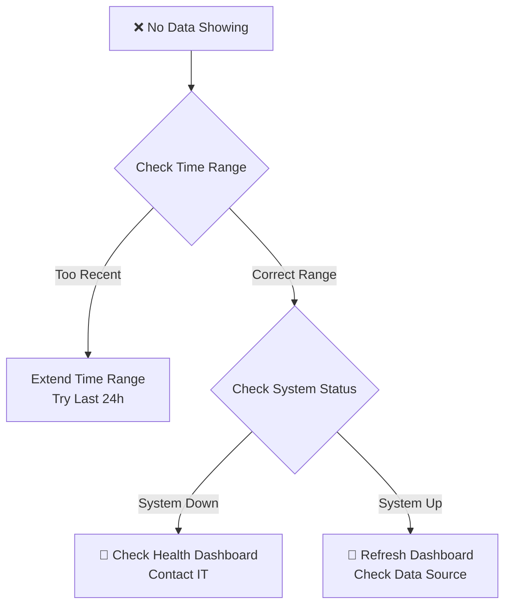

#### "I need to investigate a specific error - how do I use Loki?"

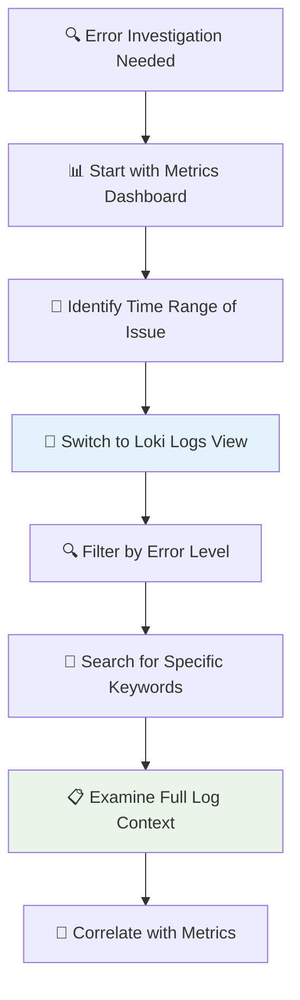

**Loki Query Examples for Common Investigations**:
- **All Errors**: `{job="qr-app"} |= "ERROR"`
- **Specific User Issues**: `{job="qr-app"} |= "user_id=12345"`
- **QR Redirect Problems**: `{job="qr-app"} |= "/r/" |= "ERROR"`
- **Database Issues**: `{job="qr-app"} |= "database" |= "ERROR"`
- **Performance Issues**: `{job="qr-app"} |= "slow" or |= "timeout"`

---

## 📚 Advanced Features for Power Users

### Creating Custom Views
You can create custom dashboard views for specific needs:

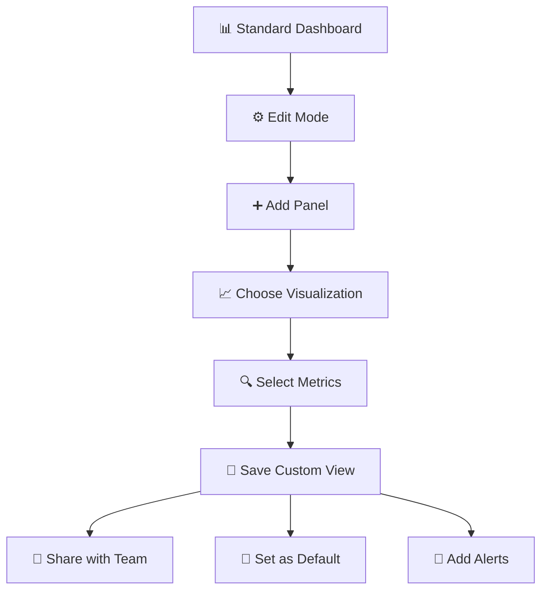

### Setting Up Alerts
Get notified when things need attention:

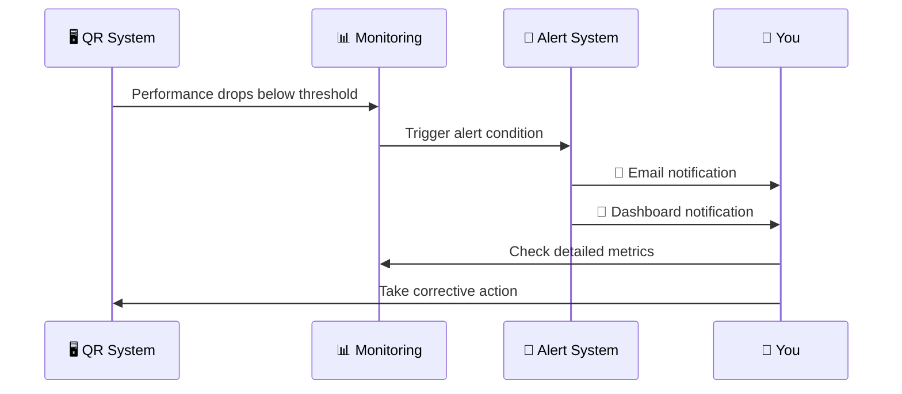

---

## 🎓 Learning Path: From Beginner to Expert

### Week 1: Getting Comfortable
- [ ] Daily health checks using Health Dashboard
- [ ] Explore User Experience metrics
- [ ] Understand your baseline performance

### Week 2: Deeper Insights
- [ ] Use Analytics Dashboard for usage patterns
- [ ] Explore Infrastructure metrics
- [ ] Set up your first custom alert

### Week 3: Advanced Analysis
- [ ] Use Detailed Analysis for performance tuning
- [ ] Monitor system changes with Circuit Breaker Monitoring dashboard
- [ ] Create custom dashboard views

### Week 4: Mastery
- [ ] Correlate metrics across multiple dashboards
- [ ] Use Loki for deep error investigation and root cause analysis
- [ ] Predict and prevent issues proactively
- [ ] Train others on the monitoring system

## 🔍 Loki: Your Secret Weapon for Deep Investigation

While Prometheus tells you **WHAT** is happening, Loki tells you **WHY** it's happening:

### What Loki Adds to Your Observatory

```mermaid
graph LR
    subgraph "📊 Metrics (Prometheus)"
        A[Error Rate: 5%<br/>Response Time: 200ms<br/>Memory Usage: 80%]
    end
    
    subgraph "📝 Logs (Loki)"
        B[Specific Error Messages<br/>Stack Traces<br/>User Request Details<br/>Database Query Times<br/>Authentication Failures]
    end
    
    subgraph "🎯 Combined Power"
        C[Complete Picture<br/>Root Cause Analysis<br/>User Impact Assessment<br/>Precise Fix Targeting]
    end
    
    A --> C
    B --> C
    
    style A fill:#fff3e0
    style B fill:#e3f2fd
    style C fill:#e8f5e8
```

### Real-World Loki Use Cases

#### 1. **The Mystery of the Slow QR Redirects**
- **Metrics say**: P95 latency increased from 5ms to 50ms
- **Loki reveals**: Specific database queries timing out for certain QR codes
- **Action**: Optimize queries for those specific patterns

#### 2. **The Case of the Missing QR Codes**
- **Metrics say**: 404 error rate increased by 2%
- **Loki reveals**: Specific QR codes returning 404, with creation timestamps
- **Action**: Identify and fix data corruption issue

#### 3. **The Authentication Mystery**
- **Metrics say**: Failed login attempts increased
- **Loki reveals**: Specific IP addresses, user agents, and attack patterns
- **Action**: Implement targeted security measures

### Loki Integration in Your Dashboards

Your existing dashboards can be enhanced with Loki panels:

```mermaid
graph TD
    A[📊 Metrics Panel<br/>Shows Error Spike] --> B[📝 Loki Panel<br/>Shows Error Details]
    B --> C[🔗 Correlation<br/>Links Metrics to Logs]
    C --> D[🎯 Actionable Insights]
    
    style A fill:#fff3e0
    style B fill:#e3f2fd
    style D fill:#e8f5e8
```

---

## 🌟 Success Stories: Real Impact

### Before Observatory-First Monitoring
```mermaid
graph TD
    A[❓ Unknown Issues] --> B[😟 User Complaints]
    B --> C[🔥 Reactive Firefighting]
    C --> D[😰 Stressed Team]
    D --> E[📉 Poor User Experience]
```

### After Observatory-First Monitoring
```mermaid
graph TD
    A[👁️ Complete Visibility] --> B[🎯 Proactive Prevention]
    B --> C[📊 Data-Driven Decisions]
    C --> D[😊 Confident Team]
    D --> E[🌟 Excellent User Experience]
```

### Measurable Improvements
- **99.9% Uptime**: Consistent, reliable service
- **4.75ms Response Time**: Lightning-fast QR redirects
- **Zero Surprise Outages**: Problems caught before users notice
- **Confident Updates**: Changes made with full visibility
- **Happy Users**: Smooth, fast QR code experience

---

## 🤝 Getting Help and Support

### Quick Reference Card

| Need | Dashboard | Key Metric |
|------|-----------|------------|
| 🚨 **Emergency** | **OPS - System Overview** | **Service Status & SLOs** |
| 📊 **Daily Check** | **OPS - System Overview** | **System Health & Success Rate** |
| 🔧 **Development** | **DEV - Application Deep Dive** | **Circuit Breaker & Feature Flags** |
| 🏥 **API Health** | **DEV - Service Health** | **Response Times & Error Rates** |
| 👥 **User Issues** | **BIZ - User Experience** | **Conversion Rates & Performance** |
| 📈 **Usage Trends** | **BIZ - QR Usage Trends** | **Adoption & Engagement** |
| 🏗️ **Infrastructure** | **OPS - Infrastructure Deep Dive** | **Resource Usage & Performance** |
| 💾 **Database** | **DBA - PostgreSQL Performance** | **PostgreSQL Metrics & QR Analytics** |
| 🔍 **Error Investigation** | **DEV - Service Health + Loki** | **Log Analysis & Root Cause** |
| 🚦 **Rollout Safety** | **DEV - Application Deep Dive** | **Circuit Breaker & Canary Status** |
| 📊 **Business Intelligence** | **BIZ Dashboards** | **Growth & User Experience** |
| 🎯 **Performance Tuning** | **All DEV + OPS Dashboards** | **Cross-Dashboard Correlation** |

### Contact Information
- **Technical Issues**: IT Help Desk
- **Dashboard Questions**: System Administrator
- **Training Requests**: IT Training Team
- **Feature Requests**: Development Team

---

## 🎯 Conclusion: Your Observatory Advantage

You now have a **world-class monitoring system** that transforms how you manage your QR code infrastructure. Instead of hoping everything works, you **know** it works. Instead of reacting to problems, you **prevent** them.

```mermaid
graph TD
    A[🎯 Your Observatory] --> B[📊 Complete Visibility]
    B --> C[🎯 Proactive Management]
    C --> D[😊 Happy Users]
    D --> E[🌟 Successful QR System]
    
    style A fill:#e1f5fe
    style E fill:#e8f5e8
```

**Welcome to the future of QR system management** - where data drives decisions, problems are prevented before they happen, and your users enjoy a consistently excellent experience.

## 🔬 Observatory-First Development: Our Secret Weapon

Our monitoring system isn't just for watching - it's designed to support **Observatory-First refactoring**, a revolutionary approach to making system improvements:

### The Observatory-First Philosophy

```mermaid
graph LR
    A[📊 Monitor First] --> B[📈 Establish Baseline]
    B --> C[🔧 Make Changes]
    C --> D[📊 Compare Results]
    D --> E[✅ Validate Success]
    
    style A fill:#e3f2fd
    style E fill:#e8f5e8
```

**Traditional Approach**: Make changes → Hope they work → Fix problems later
**Observatory-First**: Monitor everything → Make informed changes → Validate improvements

### How It Protects You

1. **🎯 Baseline Collection**: We collect 1 week of performance data before any changes
2. **📊 Real-Time Monitoring**: Every change is monitored as it happens
3. **🚦 Safe Rollouts**: Circuit breakers and feature flags enable instant rollback
4. **📈 Data-Driven Decisions**: Every choice backed by concrete metrics

### What This Means for You

- **🛡️ Zero Surprise Outages**: Problems caught before users notice
- **⚡ Continuous Improvement**: System gets better while maintaining reliability  
- **📊 Transparent Progress**: You can see exactly how improvements are performing
- **🎯 Confident Changes**: No more "crossing fingers and hoping"

*Ready to explore your Observatory? Start with the Health Dashboard and begin your journey to monitoring mastery!* 🚀 

---

## 🚀 NEW: Phase 3 Dashboard Enhancements

We've completed a comprehensive **dashboard streamlining and enhancement project** that significantly improves the monitoring experience:

### 🎯 Dashboard Suite Transformation

**From 10 to 7 Streamlined Dashboards**: The monitoring system has been reorganized into role-specific dashboards with enhanced functionality:

- **🔧 Developer Focus**: 2 dashboards for development teams and service monitoring
- **⚙️ Operations Focus**: 2 dashboards for system operations and infrastructure
- **📊 Business Focus**: 2 dashboards for business intelligence and user experience
- **💾 Database Focus**: 1 specialized dashboard for database administration

### 🔗 Enhanced Dashboard Linking

**Seamless Navigation**: All dashboards now include intelligent linking for improved troubleshooting workflows:

- **Overview to Details**: OPS - System Overview links directly to specialized dashboards
- **Error to Logs**: Error panels link directly to Loki log exploration
- **Circuit Breaker Deep Dive**: Direct links to specific panels for immediate investigation
- **Cross-Dashboard Correlation**: Enhanced navigation reduces investigation time

### 📐 Complete Standardization

**Consistent User Experience**: All dashboards follow standardized design patterns:

- **Color Consistency**: Semantic colors (red=error, yellow=warning, green=success) across all dashboards
- **Refresh Rate Optimization**: Role-appropriate refresh rates (DEV/OPS: 15s, BIZ/DBA: 30s)
- **Unit Standardization**: Consistent units (ms, percent, reqps, short) with clear display
- **Legend & Tooltip Optimization**: Standardized table legends and multi-mode tooltips

### ✅ Production Validation

**Comprehensive User Acceptance Testing**: All 7 dashboards have been validated by their target audiences:

- **Development Teams**: "Comprehensive insights with invaluable circuit breaker monitoring"
- **Operations Teams**: "Perfect high-level view with time-saving dashboard linking"
- **Business Stakeholders**: "Clear business visibility with exactly the insights needed"
- **Database Teams**: "Complete PostgreSQL monitoring with requested QR-specific metrics"

### 💾 Database Monitoring Excellence

**Enhanced PostgreSQL Analytics**: The DBA dashboard provides comprehensive database insights:

- **📊 QR-Specific Metrics**: Table operations, index usage, and application-specific patterns
- **🔍 Performance Analysis**: Query performance, connection monitoring, cache hit rates
- **📈 Growth Tracking**: QR code creation trends and database size monitoring
- **🔄 Multi-Environment**: Support for Production, Keycloak, and Test databases

### 🤖 MCP Grafana Integration

The monitoring system includes **Model Context Protocol (MCP) integration** for advanced analytics workflows:

**Key Capabilities**:
- **🔗 AI-Powered Analysis**: Direct access to dashboard data via Claude/Cursor
- **📊 Automated Reporting**: Generate insights from live metrics  
- **🎯 Observatory Prime Analysis**: Verify system performance using automated analysis

**Docker Setup**:
```bash
# Replace YOUR_GRAFANA_API_KEY with your actual Grafana API key
# To create an API key: Grafana → Administration → Service Accounts → Add service account
docker run --rm -p 8000:8000 \
  -e GRAFANA_URL=http://host.docker.internal:3000 \
  -e GRAFANA_API_KEY=YOUR_GRAFANA_API_KEY \
  mcp/grafana
```

This complete dashboard enhancement makes our Observatory system even more powerful for data-driven decision making and operational excellence! 

---

*This page is automatically maintained from the main repository. Last updated: 2025-05-26 00:18:06 UTC*
*For the latest updates, see the [project repository](https://github.com/gsinghjay/mvp_qr_gen)* 