# 📊 QR Code System Monitoring Guide for College Faculty & Staff

*A Visual Journey Through Our Observatory-First Monitoring System*

---

## 🎯 Welcome to Your QR System Observatory

Imagine you're running a campus-wide QR code system that students, faculty, and visitors use daily. How do you know it's working well? How do you spot problems before users complain? How do you make improvements with confidence?

**Welcome to your QR System Observatory** - a comprehensive monitoring system that gives you complete visibility into your QR code infrastructure.

```mermaid
graph TD
    A[👥 College Community] --> B[📱 QR Code Usage]
    B --> C[🔍 Real-time Monitoring]
    C --> D[📊 8 Specialized Dashboards]
    D --> E[💡 Data-Driven Decisions]
    E --> F[🎯 Better User Experience]
    
    style A fill:#e1f5fe
    style D fill:#f3e5f5
    style F fill:#e8f5e8
```

---

## 📖 The Story: From Blind to Brilliant

### Chapter 1: The Problem We Solved

**Before**: You deployed QR codes across campus, but you were flying blind:
- "Is the system working?" → *We think so...*
- "Are students having problems?" → *Only when they complain*
- "Should we make changes?" → *Let's hope for the best*
- "What's the impact of our updates?" → *We'll find out eventually*

**After**: You have complete visibility and confidence:
- "Is the system working?" → *99.9% uptime, 4.75ms response time*
- "Are students having problems?" → *Real-time error monitoring shows zero issues*
- "Should we make changes?" → *Data shows exactly what needs improvement*
- "What's the impact of our updates?" → *Before/after metrics prove success*


---

## 🏗️ Your Monitoring Architecture

Think of this as your **Mission Control Center** for the QR code system:

```mermaid
graph TB
    subgraph "🏫 Campus QR Usage"
        A[👨‍🎓 Students] 
        B[👩‍🏫 Faculty]
        C[👥 Visitors]
    end
    
    subgraph "📱 QR System"
        D[QR Code Generator]
        E[Database]
        F[Web Interface]
    end
    
    subgraph "🔍 Observatory (Your Mission Control)"
        G[📊 Prometheus<br/>Metrics Collector]
        G2[📝 Loki<br/>Log Aggregator]
        H[📈 Grafana<br/>8 Dashboard Suite<br/>+ Log Analysis]
        I[🚨 Alert System]
    end
    
    subgraph "👥 Your Team"
        J[🔧 IT Staff]
        K[📋 Administrators]
        L[📊 Analysts]
    end
    
    A --> D
    B --> D
    C --> D
    
    D --> G
    E --> G
    F --> G
    D --> G2
    E --> G2
    F --> G2
    
    G --> H
    G2 --> H
    H --> I
    
    H --> J
    H --> K
    H --> L
    
    style G fill:#fff3e0
    style G2 fill:#e3f2fd
    style H fill:#e8f5e8
    style I fill:#ffebee
```

---

## 🎭 Meet Your 8 Dashboard Characters

Each dashboard has a specific role in telling your system's story:

### 1. 🏥 **The Health Guardian** - System Health Dashboard
*"I watch over everything, 24/7"*

**Role**: Your primary operational dashboard - the first place you check each morning
**Audience**: IT staff, administrators
**What it shows**: 
- Overall system health at a glance
- QR redirect performance (most critical metric)
- Service availability status
- Real-time error monitoring

```mermaid
graph LR
    A[☀️ Morning Check] --> B[🏥 Health Dashboard]
    B --> C{All Green?}
    C -->|Yes| D[😊 Great Day Ahead]
    C -->|No| E[🔍 Investigate Further]
    E --> F[📊 Use Specialized Dashboards]
```

### 2. 📊 **The Progress Tracker** - Refactoring Progress Dashboard
*"I show how we're improving over time"*

**Role**: Tracks system evolution and improvements
**Audience**: Development team, project managers
**What it shows**:
- Performance trends over time
- Before/after comparisons when making changes
- System improvement milestones

### 3. 🔍 **The User Whisperer** - Analytics Deep Dive Dashboard
*"I understand how people use our QR codes"*

**Role**: Business intelligence and usage insights
**Audience**: Marketing, student services, administrators
**What it shows**:
- QR scan patterns and trends
- Popular QR codes and content
- User engagement analytics
- Geographic and temporal usage patterns

### 4. 🔬 **The Technical Detective** - Detailed Analysis Dashboard
*"I provide surgical precision during system changes"*

**Role**: Deep technical monitoring during active development
**Audience**: Senior engineers, system architects
**What it shows**:
- Detailed performance breakdown by operation type
- Database activity patterns
- Error analysis by specific function
- Critical path performance monitoring

### 5. 🚦 **The Safety Controller** - Circuit Breaker & Feature Flag Dashboard
*"I ensure safe system updates and rollouts"*

**Role**: Monitors new feature rollouts and system safety mechanisms
**Audience**: DevOps team, release managers
**What it shows**:
- New vs old system performance comparison
- Feature flag adoption rates
- Fallback mechanism activation
- Canary deployment progress

### 6. 🏗️ **The Infrastructure Specialist** - Infrastructure Deep Dive Dashboard
*"I monitor the foundation that everything runs on"*

**Role**: Comprehensive infrastructure and resource monitoring
**Audience**: Infrastructure team, capacity planners
**What it shows**:
- Server resource usage (CPU, memory)
- Database performance metrics
- Network traffic patterns
- Container health and performance

### 7. 👥 **The Experience Guardian** - User Experience Monitoring Dashboard
*"I ensure students and faculty have a great experience"*

**Role**: End-to-end user journey and experience tracking
**Audience**: UX team, student services, administrators
**What it shows**:
- Page load times and responsiveness
- User journey success rates (creation → usage)
- Conversion rates and engagement metrics
- Error rates from user perspective

### 8. 🚨 **The Compliance Officer** - Alerting & SLA Overview Dashboard
*"I ensure we meet our service commitments"*

**Role**: SLA compliance monitoring and management reporting
**Audience**: Management, service level managers
**What it shows**:
- 99.9% uptime compliance tracking
- Performance target adherence
- Alert threshold monitoring
- Executive summary reporting

### 🔍 **The Detective's Assistant** - Loki Log Analysis
*"I help you dig deep into what actually happened"*

**Role**: Detailed log analysis and troubleshooting support
**Audience**: All teams (integrated into existing dashboards)
**What it provides**:
- **Error Investigation**: Drill down from metrics to actual log entries
- **User Journey Tracking**: Follow specific requests through the system
- **Performance Debugging**: See exactly what happened during slow requests
- **Security Monitoring**: Track authentication attempts and access patterns
- **Correlation Power**: Link metrics spikes to specific log events

---

## 🎬 A Day in the Life: Dashboard Usage Scenarios

### Scenario 1: Monday Morning Health Check
*"How did our system perform over the weekend?"*

```mermaid
sequenceDiagram
    participant Admin as 👩‍💼 Administrator
    participant Health as 🏥 Health Dashboard
    participant Analytics as 🔍 Analytics Dashboard
    
    Admin->>Health: Check weekend performance
    Health-->>Admin: ✅ 100% uptime, 4.2ms avg response
    Admin->>Analytics: Check usage patterns
    Analytics-->>Admin: 📈 Peak usage Saturday 2-4pm
    Note over Admin: Confident start to the week!
```

### Scenario 2: New QR Campaign Launch
*"We're launching QR codes for the new student orientation"*

```mermaid
flowchart TD
    A[📋 Plan Campaign] --> B[🚦 Monitor Rollout]
    B --> C[👥 Track User Experience]
    C --> D[📊 Analyze Performance]
    D --> E[🎯 Optimize Based on Data]
    
    B -.-> B1[Circuit Breaker Dashboard<br/>Monitor gradual rollout]
    C -.-> C1[User Experience Dashboard<br/>Track conversion rates]
    D -.-> D1[Analytics Dashboard<br/>Understand usage patterns]
    E -.-> E1[Health Dashboard<br/>Ensure system stability]
```

### Scenario 3: Performance Investigation
*"Students are reporting slow QR code responses"*

```mermaid
graph TD
    A[📞 User Complaint] --> B[🏥 Health Dashboard]
    B --> C{Performance Issue?}
    C -->|Yes| D[🔬 Detailed Analysis]
    D --> E[🏗️ Infrastructure Check]
    E --> F[📝 Loki Log Analysis]
    F --> G[🎯 Root Cause Found]
    G --> H[🔧 Fix Applied]
    H --> I[📊 Verify Resolution]
    
    style A fill:#ffebee
    style F fill:#e3f2fd
    style G fill:#e8f5e8
    style I fill:#e8f5e8
```

### Scenario 4: Deep Dive Investigation with Loki
*"The metrics show a problem, but what exactly happened?"*

```mermaid
sequenceDiagram
    participant Admin as 👩‍💼 Administrator
    participant Grafana as 📊 Grafana Dashboard
    participant Loki as 📝 Loki Logs
    
    Admin->>Grafana: Notice error spike at 2:15 PM
    Grafana->>Loki: Query logs for 2:10-2:20 PM
    Loki-->>Grafana: Show error logs with stack traces
    Admin->>Loki: Filter by specific user request
    Loki-->>Admin: Complete request journey with timing
    Note over Admin: Exact root cause identified!
```

---

## 📈 Understanding Your Metrics: A Visual Guide

### Key Performance Indicators (KPIs)

```mermaid
graph LR
    subgraph "🎯 Critical Metrics"
        A[⚡ Response Time<br/>Target: <10ms]
        B[✅ Success Rate<br/>Target: >99.9%]
        C[📊 Uptime<br/>Target: 99.9%]
        D[👥 User Satisfaction<br/>Target: <1% errors]
    end
    
    subgraph "📊 Current Performance"
        E[⚡ 4.75ms<br/>🟢 Excellent]
        F[✅ 100%<br/>🟢 Perfect]
        G[📊 100%<br/>🟢 Perfect]
        H[👥 0%<br/>🟢 Perfect]
    end
    
    A --> E
    B --> F
    C --> G
    D --> H
    
    style E fill:#e8f5e8
    style F fill:#e8f5e8
    style G fill:#e8f5e8
    style H fill:#e8f5e8
```

### Traffic Patterns You'll See


---

## 🚀 Getting Started: Your First 15 Minutes

### Step 1: Access Your Observatory
1. Open your browser to `http://localhost:3000/`
2. Login with `admin` / `admin`
3. You'll see your dashboard home page

### Step 2: Take the Grand Tour
```mermaid
graph TD
    A[🏠 Start at Home] --> B[🏥 Health Dashboard]
    B --> C[👥 User Experience]
    C --> D[🔍 Analytics Deep Dive]
    D --> E[📊 Pick Your Focus Area]
    
    E --> F[🔧 Technical Focus]
    E --> G[📈 Business Focus]
    E --> H[🏗️ Infrastructure Focus]
    
    F --> F1[🔬 Detailed Analysis<br/>🚦 Circuit Breaker]
    G --> G1[📊 Analytics<br/>👥 User Experience]
    H --> H1[🏗️ Infrastructure<br/>🚨 SLA Overview]
```

### Step 3: Bookmark Your Favorites
Based on your role, bookmark these dashboards:

**👩‍💼 Administrators**: Health → User Experience → SLA Overview
**🔧 IT Staff**: Health → Infrastructure → Detailed Analysis
**📊 Analysts**: Analytics → User Experience → Refactoring Progress
**👨‍💻 Developers**: Detailed Analysis → Circuit Breaker → Health

---

## 🎨 Customizing Your Experience

### Dashboard Time Ranges
Each dashboard is optimized for different time perspectives:


### Color Coding System
Our dashboards use intuitive color coding:

```mermaid
graph LR
    A[🟢 Green<br/>Excellent Performance] 
    B[🟡 Yellow<br/>Warning Threshold]
    C[🔴 Red<br/>Needs Attention]
    D[🔵 Blue<br/>Informational]
    
    style A fill:#e8f5e8
    style B fill:#fff3e0
    style C fill:#ffebee
    style D fill:#e3f2fd
```

---

## 🔧 Troubleshooting Guide

### Common Scenarios and Solutions

#### "I see a red metric - what do I do?"

```mermaid
flowchart TD
    A[🔴 Red Metric Detected] --> B{Which Dashboard?}
    
    B -->|Health| C[Check Service Status<br/>Look for Error Patterns]
    B -->|User Experience| D[Check Page Load Times<br/>Review Error Rates]
    B -->|Infrastructure| E[Check Resource Usage<br/>Review Capacity]
    B -->|SLA| F[Check Compliance Breach<br/>Review Alert History]
    
    C --> G[📞 Contact IT Team]
    D --> H[📧 Notify UX Team]
    E --> I[🔧 Scale Resources]
    F --> J[📋 Document Incident]
```

#### "The dashboard shows 'No Data' - help!"

```mermaid
graph TD
    A[❌ No Data Showing] --> B{Check Time Range}
    B -->|Too Recent| C[Extend Time Range<br/>Try Last 24h]
    B -->|Correct Range| D{Check System Status}
    D -->|System Down| E[🚨 Check Health Dashboard<br/>Contact IT]
    D -->|System Up| F[🔄 Refresh Dashboard<br/>Check Data Source]
```

#### "I need to investigate a specific error - how do I use Loki?"

```mermaid
flowchart TD
    A[🔍 Error Investigation Needed] --> B[📊 Start with Metrics Dashboard]
    B --> C[📅 Identify Time Range of Issue]
    C --> D[📝 Switch to Loki Logs View]
    D --> E[🔍 Filter by Error Level]
    E --> F[🎯 Search for Specific Keywords]
    F --> G[📋 Examine Full Log Context]
    G --> H[🔗 Correlate with Metrics]
    
    style D fill:#e3f2fd
    style G fill:#e8f5e8
```

**Loki Query Examples for Common Investigations**:
- **All Errors**: `{job="qr-app"} |= "ERROR"`
- **Specific User Issues**: `{job="qr-app"} |= "user_id=12345"`
- **QR Redirect Problems**: `{job="qr-app"} |= "/r/" |= "ERROR"`
- **Database Issues**: `{job="qr-app"} |= "database" |= "ERROR"`
- **Performance Issues**: `{job="qr-app"} |= "slow" or |= "timeout"`

---

## 📚 Advanced Features for Power Users

### Creating Custom Views
You can create custom dashboard views for specific needs:

```mermaid
graph TD
    A[📊 Standard Dashboard] --> B[⚙️ Edit Mode]
    B --> C[➕ Add Panel]
    C --> D[📈 Choose Visualization]
    D --> E[🔍 Select Metrics]
    E --> F[💾 Save Custom View]
    
    F --> G[👥 Share with Team]
    F --> H[📌 Set as Default]
    F --> I[🔔 Add Alerts]
```

### Setting Up Alerts
Get notified when things need attention:

```mermaid
sequenceDiagram
    participant System as 🖥️ QR System
    participant Monitor as 📊 Monitoring
    participant Alert as 🚨 Alert System
    participant You as 👤 You
    
    System->>Monitor: Performance drops below threshold
    Monitor->>Alert: Trigger alert condition
    Alert->>You: 📧 Email notification
    Alert->>You: 📱 Dashboard notification
    You->>Monitor: Check detailed metrics
    You->>System: Take corrective action
```

---

## 🎓 Learning Path: From Beginner to Expert

### Week 1: Getting Comfortable
- [ ] Daily health checks using Health Dashboard
- [ ] Explore User Experience metrics
- [ ] Understand your baseline performance

### Week 2: Deeper Insights
- [ ] Use Analytics Dashboard for usage patterns
- [ ] Explore Infrastructure metrics
- [ ] Set up your first custom alert

### Week 3: Advanced Analysis
- [ ] Use Detailed Analysis for performance tuning
- [ ] Monitor system changes with Circuit Breaker dashboard
- [ ] Create custom dashboard views

### Week 4: Mastery
- [ ] Correlate metrics across multiple dashboards
- [ ] Use Loki for deep error investigation and root cause analysis
- [ ] Predict and prevent issues proactively
- [ ] Train others on the monitoring system

## 🔍 Loki: Your Secret Weapon for Deep Investigation

While Prometheus tells you **WHAT** is happening, Loki tells you **WHY** it's happening:

### What Loki Adds to Your Observatory

```mermaid
graph LR
    subgraph "📊 Metrics (Prometheus)"
        A[Error Rate: 5%<br/>Response Time: 200ms<br/>Memory Usage: 80%]
    end
    
    subgraph "📝 Logs (Loki)"
        B[Specific Error Messages<br/>Stack Traces<br/>User Request Details<br/>Database Query Times<br/>Authentication Failures]
    end
    
    subgraph "🎯 Combined Power"
        C[Complete Picture<br/>Root Cause Analysis<br/>User Impact Assessment<br/>Precise Fix Targeting]
    end
    
    A --> C
    B --> C
    
    style A fill:#fff3e0
    style B fill:#e3f2fd
    style C fill:#e8f5e8
```

### Real-World Loki Use Cases

#### 1. **The Mystery of the Slow QR Redirects**
- **Metrics say**: P95 latency increased from 5ms to 50ms
- **Loki reveals**: Specific database queries timing out for certain QR codes
- **Action**: Optimize queries for those specific patterns

#### 2. **The Case of the Missing QR Codes**
- **Metrics say**: 404 error rate increased by 2%
- **Loki reveals**: Specific QR codes returning 404, with creation timestamps
- **Action**: Identify and fix data corruption issue

#### 3. **The Authentication Mystery**
- **Metrics say**: Failed login attempts increased
- **Loki reveals**: Specific IP addresses, user agents, and attack patterns
- **Action**: Implement targeted security measures

### Loki Integration in Your Dashboards

Your existing dashboards can be enhanced with Loki panels:

```mermaid
graph TD
    A[📊 Metrics Panel<br/>Shows Error Spike] --> B[📝 Loki Panel<br/>Shows Error Details]
    B --> C[🔗 Correlation<br/>Links Metrics to Logs]
    C --> D[🎯 Actionable Insights]
    
    style A fill:#fff3e0
    style B fill:#e3f2fd
    style D fill:#e8f5e8
```

---

## 🌟 Success Stories: Real Impact

### Before Observatory-First Monitoring
```mermaid
graph TD
    A[❓ Unknown Issues] --> B[😟 User Complaints]
    B --> C[🔥 Reactive Firefighting]
    C --> D[😰 Stressed Team]
    D --> E[📉 Poor User Experience]
```

### After Observatory-First Monitoring
```mermaid
graph TD
    A[👁️ Complete Visibility] --> B[🎯 Proactive Prevention]
    B --> C[📊 Data-Driven Decisions]
    C --> D[😊 Confident Team]
    D --> E[🌟 Excellent User Experience]
```

### Measurable Improvements
- **99.9% Uptime**: Consistent, reliable service
- **4.75ms Response Time**: Lightning-fast QR redirects
- **Zero Surprise Outages**: Problems caught before users notice
- **Confident Updates**: Changes made with full visibility
- **Happy Users**: Smooth, fast QR code experience

---

## 🤝 Getting Help and Support

### Quick Reference Card

| Need | Dashboard | Key Metric |
|------|-----------|------------|
| 🚨 Emergency | Health Dashboard | Service Status |
| 📊 Daily Check | Health Dashboard | Success Rate |
| 👥 User Issues | User Experience | Error Rates |
| 📈 Usage Trends | Analytics Deep Dive | Scan Patterns |
| 🔧 Performance | Detailed Analysis | Response Times |
| 🏗️ Capacity | Infrastructure | Resource Usage |
| 📋 Reporting | SLA Overview | Compliance Metrics |
| 🔍 **Error Investigation** | **Loki Logs** | **Log Analysis** |
| 🎯 **Root Cause Analysis** | **Loki + Metrics** | **Correlation** |

### Contact Information
- **Technical Issues**: IT Help Desk
- **Dashboard Questions**: System Administrator
- **Training Requests**: IT Training Team
- **Feature Requests**: Development Team

---

## 🎯 Conclusion: Your Observatory Advantage

You now have a **world-class monitoring system** that transforms how you manage your QR code infrastructure. Instead of hoping everything works, you **know** it works. Instead of reacting to problems, you **prevent** them.

```mermaid
graph TD
    A[🎯 Your Observatory] --> B[📊 Complete Visibility]
    B --> C[🎯 Proactive Management]
    C --> D[😊 Happy Users]
    D --> E[🌟 Successful QR System]
    
    style A fill:#e1f5fe
    style E fill:#e8f5e8
```

**Welcome to the future of QR system management** - where data drives decisions, problems are prevented before they happen, and your users enjoy a consistently excellent experience.

*Ready to explore your Observatory? Start with the Health Dashboard and begin your journey to monitoring mastery!* 🚀 