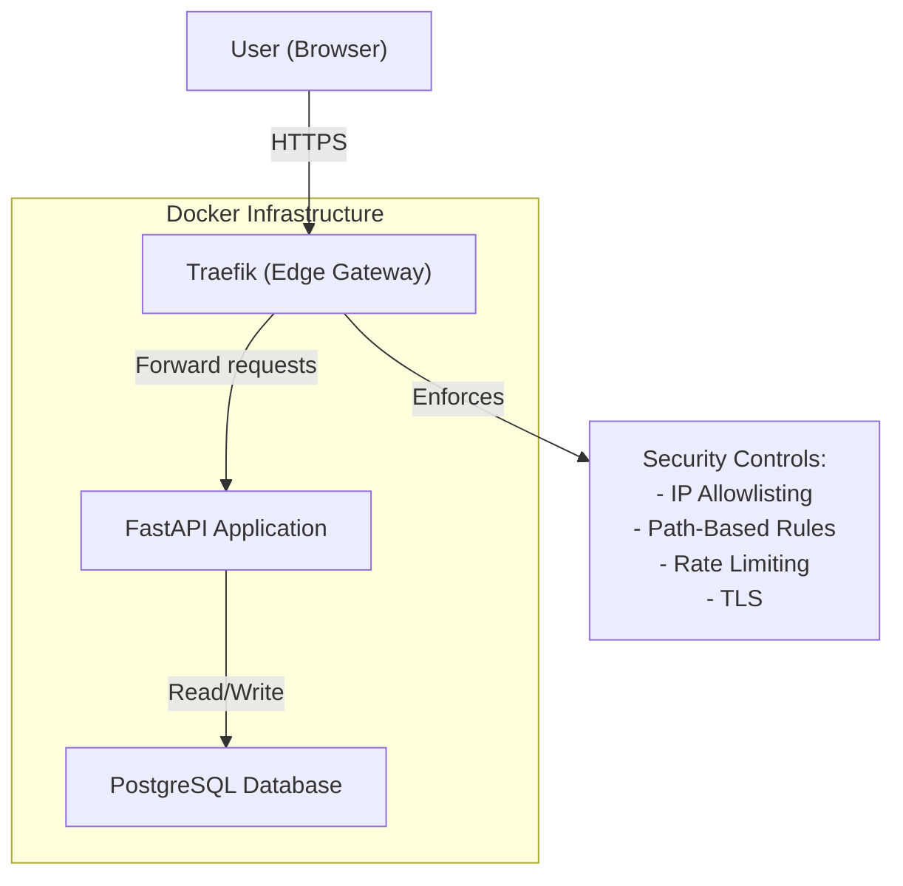
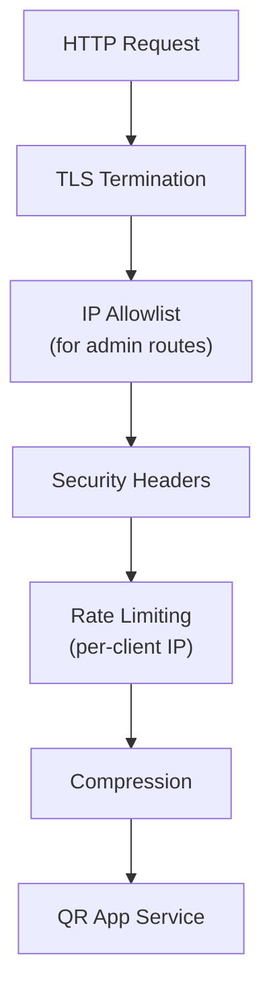
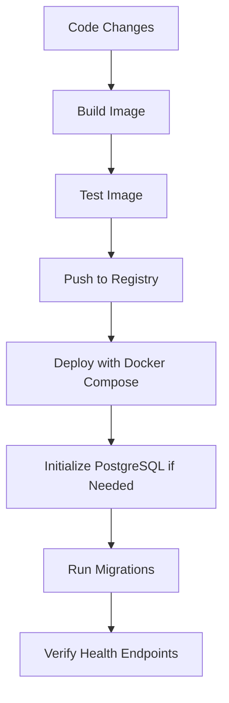

# QR Code Generator Infrastructure

## Architecture Overview

The QR Code Generator is deployed as a container-based application with the following components:



## Infrastructure Components

### Containers and Services

| Service              | Image/Build                   | Main Purpose                               | Ports      | Volumes               |
|----------------------|-------------------------------|--------------------------------------------|-----------|-----------------------|
| `traefik`            | traefik:v2.10                 | Edge gateway, routing, TLS termination     | 80, 443   | traefik-certificates  |
| `qr-app`             | Built from Dockerfile         | QR code generation and management API      | None (internal) | qr_data          |
| `postgres`           | postgres:15                   | PostgreSQL database                         | None (internal) | postgres_data    |

### Networks

| Network Name   | Purpose                                      | Connected Services           |
|----------------|----------------------------------------------|-----------------------------|
| `traefik_net`  | Communication between Traefik and services   | traefik, qr-app             |
| `qr_generator_network` | Internal communication between app and database | qr-app, postgres |

### Volumes

| Volume Name           | Purpose                                         | Used By            |
|-----------------------|-------------------------------------------------|--------------------|
| `qr_data`             | Persistent storage for QR images                | qr-app             |
| `postgres_data`       | Persistent storage for PostgreSQL database      | postgres           |
| `traefik-certificates`| Storage for Let's Encrypt certificates          | traefik            |

## Security Model

The application uses a network-level security model:

1. **Edge Security at Traefik**:
   - IP allowlisting restricts access to administrative endpoints
   - Path-based rules control which endpoints are publicly accessible
   - TLS termination ensures encrypted traffic
   - Rate limiting protects against abuse
   - Security headers protect against common web vulnerabilities

2. **Application Access Control**:
   - Administrative endpoints are restricted to trusted network IPs
   - Public QR redirect endpoints (`/r/{short_id}`) are accessible to all
   - No user-level authentication is required

3. **Network Isolation**:
   - Container services communicate on internal networks only
   - Only Traefik is exposed to the host network
   - PostgreSQL database is only accessible from the application container

## Traefik Configuration

Traefik is configured using two files:

1. **`traefik.yml`** (static configuration):
   - Global settings, entrypoints, providers
   - TLS configuration and certificate storage
   - Logging and metrics

2. **`dynamic_conf.yml`** (dynamic configuration):
   - Router definitions for each service
   - Middleware chains
   - Service backends

### Middleware Stack



## Database Management

The application uses PostgreSQL for data persistence:

- PostgreSQL 15 running in a dedicated container
- Data stored on `postgres_data` volume
- Connection string managed via environment variables
- Automated backups via pg_dump
- Migrations managed by Alembic

### Backup Strategy

- Regular backups created via pg_dump
- Backups stored in `./backups` directory via volume mapping
- Backup creation triggered during container startup
- Retention policy configurable via environment variables

## Deployment Process



### Initial Deployment

```bash
# Clone the repository
git clone https://github.com/your-org/qr-code-generator.git
cd qr-code-generator

# Set up environment variables
cp .env.example .env
# Edit .env with your environment-specific values

# Start the services
docker-compose up -d

# Verify deployment
curl http://localhost/health
```

### Updates

```bash
# Pull the latest changes
git pull

# Rebuild and restart the services
docker-compose down
docker-compose build
docker-compose up -d

# Run migrations if needed
docker-compose exec qr-app python -m app.scripts.manage_db migrate
```

## Monitoring and Maintenance

### Health Checks

- `/health` endpoint provides basic service health and database connectivity
- `/metrics` exposes Prometheus metrics
- PostgreSQL health checks ensure database readiness

### Logging

- Structured JSON logging to stdout/stderr
- Log level configurable via environment variables
- Request logging includes request ID, path, method, status, duration

### Performance Considerations

- PostgreSQL offers improved concurrency and better performance for writes
- QR code generation is CPU-intensive but quick
- Image caching reduces regeneration overhead
- Rate limiting prevents abuse

## Disaster Recovery

1. **Database Corruption**:
   - Restore from the latest PostgreSQL backup in `./backups`
   - Run migrations to ensure schema is up-to-date

2. **Container Failure**:
   - Services will restart automatically (restart policy)
   - Data persists on named volumes for both PostgreSQL and application files

3. **Complete System Recovery**:
   - Reinstall Docker and Docker Compose
   - Clone repository and restore environment files
   - Restore PostgreSQL backup
   - Restart services

## Future Improvements

1. **Monitoring Enhancement**:
   - Add Prometheus/Grafana integration
   - Set up alerting for critical metrics

2. **Security Hardening**:
   - Regular security scanning of Docker images
   - Implementation of more granular access controls
   - Consider implementing Keycloak for user authentication

3. **Database Scaling**:
   - Consider PostgreSQL replication for high-availability
   - Implement connection pooling for high-volume deployments
   - Set up automated database maintenance tasks