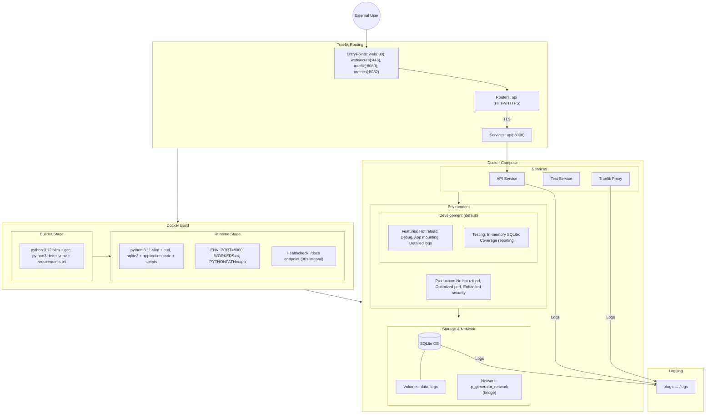

# Docker Infrastructure Flow Diagram

# Environment Configuration Notes

## Development Mode (Default)
- Features:
  - Hot reloading and debug features enabled
  - App directory mounted for live changes
  - Detailed logging for development
  - Testing with in-memory SQLite (`docker compose exec api pytest --cov -v`)

## Production Mode
- Enable by changing `ENVIRONMENT=production` in docker-compose.yml
- Features:
  - Hot reloading disabled
  - Optimized performance settings
  - Enhanced security features
  - Production-level logging