# Docker Infrastructure Flow Diagram

```mermaid
flowchart TD
    %% External Users/Systems
    USER((External User)) --> ENTRY
    
    subgraph traefik["Traefik Routing"]
        direction LR
        ENTRY["EntryPoints: web(:80), websecure(:443), traefik(:8080), metrics(:8082)"]
        ROUTERS["Routers: api (HTTP/HTTPS)"]
        SERVICES["Services: api(:8000)"]
        ENTRY --> ROUTERS --> |"TLS"| SERVICES
    end
    
    traefik --> dockerfile

    subgraph dockerfile["Docker Build"]
        direction LR
        subgraph builder["Builder Stage"]
            B["python:3.12-slim + gcc, python3-dev + venv + requirements.txt"]
        end
        
        subgraph runtime["Runtime Stage"]
            R["python:3.12-slim + curl, sqlite3 + application code + scripts"]
            ENV["ENV: PORT=8000, WORKERS=4, PYTHONPATH=/app"]
            HEALTH["Healthcheck: /health endpoint (30s interval)"]
        end
        
        builder --> runtime
    end
    
    dockerfile --> compose
    
    subgraph compose["Docker Compose"]
        direction LR
        subgraph services["Services"]
            API["API Service"] 
            PROXY["Traefik Proxy"]
        end
        
        subgraph env["Environment"]
            direction LR
            subgraph DEV["Development (default)"]
                DEV_FEATURES["Features: Hot reload, Debug, App mounting, Detailed logs"]
                TEST_MODE["Testing: In-memory SQLite, Coverage reporting"]
            end
            
            PROD["Production: No hot reload, Optimized perf, Enhanced security"]
        end
        
        subgraph storage["Storage & Network"]
            direction LR
            DB[("SQLite DB")] --- VOLUMES["Volumes: data, logs"]
            NET["Network: qr_generator_network (bridge)"]
        end
        
        services --> env --> storage
    end
    
    SERVICES --> API
    
    %% Logging Flow
    subgraph logs["Logging"]
        direction LR
        LOG_VOL["./logs → /logs"]
        LOG_DIRS["Subdirectories: api, database, traefik"]
        API & DB & PROXY -- "Logs" --> LOG_VOL --> LOG_DIRS
    end
```

# Environment Configuration Notes

## Development Mode (Default)
- Features:
  - Hot reloading and debug features enabled
  - App directory mounted for live changes
  - Detailed logging for development
  - Testing with in-memory SQLite (run with `docker compose exec api pytest --cov -v`)

## Production Mode
- Enable by changing `ENVIRONMENT=production` in docker-compose.yml
- Features:
  - Hot reloading disabled
  - Optimized performance settings
  - Enhanced security features
  - Production-level logging

## Directory Structure
- `data/`: Contains SQLite database and backups
  - `backups/`: Database backup files
  - `logs/`: Application data logs
- `logs/`: Container logs
  - `api/`: API service logs
  - `database/`: Database operation logs
  - `traefik/`: Traefik proxy logs
- `certificates/`: TLS certificates for secure connections

## Security Notes
- TLS is enabled for secure connections
- Self-signed certificates are used for local development
- Production should use proper certificates from Let's Encrypt
- Non-root user (appuser) is used in the container for enhanced security