# 🌐 QR Code System Network Infrastructure Guide

> **Complete Network Architecture & Domain Strategy Documentation**

*A comprehensive guide to understanding and managing the QR Code Generator's network infrastructure, domain strategy, and security architecture.*

---

## 🎯 Welcome to Your Network Command Center

Managing a production QR code system requires understanding how users, domains, security, and services interconnect. This guide provides complete visibility into our network architecture, from external user requests to internal service communication.

```mermaid
graph TB
    subgraph "🌍 External World"
        USERS[👥 Users & Students]
        INTERNET[🌐 Internet]
    end
    
    subgraph "🏢 HCCC Network Infrastructure"
        DNS[🔍 DNS Resolution]
        FIREWALL[🛡️ Network Firewall]
        
        subgraph "📊 Domain Strategy"
            WEB["🌐 web.hccc.edu<br/>130.156.44.52<br/>Public QR Operations"]
            AUTH["🔐 auth.hccc.edu<br/>130.156.44.53<br/>Authentication Service"]
            WEBHOST["🖥️ webhost.hccc.edu<br/>10.1.6.12<br/>Admin & Internal"]
        end
    end
    
    subgraph "🖥️ VM Infrastructure (10.1.6.12)"
        TRAEFIK[🚦 Traefik Edge Gateway]
        
        subgraph "🐳 Docker Services"
            API[📱 QR Application]
            KEYCLOAK[🔑 Keycloak]
            OAUTH[🔐 OAuth2-Proxy]
            POSTGRES[💾 PostgreSQL]
            MONITORING[📊 Observatory Stack]
        end
    end
    
    USERS --> INTERNET
    INTERNET --> DNS
    DNS --> FIREWALL
    FIREWALL --> WEB
    FIREWALL --> AUTH
    FIREWALL --> WEBHOST
    
    WEB --> TRAEFIK
    AUTH --> TRAEFIK
    WEBHOST --> TRAEFIK
    
    TRAEFIK --> API
    TRAEFIK --> KEYCLOAK
    TRAEFIK --> OAUTH
    
    style WEB fill:#e1f5fe
    style AUTH fill:#fff3e0
    style WEBHOST fill:#e8f5e8
    style TRAEFIK fill:#f3e5f5
```

---

## 🏗️ Network Architecture Overview

### The Big Picture

Our QR Code system uses a **three-domain strategy** with **edge gateway security** to provide both public accessibility and administrative control.

```mermaid
graph LR
    subgraph "🌐 Public Access"
        A[👥 Students & Faculty<br/>📱 QR Code Scanning<br/>🔗 web.hccc.edu]
    end
    
    subgraph "🔐 Authentication"
        B[🎫 User Login<br/>🔑 Azure AD Integration<br/>🔗 auth.hccc.edu]
    end
    
    subgraph "🛠️ Administration"
        C[👨‍💻 IT Staff<br/>📊 System Monitoring<br/>🔗 webhost.hccc.edu]
    end
    
    subgraph "🖥️ Single VM (10.1.6.12)"
        D[🚦 Traefik Gateway<br/>📱 QR Application<br/>🔑 Keycloak<br/>📊 Monitoring Stack]
    end
    
    A --> D
    B --> D
    C --> D
    
    style A fill:#e1f5fe
    style B fill:#fff3e0
    style C fill:#e8f5e8
    style D fill:#f3e5f5
```

### Key Design Principles

1. **🎯 Single VM Architecture**: Everything runs on one powerful virtual machine for simplicity
2. **🌐 Domain-Based Routing**: Different domains for different purposes and audiences
3. **🚦 Edge Gateway Security**: Traefik handles all security, routing, and TLS termination
4. **🔄 Service Discovery**: Automatic routing between Docker services
5. **📊 Observatory-First**: Comprehensive monitoring built into the architecture

---

## 🏛️ Domain Strategy Architecture

### Domain Responsibility Matrix

| Domain | Purpose | Audience | Security | External IP |
|--------|---------|----------|----------|-------------|
| **web.hccc.edu** | 🌐 QR Operations & Public Dashboard | 👥 Students, Faculty, Public | 🔒 Basic Auth + Rate Limiting + Path-based | 130.156.44.52 |
| **auth.hccc.edu** | 🔐 Authentication Service | 🎫 All authenticated users | 🛡️ Public with OIDC security | 130.156.44.53 |
| **webhost.hccc.edu** | 🛠️ Administration & Monitoring | 👨‍💻 IT Staff, Admins | 🔐 IP Whitelist + Basic Auth | 10.1.6.12 |

### Domain Flow Architecture

```mermaid
sequenceDiagram
    participant Student as 👨‍🎓 Student
    participant Faculty as 👩‍🏫 Faculty Member
    participant Admin as 👨‍💻 IT Administrator
    
    participant WebDomain as 🌐 web.hccc.edu
    participant AuthDomain as 🔐 auth.hccc.edu
    participant AdminDomain as 🛠️ webhost.hccc.edu
    
    participant Traefik as 🚦 Traefik Gateway
    participant Services as 🐳 Backend Services
    
    Note over Student, Admin: QR Code Scanning (Public Access)
    Student->>WebDomain: Scan QR code (/r/abc123)
    WebDomain->>Traefik: Public request + rate limiting
    Traefik->>Services: Route to QR service
    Services-->>Student: 302 Redirect (16ms response)
    
    Note over Student, Admin: Authentication Flow
    Faculty->>WebDomain: Access protected page
    WebDomain->>Traefik: Check authentication
    Traefik->>AuthDomain: Redirect to login
    AuthDomain->>Services: Azure AD → Keycloak → OAuth2-Proxy
    Services-->>Faculty: Authenticated session + user info
    
    Note over Student, Admin: Administrative Operations
    Admin->>AdminDomain: Access monitoring dashboard
    AdminDomain->>Traefik: IP whitelist + basic auth
    Traefik->>Services: Route to admin endpoints
    Services-->>Admin: System metrics & controls
```

---

## 🚦 Traefik Edge Gateway Architecture

Traefik serves as our **single point of entry** and **security enforcement**, handling all routing, security, and TLS termination.

### Traefik Configuration Structure

```mermaid
graph TD
    subgraph "📁 Traefik Configuration"
        STATIC[📝 traefik.yml<br/>Static Configuration]
        
        subgraph "📂 Dynamic Configuration (traefik_config/dynamic_conf/)"
            SERVICES[00-http-services.yml<br/>🔧 Service Definitions]
            MIDDLEWARE[01-http-middlewares.yml<br/>🛡️ Security & Rate Limiting]
            PUBLIC[10-qrapp-public-routers.yml<br/>🌐 Public QR Routes]
            AUTH[15-keycloak-routers.yml<br/>🔐 Authentication Routes]
            DASHBOARD[20-qrapp-dashboard-routers.yml<br/>📊 Admin & OAuth2 Routes]
            HEALTH[30-admin-health-routers.yml<br/>❤️ Health & Admin Endpoints]
            MONITORING[40-monitoring-routers.yml<br/>📈 Grafana & Prometheus]
            TLS[99-tls.yml<br/>🔒 TLS Certificates]
        end
    end
    
    STATIC --> SERVICES
    SERVICES --> MIDDLEWARE
    MIDDLEWARE --> PUBLIC
    MIDDLEWARE --> AUTH
    MIDDLEWARE --> DASHBOARD
    MIDDLEWARE --> HEALTH
    MIDDLEWARE --> MONITORING
    MIDDLEWARE --> TLS
    
    style STATIC fill:#e3f2fd
    style MIDDLEWARE fill:#fff3e0
    style TLS fill:#e8f5e8
```

### Router Priority System

Our routing uses a **priority-based system** to ensure correct request handling:


### Middleware Security Layers

```mermaid
graph LR
    subgraph "🛡️ Security Middleware Pipeline"
        A[📥 Incoming Request] --> B[🔒 TLS Termination]
        B --> C[🌐 IP Whitelisting]
        C --> D[⏱️ Rate Limiting]
        D --> E[🔐 Authentication]
        E --> F[🛡️ Security Headers]
        F --> G[📤 Route to Service]
    end
    
    style A fill:#e3f2fd
    style G fill:#e8f5e8
```

---

## 🔐 Security Architecture Deep Dive

### Edge Gateway Security Model

Our security is **layered at the edge** rather than within applications, providing consistent protection across all services.

**🆕 Hybrid Authentication Model for web.hccc.edu:**

The system implements a **sophisticated hybrid authentication strategy** that balances public accessibility with administrative security:

- **🟢 Public Endpoints**: QR redirects (`/r/*`), static assets (`/static/*`), OAuth2 flows (`/oauth2/*`), logout pages
- **🔐 OIDC Protected**: Specific endpoints like `/hello-secure` use OAuth2-Proxy with Azure AD authentication
- **🔒 Basic Auth Protected**: Dashboard/admin routes use basic auth (`admin_user:strongpassword`)

This approach ensures:
✅ **Business continuity** - QR codes always work without authentication barriers  
✅ **Modern user experience** - OIDC authentication for interactive features  
✅ **Administrative control** - Simple basic auth for dashboard access  
✅ **Static asset performance** - CSS, JS, images load without auth delays  

```mermaid
graph TD
    subgraph "🌍 External Threats"
        ATTACKS[🎯 DDoS Attacks<br/>🔓 Unauthorized Access<br/>🕷️ Web Crawlers<br/>🤖 Bot Traffic]
    end
    
    subgraph "🛡️ Traefik Security Layers"
        TLS[🔒 TLS Termination<br/>HTTPS Enforcement]
        IP[🌐 IP Whitelisting<br/>Geographic Filtering]
        RATE[⏱️ Rate Limiting<br/>Burst Protection]
        AUTH[🔐 Hybrid Authentication<br/>OAuth2 + Basic Auth + Public]
        HEADERS[🛡️ Security Headers<br/>CSP, HSTS, etc.]
    end
    
    subgraph "🐳 Protected Services"
        SERVICES[📱 QR Application<br/>🔑 Keycloak<br/>📊 Monitoring<br/>💾 Database]
    end
    
    ATTACKS --> TLS
    TLS --> IP
    IP --> RATE
    RATE --> AUTH
    AUTH --> HEADERS
    HEADERS --> SERVICES
    
    style ATTACKS fill:#ffebee
    style AUTH fill:#e1f5fe
    style SERVICES fill:#e8f5e8
```

### Security Configuration Matrix

| Path Pattern | Security Level | Authentication | IP Restrictions | Rate Limiting |
|--------------|----------------|----------------|-----------------|---------------|
| `/r/{short_id}` | 🟢 Public | None | None | 🔄 Classroom-friendly (300/min) |
| `/oauth2/*` | 🟡 OAuth2 | OAuth2-Proxy | None | 🔄 Standard (60/min) |
| `/hello-secure` | 🔴 Protected | OIDC Required | None | 🔄 Standard (60/min) |
| `/api/v1/admin/*` | 🔴 Admin | Basic Auth | 🛡️ IP Whitelist | 🔄 Standard (60/min) |
| `/health` | 🟡 Monitoring | Basic Auth | 🛡️ IP Whitelist | 🔄 Standard (60/min) |

---

## 🎫 Authentication Flow Architecture

### Complete OIDC Authentication Journey

```mermaid
sequenceDiagram
    participant User as 👤 User
    participant Browser as 🌐 Browser
    participant Traefik as 🚦 Traefik
    participant OAuth2 as 🔐 OAuth2-Proxy
    participant Keycloak as 🔑 Keycloak
    participant AzureAD as ☁️ Azure AD
    participant App as 📱 QR Application
    
    Note over User, App: 1. Initial Access Attempt
    User->>Browser: Visit https://web.hccc.edu/hello-secure
    Browser->>Traefik: HTTPS Request
    Traefik->>OAuth2: Route to OAuth2-Proxy
    
    Note over User, App: 2. Authentication Challenge
    OAuth2-->>Browser: 302 Redirect to Keycloak
    Browser->>Keycloak: Authentication request
    Keycloak-->>Browser: 302 Redirect to Azure AD
    
    Note over User, App: 3. User Authentication
    Browser->>AzureAD: Login page
    User->>AzureAD: Enter credentials
    AzureAD-->>Browser: Authentication token
    
    Note over User, App: 4. Token Exchange & Session Creation
    Browser->>Keycloak: Return with Azure token
    Keycloak->>Keycloak: Validate & create session
    Keycloak-->>Browser: Redirect to OAuth2-Proxy callback
    Browser->>OAuth2: OAuth2 callback with tokens
    OAuth2->>OAuth2: Create proxy session
    
    Note over User, App: 5. Access Granted
    OAuth2-->>Browser: 302 Redirect to original page
    Browser->>Traefik: Request with auth cookies
    Traefik->>App: Forward with user headers
    App-->>User: Protected page with user info
    
    Note over User, App: Headers: X-Auth-Request-Email, X-Auth-Request-User, etc.
```

### Authentication Configuration Stack

```mermaid
graph TB
    subgraph "☁️ Identity Provider"
        AZURE[Azure AD<br/>🏢 Enterprise Identity<br/>📧 user@hccc.edu]
    end
    
    subgraph "🔑 Identity Broker"
        KEYCLOAK[Keycloak<br/>🌐 auth.hccc.edu<br/>🔄 Token Translation<br/>👥 User Management]
    end
    
    subgraph "🔐 Authentication Proxy"
        OAUTH2[OAuth2-Proxy<br/>🍪 Session Management<br/>📝 Header Injection<br/>🔒 Token Validation]
    end
    
    subgraph "📱 Protected Application"
        APP[QR Application<br/>📊 User Context<br/>🛡️ Authorization Logic<br/>📝 Audit Logging]
    end
    
    AZURE --> KEYCLOAK
    KEYCLOAK --> OAUTH2
    OAUTH2 --> APP
    
    style AZURE fill:#e3f2fd
    style KEYCLOAK fill:#fff3e0
    style OAUTH2 fill:#f3e5f5
    style APP fill:#e8f5e8
```

---

## 🐳 Container Network Architecture

### Docker Service Mesh

All services communicate through a dedicated Docker network with **service discovery** and **health monitoring**.

```mermaid
graph TB
    subgraph "🐳 qr_generator_network"
        subgraph "🚦 Edge Services"
            TRAEFIK[traefik<br/>:80, :443]
            OAUTH2[oauth2-proxy-qr-dashboard<br/>:4180]
        end
        
        subgraph "📱 Application Services"
            API[api<br/>:8000]
            KEYCLOAK[keycloak_service<br/>:8080]
        end
        
        subgraph "💾 Data Services"
            POSTGRES[postgres<br/>:5432]
            POSTGRES_TEST[postgres_test<br/>:5432]
        end
        
        subgraph "📊 Observatory Services"
            PROMETHEUS[prometheus<br/>:9090]
            GRAFANA[grafana<br/>:3000]
            LOKI[loki<br/>:3100]
            PROMTAIL[promtail<br/>log collector]
        end
    end
    
    subgraph "🌐 External Access"
        EXTERNAL[External Traffic<br/>Port 80, 443]
    end
    
    EXTERNAL --> TRAEFIK
    TRAEFIK --> API
    TRAEFIK --> OAUTH2
    TRAEFIK --> KEYCLOAK
    
    API --> POSTGRES
    API --> POSTGRES_TEST
    KEYCLOAK --> POSTGRES
    
    PROMETHEUS --> API
    PROMETHEUS --> TRAEFIK
    GRAFANA --> PROMETHEUS
    GRAFANA --> LOKI
    PROMTAIL --> LOKI
    
    style TRAEFIK fill:#f3e5f5
    style API fill:#e1f5fe
    style POSTGRES fill:#fff3e0
    style GRAFANA fill:#e8f5e8
```

### Service Communication Patterns

```mermaid
graph LR
    subgraph "🔄 Service Communication Types"
        A[📥 HTTP Requests<br/>User → Traefik → Services]
        B[💾 Database Queries<br/>API → PostgreSQL]
        C[📊 Metrics Collection<br/>Prometheus → All Services]
        D[📝 Log Aggregation<br/>Promtail → Loki]
        E[🔐 Authentication Flow<br/>OAuth2 → Keycloak → Azure AD]
    end
    
    style A fill:#e3f2fd
    style B fill:#fff3e0
    style C fill:#e8f5e8
    style D fill:#f3e5f5
    style E fill:#fce4ec
```

---

## 📊 Monitoring & Observability Architecture

### Observatory-First Network Monitoring

Our network infrastructure includes **comprehensive monitoring** that provides visibility into every layer of the system.

```mermaid
graph TB
    subgraph "📈 Metrics Collection Layer"
        PROM[📊 Prometheus<br/>🔍 Service Discovery<br/>⏱️ Real-time Metrics<br/>https://webhost.hccc.edu/prometheus/]
        
        subgraph "📝 Log Collection Layer"
            LOKI[📝 Loki<br/>📚 Log Aggregation]
            PROMTAIL[🔄 Promtail<br/>📤 Log Shipping]
        end
    end
    
    subgraph "🎨 Visualization Layer"
        GRAFANA[📊 Grafana<br/>10 Specialized Dashboards<br/>🚨 Alert Management<br/>https://webhost.hccc.edu/grafana/]
    end
    
    subgraph "🎯 Monitored Components"
        TRAEFIK_M[🚦 Traefik Metrics<br/>📊 Request Rates<br/>⏱️ Response Times<br/>🚨 Error Rates]
        
        APP_M[📱 Application Metrics<br/>🔄 QR Operations<br/>💾 Database Performance<br/>👥 User Activity]
        
        INFRA_M[🏗️ Infrastructure Metrics<br/>💻 Container Resources<br/>🌐 Network Performance<br/>💾 Storage Usage]
    end
    
    TRAEFIK_M --> PROM
    APP_M --> PROM
    INFRA_M --> PROM
    
    TRAEFIK_M --> PROMTAIL
    APP_M --> PROMTAIL
    INFRA_M --> PROMTAIL
    
    PROMTAIL --> LOKI
    PROM --> GRAFANA
    LOKI --> GRAFANA
    
    style PROM fill:#fff3e0
    style LOKI fill:#e3f2fd
    style GRAFANA fill:#e8f5e8
```

### Network Performance Monitoring

| Component | Key Metrics | Current Performance | Target |
|-----------|-------------|-------------------|---------|
| **QR Redirects** | P95 Latency | 4.75ms | <10ms |
| **Traefik Gateway** | Request Rate | Variable | Monitor |
| **Database** | Query Time | 3.03ms | <5ms |
| **Container Memory** | Usage | 35.5% | <80% |
| **TLS Handshakes** | Success Rate | 100% | >99.9% |

---

## 🔧 Configuration Management

### Environment-Based Configuration


### Key Configuration Patterns

#### Domain Configuration
```yaml
# .env
API_URL=https://web.hccc.edu                # Public API access
INTERNAL_API_URL=https://webhost.hccc.edu  # Internal admin access
E2E_API_BASE_URL=https://webhost.hccc.edu  # Testing
```

#### OAuth2-Proxy Configuration
```ini
# oauth2-proxy/oauth2-proxy.cfg
redirect_url = "https://web.hccc.edu/oauth2/callback"
cookie_domains = "web.hccc.edu,webhost.hccc.edu"
whitelist_domains = "web.hccc.edu,webhost.hccc.edu,auth.hccc.edu"
```

#### Traefik Router Example
```yaml
# 20-qrapp-dashboard-routers.yml
web-hccc-oauth2-callback-secure-router:
  rule: "Host(`web.hccc.edu`) && PathPrefix(`/oauth2/`)"
  service: oauth2-proxy-qr-dashboard-service
  entryPoints: [websecure]
  middlewares: [public-endpoints@file, security-headers@file]
  priority: 815
```

---

## 🚨 Troubleshooting Guide

### Network Diagnostic Flowchart


### Common Issues & Solutions

#### 1. 🌐 Domain Resolution Issues

**Symptoms**: "This site can't be reached" or DNS errors

**Diagnostic Commands**:
```bash
# Check DNS resolution
nslookup web.hccc.edu
nslookup auth.hccc.edu
nslookup webhost.hccc.edu

# Check external vs internal resolution
nslookup web.hccc.edu 8.8.8.8
nslookup web.hccc.edu 10.1.1.238
```

**Solutions**:
- Verify DNS configuration with network team
- Check /etc/hosts file for local overrides
- Confirm external IPs are properly routed

#### 2. 🔐 Authentication Flow Failures

**Symptoms**: Login redirects fail, 404 on OAuth2 endpoints, basic auth prompts on wrong pages

**Diagnostic Commands**:
```bash
# Check OAuth2 endpoints (should be public)
curl -k -s -I https://web.hccc.edu/oauth2/sign_out
curl -k -s -I https://web.hccc.edu/hello-secure

# Check static assets (should be public)
curl -k -s -I https://web.hccc.edu/static/portal_template/css/main-public.css

# Check dashboard access (should require basic auth)
curl -k -s https://web.hccc.edu/

# Check dashboard with basic auth (should work)
curl -k -s -u admin_user:strongpassword https://web.hccc.edu/

# Check Keycloak health
curl -k -s -I https://auth.hccc.edu/
```

**Solutions**:
- Verify OAuth2-Proxy container is running
- Check Keycloak client configuration
- Confirm Traefik routing priorities (static assets: 860, hello-secure: 850, dashboard: 800)
- Verify basic auth credentials in `users.htpasswd`

#### 3. 🚦 Traefik Routing Issues

**Symptoms**: 404 errors, wrong service responses

**Diagnostic Steps**:
```bash
# Check container connectivity
docker network inspect qr_generator_network

# Test internal service communication
docker exec traefik curl http://api:8000/health
```

#### 4. 🐳 Container Communication Issues

**Symptoms**: Services can't reach each other

**Diagnostic Commands**:
```bash
# Check all container status
docker-compose ps

# Inspect network configuration
docker network ls
docker network inspect qr_generator_network

# Test inter-container connectivity
docker exec api ping postgres
docker exec traefik ping api
```

### Emergency Recovery Procedures

#### 1. 🚨 Complete System Restart
```bash
# Stop all services
docker-compose down

# Clean up networks and volumes (careful!)
docker network prune
docker volume prune

# Restart everything
docker-compose up --build -d

# Verify health
curl -k https://webhost.hccc.edu/health
```

#### 2. 🔄 Authentication System Reset
```bash
# Restart authentication stack
docker-compose restart oauth2-proxy-qr-dashboard
docker-compose restart keycloak_service

# Clear browser cookies and test
curl -k -s https://web.hccc.edu/hello-secure
```

#### 3. 📊 Monitoring System Recovery
```bash
# Restart monitoring stack
docker-compose restart prometheus grafana loki promtail

# Verify dashboards
curl -s http://localhost:3000/api/health
curl -s http://localhost:9090/-/healthy
```

---

## 🎯 Performance Optimization

### Network Performance Tuning


### Current Performance Metrics

| Metric | Current | Target | Status |
|--------|---------|---------|---------|
| QR Redirect Response | 4.75ms P95 | <10ms | 🟢 Excellent |
| TLS Handshake Time | <100ms | <200ms | 🟢 Good |
| Container Startup | <30s | <60s | 🟢 Good |
| Network Throughput | Variable | Monitor | 📊 Monitoring |
| Memory Usage | 35.5% | <80% | 🟢 Healthy |

---

## 🔮 Future Network Enhancements

### Planned Infrastructure Improvements


### Scalability Considerations


---

## 📚 Quick Reference

### Essential URLs

| Service | URL | Purpose | Authentication |
|---------|-----|---------|----------------|
| **Public QR App** | https://web.hccc.edu | Main application access | Basic Auth (admin_user:strongpassword) |
| **QR Redirects** | https://web.hccc.edu/r/{id} | QR code scanning | None (Public) |
| **OAuth2 Demo** | https://web.hccc.edu/hello-secure | OIDC authentication demo | Azure AD via OAuth2-Proxy |
| **Authentication** | https://auth.hccc.edu | User login & OIDC | Public (OIDC flow) |
| **Admin Dashboard** | https://webhost.hccc.edu | System administration | IP Whitelist + Basic Auth |
| **Grafana Monitoring** | https://webhost.hccc.edu/grafana/ | System dashboards | IP Whitelist + Basic Auth |
| **Prometheus Metrics** | https://webhost.hccc.edu/prometheus/ | Raw metrics data | IP Whitelist + Basic Auth |

### Critical Commands

```bash
# Health Checks
curl -k -s -u admin_user:strongpassword https://webhost.hccc.edu/health | jq .

# Authentication Test (OIDC)
curl -k -s https://web.hccc.edu/hello-secure | grep -o "auth.hccc.edu"

# Basic Auth Test (Dashboard)
curl -k -s -u admin_user:strongpassword https://web.hccc.edu/

# Public Endpoint Test (QR Redirects)
curl -k -s -I https://web.hccc.edu/r/test

# Static Assets Test (Should be public)
curl -k -s -I https://web.hccc.edu/static/portal_template/css/main-public.css

# Container Status
docker-compose ps

# Network Inspection
docker network inspect qr_generator_network

# View Logs
docker-compose logs -f traefik
docker-compose logs -f api
```

### Support Contacts

| Issue Type | Contact | Response Time |
|------------|---------|---------------|
| 🚨 **Emergency** | IT Help Desk | Immediate |
| 🌐 **DNS Issues** | Network Team | 1-2 hours |
| 🔐 **Auth Problems** | Security Team | 2-4 hours |
| 📊 **Monitoring** | DevOps Team | 4-8 hours |
| 🐳 **Container Issues** | Development Team | Next business day |

---

## 🎉 Conclusion: Your Network Foundation

This network infrastructure provides a **robust, scalable, and secure foundation** for the QR Code Generator system. With **three-domain architecture**, **edge gateway security**, and **comprehensive monitoring**, you have:

✅ **Public accessibility** without compromising security  
✅ **Administrative control** with proper access restrictions  
✅ **Authentication integration** with enterprise identity systems  
✅ **Complete observability** into all network layers  
✅ **Scalable architecture** ready for future growth  


**Your network infrastructure is production-ready and built for success!** 🌟

---

*This network infrastructure guide is automatically maintained from the main repository. Last updated: 2025-05-28 19:30:00 UTC*  
*For the latest updates, see the [project repository](https://github.com/gsinghjay/mvp_qr_gen)*