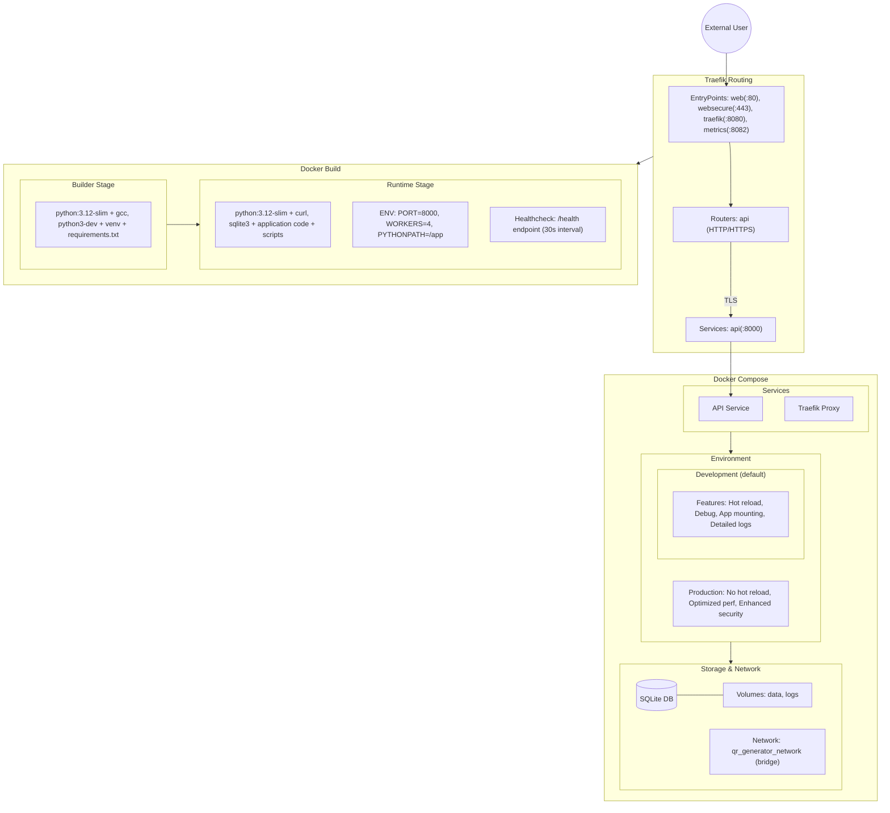

# QR Code Generator

A robust QR code generation and management API built with FastAPI and SQLite, featuring both static and dynamic QR codes with redirect URL support, scan tracking, and Microsoft Azure AD authentication.

## Features

- **Static QR Codes**: Generate permanent QR codes with customizable appearance
- **Dynamic QR Codes**: Create scannable codes with updatable redirect URLs
- **Scan Tracking**: Monitor usage with scan count and timestamp tracking
- **Microsoft Azure AD Authentication**: Secure your QR codes with Single Sign-On (SSO)
- **User-Associated QR Codes**: Track which user created each QR code
- **Docker & Traefik Integration**: Production-ready deployment with HTTPS support
- **SQLite Optimization**: WAL mode, connection pooling, and performance tuning
- **Comprehensive API**: Well-documented endpoints with proper validation and error handling

## Quick Start

To run the QR Code Generator locally using Docker Compose:

1. Ensure Docker and Docker Compose are installed
2. Clone the repository
3. Configure Azure AD credentials (see Authentication Setup below)
4. Run: `docker-compose up --build`

The application will be available at:
- Web interface: `https://localhost/`
- API documentation: `https://localhost/docs`
- API base URL: `https://localhost/api/v1`
- Traefik dashboard: `http://localhost:8080/`
- Prometheus metrics: `http://localhost:8082/metrics`

### Docker Container Configuration

The application runs in a multi-container environment:

| Container | Purpose | Ports |
|-----------|---------|-------|
| `qr_generator_api` | FastAPI application | 8000 (internal) |
| `qr_generator_traefik` | Reverse proxy, TLS termination | 80, 443, 8080, 8082 |

All containers run in an isolated `qr_generator_network` for security.

## Authentication Setup

The application uses Microsoft Azure AD for authentication. To set it up:

1. **Create an Azure AD Application**:
   - Go to the [Azure Portal](https://portal.azure.com)
   - Navigate to "Azure Active Directory" > "App registrations"
   - Create a new registration
   - Set the redirect URI to match your deployment (e.g., `https://localhost/auth/callback`)
   - Note the Application (client) ID and create a client secret

2. **Configure Environment Variables**:
   Add the following to your environment or docker-compose.yml:
   ```yaml
   environment:
     - AZURE_CLIENT_ID=your-client-id
     - AZURE_CLIENT_SECRET=your-client-secret
     - AZURE_TENANT_ID=your-tenant-id
     - REDIRECT_URI=https://localhost/auth/callback
     - SECRET_KEY=your-secure-secret-key
   ```

3. **Authentication Endpoints**:
   - `/auth/login`: Redirects to Microsoft login page
   - `/auth/callback`: Processes OAuth response
   - `/auth/logout`: Clears authentication state
   - `/auth/me`: Returns current user information (protected)

## Infrastructure Architecture

The application follows a layered architecture with Docker containerization and Traefik for routing:



## API Documentation

### API Endpoints

#### Authentication

- **GET /auth/login**: Redirects to Microsoft login page
- **GET /auth/callback**: Processes OAuth response from Microsoft
- **GET /auth/logout**: Clears authentication state
- **GET /auth/me**: Returns current user information (protected)

#### QR Code Management

- **GET /api/v1/qr**: List QR codes with pagination and filtering
- **GET /api/v1/qr/{qr_id}**: Get QR code details by ID
- **GET /api/v1/qr/{qr_id}/image**: Get QR code image by ID
- **PUT /api/v1/qr/{qr_id}**: Update QR code (redirect URL for dynamic codes)
- **DELETE /api/v1/qr/{qr_id}**: Delete QR code by ID

#### Dynamic QR Codes

- **POST /api/v1/qr/dynamic**: Create a new dynamic QR code
- **PUT /api/v1/qr/dynamic/{qr_id}**: Update dynamic QR code redirect URL

#### Static QR Codes

- **POST /api/v1/qr/static**: Create a new static QR code

#### Redirects

- **GET /r/{short_id}**: Redirect endpoint for dynamic QR codes

#### Health Check

- **GET /health**: System health check with detailed metrics

## Configuration

The application can be configured via environment variables and configuration files:

### Docker Environment Configuration

The Docker environment is configured through the `docker-compose.yml` file. Key configuration options include:

```yaml
services:
  api:
    environment:
      - DATABASE_URL=sqlite:////app/data/qr_codes.db
      - ENVIRONMENT=${ENVIRONMENT:-development} # switch to production for deployment
      - AZURE_CLIENT_ID=your-client-id
      - AZURE_CLIENT_SECRET=your-client-secret
      - AZURE_TENANT_ID=your-tenant-id
      - REDIRECT_URI=https://localhost/auth/callback
      - SECRET_KEY=your-secure-secret-key
    volumes:
      - ./data:/app/data  # Database persistence
      - ./logs:/logs      # Log persistence
      - ./app:/app/app    # Mount app directory for hot reloading (dev only)
    healthcheck:
      test: ["CMD", "curl", "-f", "http://localhost:8000/docs"]
      interval: 30s
      timeout: 10s
      retries: 3
```

For production deployment, modify the `docker-compose.yml` file to remove the app volume mount and set `ENVIRONMENT=production`.

### Environment Variables

#### General Configuration
- **`DATABASE_URL`**: Database connection string (default: `sqlite:///./data/qr_codes.db`)
- **`ENVIRONMENT`**: `development` or `production` (default: `development`)
- **`DEBUG`**: Enable debug mode (default: `False`)
- **`TRUSTED_HOSTS`**: List of trusted hosts (default: `["*"]`)
- **`CORS_ORIGINS`**: List of allowed CORS origins (default: `["*"]`)
- **`ENABLE_GZIP`**: Enable GZip compression (default: `True`)
- **`ENABLE_METRICS`**: Enable metrics endpoint (default: `True`)
- **`ENABLE_LOGGING`**: Enable request logging (default: `True`)

#### Authentication Configuration
- **`AZURE_CLIENT_ID`**: Microsoft application client ID
- **`AZURE_CLIENT_SECRET`**: Microsoft application client secret
- **`AZURE_TENANT_ID`**: Microsoft tenant ID (default: "common")
- **`REDIRECT_URI`**: Callback URL (e.g., "https://localhost/auth/callback")
- **`SECRET_KEY`**: JWT signing key (must be secure in production)
- **`SESSION_COOKIE_NAME`**: Name of the cookie storing the session token (default: "auth_token")
- **`SESSION_COOKIE_SECURE`**: Whether to use secure cookies (default: True in production)
- **`SESSION_COOKIE_HTTPONLY`**: Whether cookies are HTTP-only (default: True)
- **`SESSION_COOKIE_SAMESITE`**: SameSite cookie policy (default: "lax")
- **`SESSION_COOKIE_MAX_AGE`**: Cookie expiration in seconds (default: 3600)

### Directory Structure

- **`data/`**: Contains SQLite database and backups
- **`logs/`**: Container logs for API, database, and Traefik
- **`certificates/`**: TLS certificates for secure connections

## Security Architecture

The application implements a comprehensive security architecture:

1. **Microsoft Azure AD Authentication**: Secure user authentication with SSO
2. **JWT Token Management**: Secure token generation and validation
3. **Docker Network Isolation**: Services run in an isolated network with Traefik controlling external access
4. **CORS Configuration**: Properly configured to restrict access in production
5. **Security Headers**: Comprehensive set of security headers to prevent common attacks
6. **Database Operations**: Atomic updates and proper transaction management
7. **TLS Encryption**: HTTPS with proper certificate handling through Traefik

## Development and Testing

### Setting Up Development Environment

1. Clone the repository
2. Create a virtual environment: `python -m venv venv`
3. Activate the virtual environment and install dependencies: `pip install -r requirements.txt`
4. Run tests: `pytest`

### Docker Development Environment

The application is fully containerized and can be developed and tested entirely within Docker:

#### Running the Application with Docker

```bash
# Build and start all services
docker-compose up --build

# Start in detached mode
docker-compose up -d

# View logs
docker-compose logs -f

# Stop all services
docker-compose down
```

#### Running Tests through Docker

The application includes a test environment configuration that uses an in-memory SQLite database:

```bash
# Run all tests with coverage
docker-compose exec api pytest --cov -v

# Run specific test modules
docker-compose exec api pytest app/tests/test_qr_service.py -v

# Run tests with specific markers
docker-compose exec api pytest -m "integration" -v

# Generate HTML coverage report
docker-compose exec api pytest --cov --cov-report=html -v
```

#### Testing Authentication Flow

You can use the included test script to verify the authentication flow:

```bash
# Run authentication test script
docker-compose exec api /app/scripts/test_auth_flow.sh
```

#### Executing Database Management Scripts

```bash
# Initialize a fresh database
docker-compose exec api /app/scripts/manage_db.py --init

# Run database migrations
docker-compose exec api /app/scripts/manage_db.py --migrate

# Validate database structure
docker-compose exec api /app/scripts/manage_db.py --validate
```

#### Testing the API Endpoints

You can use the included test script to verify API endpoints:

```bash
# Run API test script
docker-compose exec api /app/scripts/test_api_script.sh
```

### SQLite Production Tasks

To-do:

- **Implement Named Volumes**: Replace bind mounts with named volumes in docker-compose.yml
- **Configure WAL Mode**: Enable Write-Ahead Logging for better concurrency
- **Add Connection Pooling**: Optimize connection management
- **Implement Backup Strategy**: Set up daily backups with rotation
- **Add Database Integrity Checks**: Regular validation of database health

## Troubleshooting Authentication

If you encounter issues with authentication:

1. **Redirect URI Mismatch**: Ensure the redirect URI in Azure AD matches exactly what's configured in your application
2. **Environment Variables**: Verify all required authentication environment variables are set correctly
3. **HTTPS Configuration**: For local development, ensure `allow_insecure_http=True` is set if using HTTP
4. **Logs**: Check the application logs for authentication-related errors
5. **Token Validation**: Verify the JWT token is being properly validated

## License

[MIT License](LICENSE)