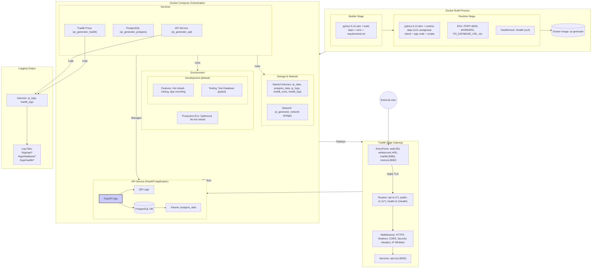

# QR Code Generator

A robust QR code generation and management API built with FastAPI and PostgreSQL. Features include static/dynamic QR codes, scan tracking, customizable appearance, and network-level security through Traefik.

## Features

-   **Static & Dynamic QR Codes**: Generate permanent codes or codes with updatable redirect URLs.
-   **Customization**: Control QR code colors, size, and border.
-   **Scan Tracking**: Monitor dynamic QR code usage with scan counts and timestamps.
-   **Edge Security Model**:
    -   **Network-level Access Control**: IP allowlisting for administrative functionality via Traefik
    -   **Path-based Protection**: Only `/r/{short_id}` endpoints exposed on public domains
    -   **Basic Authentication**: Dashboard access protected by username/password
-   **Web Interface**: Manage QR codes through an intuitive web UI built with Jinja2 templates and Bootstrap.
-   **RESTful API**: Comprehensive API for programmatic QR code management.
-   **Docker & Traefik**: Production-ready deployment with HTTPS support, reverse proxying, and load balancing capabilities provided by Traefik.
-   **PostgreSQL Database**: Robust relational database for improved concurrency and data integrity.
-   **Database Migrations**: Managed with Alembic.
-   **Optimized First-Request Performance**: Uses FastAPI's lifespan context manager to pre-initialize critical code paths, eliminating cold-start delays for QR redirects and API endpoints.

## Quick Start

To run the QR Code Generator locally using Docker Compose:

1.  **Prerequisites**: Docker and Docker Compose installed.
2.  **Clone**: Clone this repository.
3.  **Configure**: Create a `.env` file or set environment variables directly in `docker-compose.yml`.
4.  **Run**:
    ```bash
    docker-compose up --build -d
    ```

**Access Points:**

-   **Web Interface**: `https://localhost/` (e.g., `/`, `/qr-list`, `/qr-create`)
    -   Requires basic authentication for dashboard access
-   **API Docs**: `https://localhost/docs`
-   **API Base URL**: `https://localhost/api/v1`
-   **Traefik Dashboard**: `http://localhost:8080/`
-   **Prometheus Metrics**: `http://localhost:8082/metrics`

### Docker Container Configuration

| Container              | Purpose                                        | Ports Exposed (Host) | Internal Port | Network                  | Volumes Used                                                    |
| :--------------------- | :--------------------------------------------- | :------------------- | :------------ | :----------------------- | :-------------------------------------------------------------- |
| `qr_generator_api`     | FastAPI Application + Web UI                   | (via Traefik)        | 8000          | `qr_generator_network` | `qr_data`, `qr_logs`, `./app` (dev only)                        |
| `qr_generator_postgres`| PostgreSQL Database                            | (internal only)      | 5432          | `qr_generator_network` | `postgres_data`                                                 |
| `qr_generator_traefik` | Reverse Proxy, TLS, Routing, Security         | 80, 443, 8080, 8082  | N/A           | `qr_generator_network` | `docker.sock`, `traefik_certs`, `traefik_logs`                |

## Security Setup

The application uses a simplified security model based on network-level controls:

### Edge Gateway Security Model

1. **Network-level Protection**: 
   - IP allowlisting for administrative endpoints
   - Path-based routing restrictions (only `/r/{short_id}` accessible on public domains)
   - TLS termination at the edge

2. **Basic Authentication**:
   - Dashboard access protected with username/password authentication
   - Credentials managed via Traefik's basicAuth middleware
   - Layered security approach (IP whitelisting + basic authentication)

3. **Environment Variables**:
   ```dotenv
   # Basic configuration
   BASE_URL=https://10.1.6.12
   ```

4. **No Complex Authentication System**:
   - Administrative endpoints are protected via network-level controls and basic authentication
   - No complex user management or JWT/OAuth required
   - Simplified deployment and maintenance

## Infrastructure Architecture

The system uses Docker containers orchestrated by Docker Compose, with Traefik acting as the edge router and reverse proxy.



## API Documentation

The API provides endpoints for managing QR codes. Access the interactive documentation (Swagger UI) via `/docs`.

### Key Endpoints

-   **QR Management (`/api/v1/qr`)**: List, get details, get image, update, delete QR codes.
-   **Static QR Creation (`/api/v1/qr/static`)**: `POST` to create static QR codes.
-   **Dynamic QR Creation/Update (`/api/v1/qr/dynamic`)**: `POST` to create, `PUT` to update dynamic QR codes.
-   **QR Redirects (`/r/{short_id}`)**: Endpoint hit when a dynamic QR code is scanned.
-   **Health Check (`/health`)**: Monitors application and database status.

## Application Performance

The application is optimized for consistent performance, especially for critical QR redirect operations:

### First-Request Performance Optimization

- **FastAPI Lifespan Initialization**: Uses FastAPI's lifespan context manager to pre-initialize key dependencies and warm up critical code paths during application startup.
- **Optimized Cold-Start**: No performance penalty for first requests after application startup, with redirect endpoints showing excellent cold/warm request time ratios (0.96x).
- **Background Tasks**: Scan tracking statistics are processed asynchronously to avoid impacting redirect response times.
- **Performance Metrics**:
  - QR redirect response times average ~0.017 seconds
  - Health check response times average ~0.017 seconds
  - First-request/warm-request ratio averages 1.16x across all endpoints

### Performance Testing

The application includes automated performance testing tools in `app/scripts/performance_test.sh` to measure and verify the effectiveness of initialization optimizations.

## Configuration

Settings are managed via environment variables (loaded by `app/core/config.py`) and Traefik configuration files (`traefik.yml`, `dynamic_conf.yml`) or Docker labels.

### Environment Variables

Key variables include:

-   `PG_DATABASE_URL`: Connection string for the PostgreSQL database.
-   `ENVIRONMENT`: Set to `production` or `development`.
-   `BASE_URL`: The public base URL of the application (used for generating dynamic QR content).
-   `LOG_LEVEL`: Logging level (e.g., `INFO`, `DEBUG`).
-   `TRUSTED_HOSTS`, `CORS_ORIGINS`: Security settings for allowed hosts and origins.

### Directory Structure

-   **`app/`**: Main FastAPI application code.
    -   `core/`: Configuration and base exceptions.
    -   `database.py`: SQLAlchemy setup, session management, Base model.
    -   `middleware/`: Custom middleware (Logging, Metrics, Security).
    -   `models/`: SQLAlchemy models (`qr.py`).
    -   `routers/`: API and web page route definitions.
    -   `schemas/`: Pydantic models for validation.
    -   `services/`: Business logic (e.g., `qr_service.py`).
    -   `static/`: CSS, JavaScript files.
    -   `templates/`: Jinja2 HTML templates.
    -   `tests/`: Pytest tests, fixtures, factories.
    -   `scripts/`: Utility scripts (`init.sh`, `manage_db.py`).
-   **`alembic/`**: Database migration scripts.
-   **`data/`**: Persistent storage (via `qr_data` volume).
-   **`logs/`**: Log file storage (via `qr_logs`, `traefik_logs` volumes).
-   **`certs/`**: TLS certificates for Traefik.
-   `Dockerfile`: Defines the application's Docker image build process.
-   `docker-compose.yml`: Defines the multi-container setup.
-   `traefik.yml`, `dynamic_conf.yml`: Traefik static and dynamic configuration.
-   `alembic.ini`: Alembic configuration file.
-   `requirements.txt`: Python dependencies.

## Security Architecture

-   **Edge Security (Traefik)**: 
    -   TLS termination and HTTPS enforcement
    -   IP-based access control for administrative endpoints
    -   Path-based routing to restrict public access to only `/r/{short_id}` paths
    -   Security headers (HSTS, Content-Security-Policy, etc.)
    -   Rate limiting for public endpoints
    -   Basic authentication for dashboard access

-   **Application Security:**
    -   Input validation through Pydantic models
    -   Parameter sanitization
    -   CSRF protection for web forms
    -   Database query parameterization via SQLAlchemy ORM
    -   Network isolation through Docker configuration

## Development and Testing

### Local Development without Docker

1.  Set up a Python virtual environment (`python -m venv venv`).
2.  Install requirements: `pip install -r requirements.txt`.
3.  Set required environment variables (PG_DATABASE_URL, etc.).
4.  Initialize/Migrate database: `python app/scripts/manage_db.py --migrate`.
5.  Run the development server: `uvicorn app.main:app --reload`.

### Testing with Docker

Use Docker Compose for an integrated testing environment:

```bash
# Run all tests with coverage reports
docker-compose exec api pytest --cov=app --cov-report=term-missing -v

# Run tests in a specific file
docker-compose exec api pytest app/tests/test_api_v1.py -v
```

Tests utilize a dedicated test database managed by `conftest.py`, ensuring isolation.

### Database Management

Use the provided scripts via Docker:

```bash
# Check if migrations are needed
docker-compose exec api python app/scripts/manage_db.py --check

# Apply pending migrations
docker-compose exec api python app/scripts/manage_db.py --migrate

# Validate database integrity and structure
docker-compose exec api python app/scripts/manage_db.py --validate
```

The `init.sh` script automatically handles validation and migration checks on container startup.

## Troubleshooting

-   **Database Errors**: Check API logs and potentially run `docker-compose exec api python app/scripts/manage_db.py --validate`.
-   **Connectivity**: Ensure containers are on the same `qr_generator_network`. Use `docker network inspect qr_generator_network`.
-   **Traefik Issues**: Check Traefik logs (`docker-compose logs traefik`) or the Traefik dashboard for routing or middleware errors.
-   **QR Redirect Issues**: Check for valid short_id and updated redirect URL in the database.
-   **PostgreSQL Issues**: Verify PostgreSQL container is running and healthy with `docker ps` and `docker-compose logs postgres`.
-   **Authentication Issues**: Verify that `users.htpasswd` is correctly mounted in the Traefik container and has appropriate permissions (600). Check that the middleware is correctly configured in `dynamic_conf.yml`.

## License

This project is licensed under the MIT License - see the LICENSE file for details (if applicable).