# QR Code Generator & Management Platform

A production-grade QR code generation and management platform built with FastAPI and PostgreSQL. This system features a service-oriented architecture, advanced QR customization, detailed scan analytics, and a comprehensive security model enforced by Traefik. It is fully instrumented with an **Observatory-First** monitoring stack, including a suite of 10 specialized Grafana dashboards for unparalleled system visibility.

## Features

-   **Service-Oriented Architecture**: Decoupled services for creation, retrieval, updates, imaging, and scan processing ensure maintainability and scalability.
-   **Static & Dynamic QR Codes**: Generate permanent codes or codes with updatable redirect URLs.
-   **Advanced Customization**:
    -   Control QR colors, size (relative and physical units like inches/cm), border, and DPI for print.
    -   Embed a central logo with automatic error correction adjustments.
    -   Generate images in multiple formats (PNG, JPEG, SVG, WebP).
-   **Enhanced Scan Tracking & Analytics**:
    -   Detailed logging of every scan, differentiating between genuine QR scans and direct URL access.
    -   User-agent analysis provides insights into device types, operating systems, and browsers.
    -   Interactive analytics dashboard with time-series charts and filterable data.
-   **Observatory-First Monitoring**:
    -   **7 Streamlined Grafana Dashboards**: A role-specific suite for monitoring system health, performance, user experience, database, infrastructure, and business KPIs with enhanced linking and standardization.
    -   **Full-Stack Observability**: Real-time metrics via Prometheus, structured logging via Loki, and visualization via Grafana.
    -   **Enhanced Navigation**: Dashboard linking and standardized design patterns for improved troubleshooting workflows.
    -   **Data-Driven Refactoring**: Custom metrics and circuit breaker monitoring to safely roll out new features.
-   **Production-Ready Infrastructure**:
    -   **Docker & Traefik**: Deployed via Docker Compose with Traefik as a secure edge gateway.
    -   **OIDC Authentication**: Integrated with Keycloak and Azure AD for secure user access to the HCCC portal.
    -   **Robust Operations**: Includes production-safe scripts for backup, restore, and rollback.
-   **Modern Web Interface**: A dynamic UI built with Jinja2, HTMX, and Alpine.js for a responsive user experience.

## Documentation

-   **[GitHub Wiki](https://github.com/gsinghjay/mvp_qr_gen/wiki)**: The central hub for all public documentation.
-   **[System Architecture Guide](https://github.com/gsinghjay/mvp_qr_gen/wiki/System-Architecture)**: In-depth technical overview.
-   **[Network Infrastructure Guide](https://github.com/gsinghjay/mvp_qr_gen/wiki/Network-Infrastructure-Guide)**: Detailed domain and security strategy.
-   **[Observatory & Grafana Guide](https://github.com/gsinghjay/mvp_qr_gen/wiki/Observatory-Overview)**: A tour of the 10 monitoring dashboards.
-   **[Backup & Recovery Guide](BACKUP-RESTORE.md)**: Detailed procedures for data safety.
-   **API Docs**: Interactive Swagger UI at `/api/v1/docs` (when accessed via internal admin host).

## Quick Start

1.  **Prerequisites**: Docker and Docker Compose installed.
2.  **Clone Repository**: `git clone https://github.com/gsinghjay/mvp_qr_gen.git`
3.  **Configure**: Create a `.env` file from `.env.example` and set your credentials.
4.  **Run**:
    ```bash
    docker-compose up --build -d
    ```

**Access Points:**

| Service | URL | Authentication |
| :--- | :--- | :--- |
| **HCCC Portal** | `https://web.hccc.edu/` | OIDC (Azure AD) |
| **QR Redirects** | `https://web.hccc.edu/r/{short_id}` | Public |
| **Admin Dashboard** | `https://webhost.hccc.edu/` | Basic Auth + IP Whitelist |
| **Grafana Monitoring**| `https://webhost.hccc.edu/grafana/` | Basic Auth + IP Whitelist |
| **Prometheus** | `https://webhost.hccc.edu/prometheus/` | Basic Auth + IP Whitelist |
| **Traefik Dashboard** | `http://localhost:8080/` | Local Access |

### Docker Container Configuration

| Container | Purpose | Ports Exposed (Host) |
| :--- | :--- | :--- |
| `qr_generator_api` | FastAPI App, Web UI, HCCC Portal | (via Traefik) |
| `qr_generator_postgres`| Primary PostgreSQL Database | (internal) |
| `qr_generator_traefik`| Edge Gateway, TLS, Routing, Security| 80, 443, 8082 |
| `qr_generator_prometheus`| Metrics Collection & Storage | (via Traefik) |
| `qr_generator_grafana`| Monitoring Dashboards & Visualization | 3000, (via Traefik) |
| `qr_generator_loki`| Log Aggregation & Analysis | (via Traefik) |
| `keycloak_service` | OIDC Identity Broker | 8180, (via Traefik)|
| `oauth2-proxy-qr-dashboard`| Authentication Proxy | 4180, (via Traefik)|

## System Architecture

The system employs a service-oriented architecture orchestrated by Docker Compose, with Traefik as the secure edge gateway.

```mermaid
flowchart TD
    subgraph "External World"
        USER((👥 Users / Admins))
    end

    subgraph "Traefik Edge Gateway (TLS, Auth, Routing)"
        direction LR
        PUBLIC_ROUTER["🌐 Public Routers<br>(web.hccc.edu)"]
        AUTH_ROUTER["🔐 Auth Routers<br>(auth.hccc.edu)"]
        ADMIN_ROUTER["🛠️ Admin Routers<br>(webhost.hccc.edu)"]
    end

    subgraph "Docker Service Mesh (qr_generator_network)"
        direction LR
        subgraph "Authentication Services"
            OAUTH2["OAuth2-Proxy"]
            KEYCLOAK["Keycloak"]
        end
        subgraph "Application Services"
            API_SVC["FastAPI App<br>(Atomic Services)"]
            DB[("PostgreSQL DB")]
            API_SVC --> DB
        end
        subgraph "Observatory Stack"
            PROMETHEUS["Prometheus"]
            GRAFANA["Grafana"]
            LOKI["Loki"]
        end
    end

    USER --> PUBLIC_ROUTER
    USER --> AUTH_ROUTER
    USER --> ADMIN_ROUTER

    PUBLIC_ROUTER --> API_SVC
    PUBLIC_ROUTER --> OAUTH2
    AUTH_ROUTER --> KEYCLOAK
    ADMIN_ROUTER --> API_SVC
    ADMIN_ROUTER --> GRAFANA
    ADMIN_ROUTER --> PROMETHEUS

    OAUTH2 --> KEYCLOAK
    KEYCLOAK --> DB
```



## Internal Application Architecture

The FastAPI application is structured into decoupled, single-responsibility services that promote testability and maintainability.


## Authentication & Authorization

The system uses a robust OIDC flow with Keycloak as an identity broker for Azure AD, secured by Traefik and OAuth2-Proxy.


## Database Evolution

The database schema has evolved to support new features, tracked by Alembic.


## Operational Management

### Database Management
Use the `manage_db.py` script for database operations. It automatically handles backups and validations.

```bash
# Check if migrations are needed
docker-compose exec api python app/scripts/manage_db.py --check

# Apply pending migrations
docker-compose exec api python app/scripts/manage_db.py --migrate
```

### Production Backup & Restore
Production-safe scripts are provided to manage the API service lifecycle during operations.

```bash
# Create a production-safe backup
bash scripts/production_backup.sh

# Restore from a backup (stops/starts API service safely)
bash scripts/safe_restore.sh qrdb_YYYYMMDD_HHMMSS.sql
```

### System & API Testing
The project includes a comprehensive smoke test and performance test suite.

```bash
# Run a full smoke test validating critical paths and error conditions
bash scripts/enhanced_smoke_test.sh

# Run a performance test measuring cold vs. warm request times
bash app/scripts/performance_test.sh
```

## Development

Set up a local environment for development and testing.

1.  **Create venv**: `python3 -m venv venv && source venv/bin/activate`
2.  **Install Deps**: `pip install -r requirements.txt`
3.  **Set Environment**: Copy `.env.example` to `.env` and configure.
4.  **Run Migrations**: `docker-compose exec api python app/scripts/manage_db.py --migrate`
5.  **Run Dev Server**: `uvicorn app.main:app --reload`
