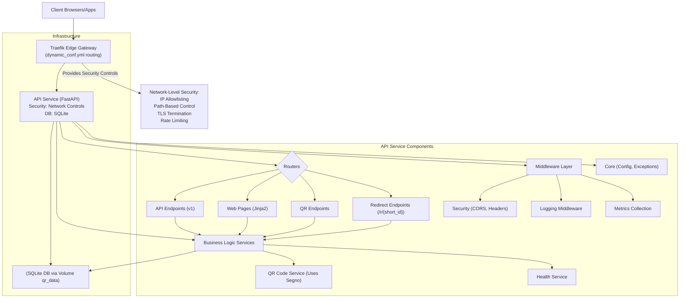
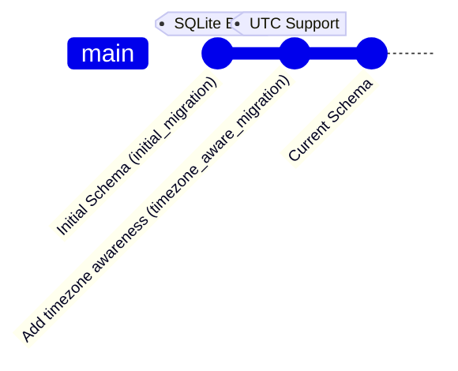
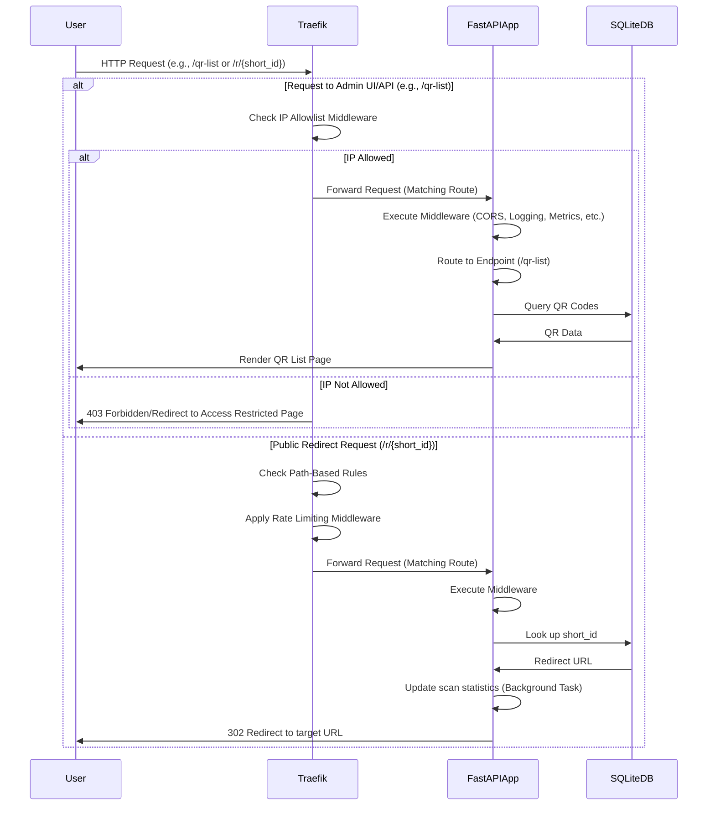

Currently, the application uses a simplified edge security model through Traefik for protection, with no user authentication required. The primary application data (QR codes, etc.) is stored in an **SQLite database**. We are actively working on enhancing QR code customization using the **Segno** library and improving overall code modularity and maintainability following FastAPI best practices.

## System Architecture Overview (Current State)

## Database Evolution

Our application's main data store is currently an **SQLite database**, managed using SQLAlchemy ORM and Alembic migrations.

-   **`initial_migration`**: Established the core `qr_codes` table structure.
-   **`timezone_aware_migration`**: Updated timestamp columns to be timezone-aware (UTC) and set stricter defaults.

## Request Flow Through The System (Current State)

## Core Components Explained

### Configuration Management (`app/core/config.py`)

Uses Pydantic `BaseSettings` loading from environment variables/`.env`. Defines settings for the **SQLite** database (`DATABASE_URL`), environment mode, CORS, trusted hosts, and security settings. The security model is simplified, relying on Traefik for network-level access control rather than authentication.

### Middleware Stack (`app/main.py`, `app/middleware/`)

Requests pass through: GZip, Trusted Hosts, CORS, Security Headers, Prometheus Metrics (`MetricsMiddleware`), Structured Logging (`LoggingMiddleware`). Security is primarily handled at the Traefik level through IP allowlisting and path-based routing rules.

### Security Model (`traefik.yml`, `dynamic_conf.yml`)

- **Edge Gateway Pattern**: Traefik acts as the security boundary for the application
- **Network-level Access Control**: IP allowlists restrict administrative access to trusted networks
- **Path-based Routing**: Public access is limited to QR redirect endpoints (`/r/{short_id}`)
- **TLS Termination**: All traffic is encrypted with HTTPS
- **Security Headers**: Implemented through Traefik middleware
- **Rate Limiting**: Applied to public endpoints to prevent abuse

### QR Code Generation System (`app/services/qr_service.py`, `app/models/qr.py`, `app/routers/qr/`)

-   **Core Logic**: `QRCodeService` handles QR operations.
-   **Database Model**: `QRCode` model (SQLAlchemy) stored in **SQLite**. Uses custom `UTCDateTime`.
-   **Generation Library**: Uses **Segno** for core QR generation, combined with **Pillow** for raster image manipulation (resizing, logo embedding).
-   **Types**: `static` and `dynamic`. Dynamic codes use a short URL (`/r/{short_id}`) stored in `content` and redirect to `redirect_url`.
-   **Redirects**: `/r/{short_id}` endpoint (`app/routers/qr/redirect.py`) handles redirection and triggers background tasks for scan statistics updates.
-   **API**: Endpoints for creating static/dynamic codes, listing, details, image generation (PNG, SVG, JPEG, WEBP), updating, and deleting.
-   **(Planned Work):** Enhance image generation:
    *   Add API parameters for `module_style` (square, dots, rounded) primarily affecting SVG output.
    *   Add API parameter for `quality` control for JPEG/WEBP.
    *   Refine SVG export using Segno's more advanced features.

### API Structure (`app/routers/`)

-   Routing is organized using FastAPI `APIRouter`. Key prefixes include:
    -   `/api/v1/qr`: Main QR operations.
    -   `/r`: Dynamic QR redirects.
    -   `/health`: Health checks.
    -   `/` (and others): Web page rendering.
-   **(Planned Work):** Review QR routers (`static.py`, `dynamic.py`) for potential code duplication and abstraction opportunities.

## Deployment and CI/CD

-   Deployed via Docker Compose (`docker-compose.yml`).
-   `init.sh` script manages database initialization/migration on container start.
-   CI/CD (e.g., GitHub Actions for Semantic Release) is partially configured. Testing (`pytest`) is executed within the Docker environment.

## Database Management

-   **Primary DB**: SQLite (`qr_codes.db`).
-   **Migrations**: Alembic (`alembic/`, `alembic.ini`).
-   **Management Scripts**: `manage_db.py` (init, migrate, check, validate, backup) and `init.sh` (startup orchestration, backups). Backups are stored internally (`qr_data` volume) and copied externally (`./backups` host mount).

## Future Plans / Conclusion

Our application provides essential QR code generation and management, secured through network-level controls at the edge gateway. It's built on a containerized FastAPI stack with Traefik handling edge routing, security, and TLS.

**Immediate Next Steps & Planned Improvements:**

1. **Cleanup:** Remove any residual authentication-related code and configuration.
2. **Segno Enhancements:** Implement API options for QR module styling (dots, rounded) and image quality control. Improve SVG export.
3. **Code Modularity:** Actively review and refactor routers and services to reduce duplication and improve structure.
4. **Security Documentation:** Ensure all documentation accurately reflects our edge gateway security model.

This ongoing work aims to enhance maintainability, improve the QR code generation features by leveraging the full potential of Segno, and ensure adherence to best practices.