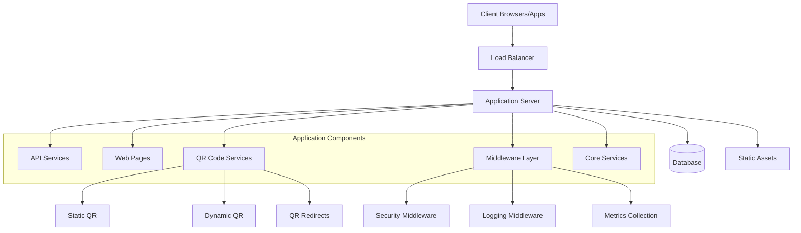
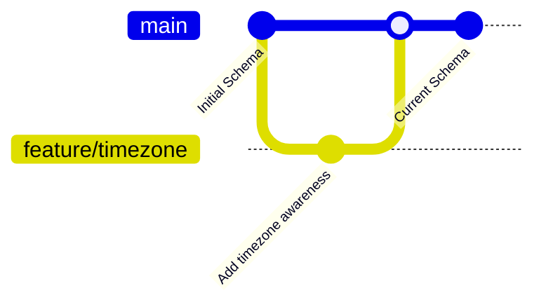
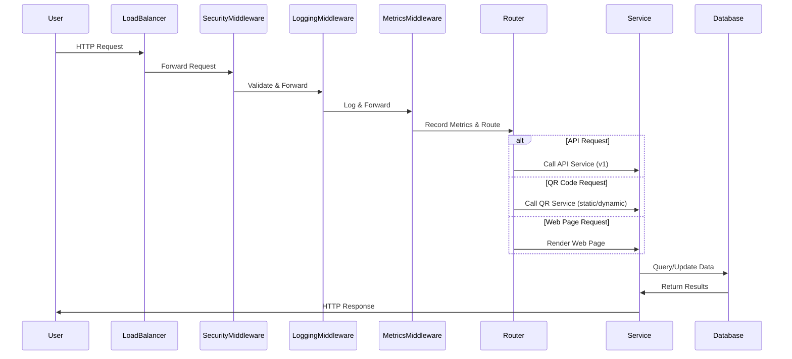
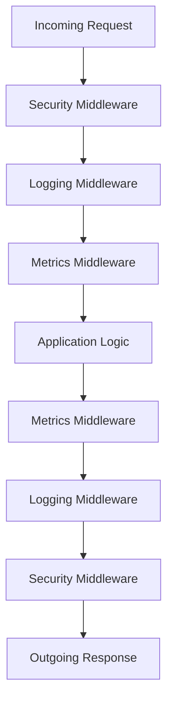
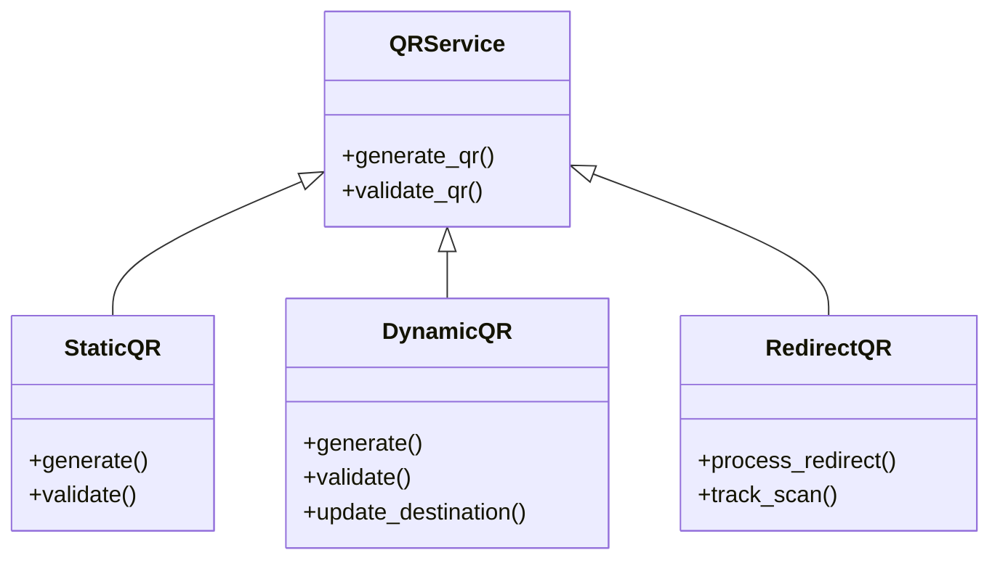
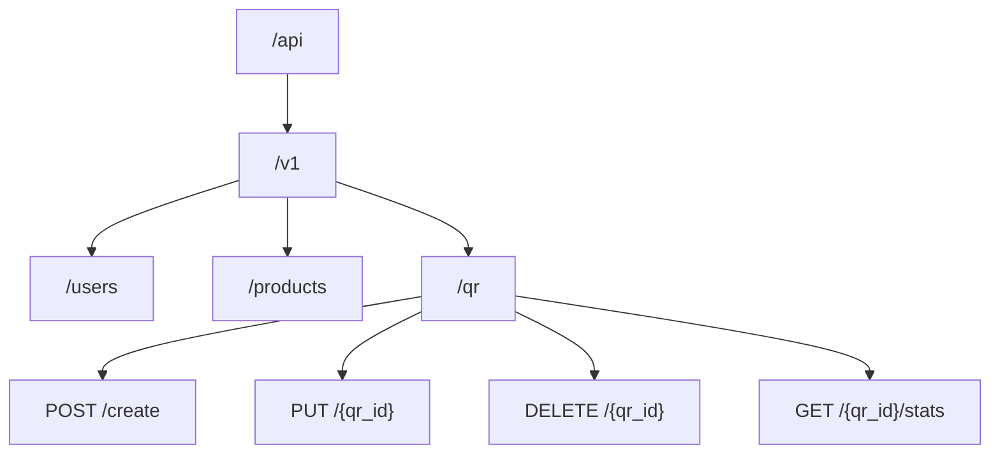
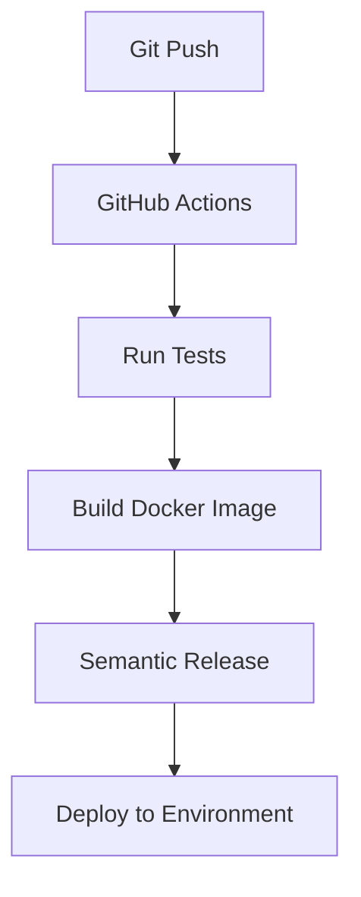
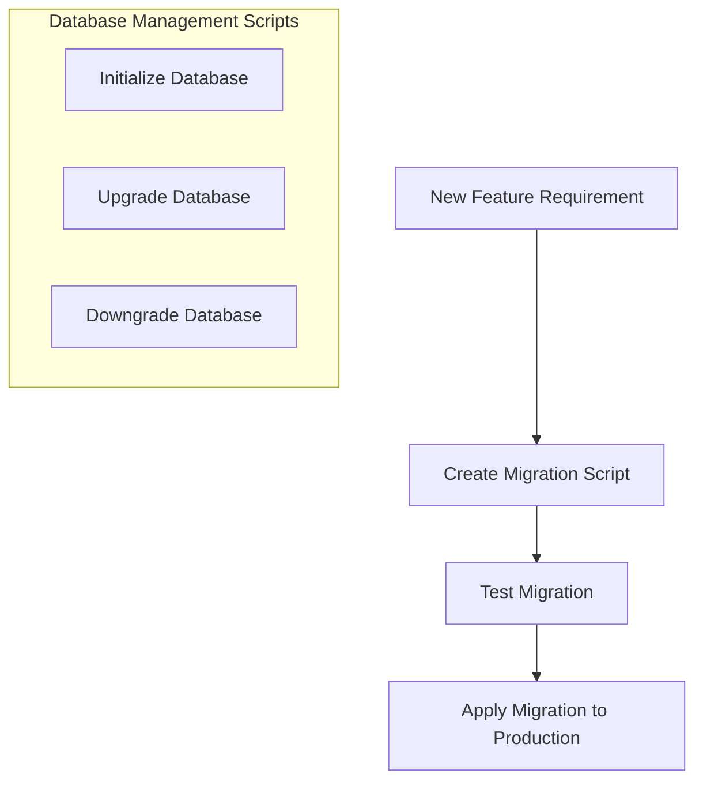

# The Tale of Our Codebase: A Journey Through the System

## Introduction

This is the story of our application - a modern web service built with FastAPI that provides both API endpoints and web interfaces, with special capabilities for QR code generation and management. Let's explore how all the pieces work together.

## System Architecture Overview

## The Database Evolution

Our application's data layer has evolved over time, as shown by our Alembic migrations:

The initial migration established our base schema, while the timezone-aware migration updated our timestamp fields to properly handle different time zones - critical for our global user base.

## Request Flow Through The System

## Core Components Explained

### Configuration Management

The core configuration system (`app/core/config.py`) provides environment-specific settings that control the behavior of all other components. It loads variables from environment or .env files and makes them available throughout the application.

### Middleware Stack

Our middleware stack:
- **Security Middleware**: Handles authentication, CORS, and protection against common attacks
- **Logging Middleware**: Records request/response details for debugging and audit trails
- **Metrics Middleware**: Collects performance data for monitoring and optimization

### QR Code Generation System

The QR code subsystem is one of our application's key features, offering:

- **Static QR Codes**: Permanent codes that point to unchangeable destinations
- **Dynamic QR Codes**: Codes whose destination can be updated without regenerating the QR code
- **QR Redirects**: Handles the redirection logic when QR codes are scanned, with analytics tracking

### API Structure

Our API follows a versioned structure to ensure backward compatibility:

## Deployment and CI/CD

Our application uses GitHub Actions for continuous integration and deployment:

The semantic-release workflow automatically determines version numbers based on commit messages and manages the release process.

## Database Management

Database migrations are handled through Alembic, with scripts to help manage the process:

The `manage_db.py` script provides convenient commands for database operations, while `init.sh` helps with initial setup.

## Conclusion

Our application architecture demonstrates a well-structured, modern web service with clear separation of concerns:

1. **Core Configuration**: Central settings management
2. **Middleware Layer**: Cross-cutting concerns like security and logging
3. **Routers**: Request routing for different types of endpoints (API, QR, Web)
4. **Database Migrations**: Versioned database schema management
5. **CI/CD Pipeline**: Automated testing and deployment

This architecture allows us to maintain a robust, scalable system that can evolve over time while maintaining backward compatibility and high performance. 