# The Tale of Our Codebase: A Journey Through the System

## Introduction

This is the story of our application - a modern web service built with FastAPI that provides both API endpoints and web interfaces, with special capabilities for QR code generation and management, secured by Microsoft Azure AD authentication. Let's explore how all the pieces work together.

## System Architecture Overview

## The Database Evolution

Our application's data layer has evolved over time, as shown by our Alembic migrations:

The initial migration established our base schema, the timezone-aware migration updated our timestamp fields to properly handle different time zones, and the user-auth migration added fields to associate QR codes with authenticated users - critical for our global user base.

## Request Flow Through The System

## Core Components Explained

### Configuration Management

The core configuration system (`app/core/config.py`) provides environment-specific settings that control the behavior of all other components. It loads variables from environment or .env files and makes them available throughout the application, including authentication settings like Azure AD credentials and JWT token configuration.

### Middleware Stack

```mermaid
flowchart TD
    Request(("👤 Client<br>Request")) -->|"HTTP/HTTPS"| Traefik
    
    Traefik["🌐 Traefik Edge Gateway<br>• TLS Termination & Certs<br>• Request Validation<br>• Layer 7 Load Balancing<br>• IP Filtering & Rate Limiting<br>• Path-based Routing"]
    
    SecurityRow["First Layer: Perimeter Security"]
    Security["🔒 Security Middleware<br>• CORS Configuration<br>• Security Headers<br>• XSS & CSRF Protection<br>• Request Sanitization<br>• Content Security Policy"]
    Auth["🔑 Authentication Middleware<br>• JWT Token Validation<br>• Azure AD SSO Integration<br>• User Context Creation<br>• Route Protection<br>• Token Renewal & Refresh"]
    
    MonitoringRow["Second Layer: Monitoring"]
    Logging["📊 Logging Middleware<br>• Structured JSON Logging<br>• Correlation ID Tracking<br>• Error Context Capture<br>• PII Data Redaction<br>• Audit Trail Recording"]
    Metrics["📈 Metrics Middleware<br>• Request Counting<br>• Response Timing<br>• Resource Utilization<br>• QR Code Analytics<br>• Prometheus Integration"]
    
    InfraRow["Third Layer: Infrastructure"]
    Health["❤️ Health Check Middleware<br>• System Status Reporting<br>• Dependency Verification<br>• Database Connection Tests<br>• Readiness/Liveness Checks<br>• Self-diagnostics"]
    DBMid["💾 Database Middleware<br>• Connection Pool Management<br>• Transaction Orchestration<br>• Query Timing & Metrics<br>• Error Handling & Retries<br>• Schema Validation"]
    
    Router["🧠 Application Logic Layer<br>API Endpoints | QR Code Service | Web UI | Auth Service"]
    
    ResponseFlow["Response Processing"]
    ResponseProcess["Response Creation"] --> DBMidOut["Database Cleanup"] --> HealthOut["Health Check"] --> MetricsOut["Metrics Recording"] --> LoggingOut["Response Logging"] --> AuthOut["Auth Headers"] --> SecurityOut["Security Headers"]
    
    TraefikOut["Traefik Response Handler"]
    Response(("🌍 Client<br>Response"))
    
    %% Main flow connections
    Traefik --> SecurityRow
    SecurityRow --> Security
    SecurityRow --> Auth
    Security --- Auth
    
    SecurityRow --> MonitoringRow
    MonitoringRow --> Logging
    MonitoringRow --> Metrics
    Logging --- Metrics
    
    MonitoringRow --> InfraRow
    InfraRow --> Health
    InfraRow --> DBMid
    Health --- DBMid
    
    InfraRow --> Router
    Router --> ResponseFlow
    ResponseFlow --> TraefikOut
    TraefikOut --> Response
    
    %% Styling with improved text contrast
    style Request fill:#f5f5f5,stroke:#666,stroke-width:2px,color:#000000,font-weight:bold
    style Response fill:#f5f5f5,stroke:#666,stroke-width:2px,color:#000000,font-weight:bold
    
    style Traefik fill:#98f5e1,stroke:#333,stroke-width:2px,color:#000000,font-weight:bold
    style TraefikOut fill:#98f5e1,stroke:#333,stroke-width:2px,color:#000000,font-weight:bold
    
    style Security fill:#f9d5e5,stroke:#333,stroke-width:2px,color:#000000,font-weight:bold
    style SecurityOut fill:#f9d5e5,stroke:#333,stroke-width:2px,opacity:0.9,color:#000000,font-weight:bold
    
    style Auth fill:#eeac99,stroke:#333,stroke-width:2px,color:#000000,font-weight:bold
    style AuthOut fill:#eeac99,stroke:#333,stroke-width:2px,opacity:0.9,color:#000000,font-weight:bold
    
    style Logging fill:#d6e0f0,stroke:#333,stroke-width:2px,color:#000000,font-weight:bold
    style LoggingOut fill:#d6e0f0,stroke:#333,stroke-width:2px,opacity:0.9,color:#000000,font-weight:bold
    
    style Metrics fill:#cfbaf0,stroke:#333,stroke-width:2px,color:#000000,font-weight:bold
    style MetricsOut fill:#cfbaf0,stroke:#333,stroke-width:2px,opacity:0.9,color:#000000,font-weight:bold
    
    style Health fill:#90dbf4,stroke:#333,stroke-width:2px,color:#000000,font-weight:bold
    style HealthOut fill:#90dbf4,stroke:#333,stroke-width:2px,opacity:0.9,color:#000000,font-weight:bold
    
    style DBMid fill:#a3c4f3,stroke:#333,stroke-width:2px,color:#000000,font-weight:bold
    style DBMidOut fill:#a3c4f3,stroke:#333,stroke-width:2px,opacity:0.9,color:#000000,font-weight:bold
    
    style Router fill:#f8f9d7,stroke:#333,stroke-width:2px,color:#000000,font-weight:bold
    style ResponseProcess fill:#ffcfd2,stroke:#333,stroke-width:2px,color:#000000,font-weight:bold
    style ResponseFlow fill:#fdffb6,stroke:#333,stroke-width:2px,color:#000000,font-weight:bold
    
    style SecurityRow fill:#ffeee6,stroke:#333,stroke-width:1px,color:#000000,font-weight:bold
    style MonitoringRow fill:#e6f7ff,stroke:#333,stroke-width:1px,color:#000000,font-weight:bold
    style InfraRow fill:#e6fff2,stroke:#333,stroke-width:1px,color:#000000,font-weight:bold
    
    %% Edge styling for better visibility
    linkStyle default stroke:#333,stroke-width:1.5px,color:#333,font-weight:bold
```

Our middleware architecture implements a layered, top-down processing pipeline that handles requests through specialized components:

#### 1. Edge Gateway Layer: Traefik
Acts as the outermost boundary and first point of contact for incoming traffic:
- **TLS Management**: Handles HTTPS termination and certificate renewal
- **Primary Security**: Provides first line of defense against attacks
- **Load Balancing**: Distributes traffic across multiple application instances
- **Traffic Control**: Implements rate limiting and IP filtering
- **Request Routing**: Routes requests to appropriate services based on path

#### 2. FastAPI Application Stack
Organized in layered middleware groups that process requests in sequence:

##### First Layer: Perimeter Security
The initial application-level defense mechanisms:
- **Security Middleware**: Manages CORS, security headers, and protection against XSS/CSRF attacks
- **Authentication Middleware**: Validates JWT tokens, integrates with Azure AD, and manages user identity

##### Second Layer: Monitoring
Captures operational data for visibility and troubleshooting:
- **Logging Middleware**: Creates structured JSON logs with correlation IDs and error context
- **Metrics Middleware**: Tracks request counts, timing, and application-specific performance data

##### Third Layer: Infrastructure
Ensures system health and data integrity:
- **Health Check Middleware**: Reports system status and verifies external dependencies
- **Database Middleware**: Manages connections, transactions, and query performance

##### Application Logic Layer
The core business functionality:
- **API Endpoints**: RESTful service interfaces for application features
- **QR Code Service**: Handles generation and management of QR codes
- **Web UI Controllers**: Serves web interface components
- **Auth Service**: Manages authentication and user sessions

#### 3. Response Processing
Handles the return journey of data back to the client:
- Response creation from business logic
- Symmetrical processing through each middleware in reverse
- Headers, metrics, and logs added to the outgoing response
- Final processing by Traefik before delivery to the client

This top-down architecture provides:
1. Clear separation of concerns with specialized middleware components
2. Logical progression from external security to internal logic
3. Complete request lifecycle management from entry to exit
4. Consistent handling of cross-cutting concerns across all endpoints
5. Maintainable structure that can evolve with changing requirements

Each layer builds upon the processing done by previous layers, ensuring that by the time the request reaches the application logic, it has been fully validated, authenticated, and prepared for business processing.

### Authentication System

The authentication system leverages Microsoft Azure AD for secure Single Sign-On:

- **Microsoft Azure AD Integration**: Secure OAuth2 authentication flow
- **JWT Token Management**: Creation and validation of secure tokens
- **User Context**: Maintains user information throughout the request lifecycle
- **Protected Routes**: Dependency injection for securing endpoints

### QR Code Generation System

The QR code subsystem is one of our application's key features, offering:

- **Static QR Codes**: Permanent codes that point to unchangeable destinations
- **Dynamic QR Codes**: Codes whose destination can be updated without regenerating the QR code
- **QR Redirects**: Handles the redirection logic when QR codes are scanned, with analytics tracking
- **User Association**: QR codes can now be associated with the user who created them

### API Structure

Our API follows a versioned structure to ensure backward compatibility:

### Authentication Flow

The authentication system leverages industry-standard OAuth 2.0 with Azure AD:

## Deployment and CI/CD

Our application uses GitHub Actions for continuous integration and deployment:

The semantic-release workflow automatically determines version numbers based on commit messages and manages the release process.

## Database Management

Database migrations are handled through Alembic, with scripts to help manage the process:

The `manage_db.py` script provides convenient commands for database operations, while `init.sh` helps with initial setup.

## Conclusion

Our application architecture demonstrates a well-structured, modern web service with clear separation of concerns:

1. **Core Configuration**: Central settings management
2. **Authentication System**: Secure Azure AD-based Single Sign-On
3. **Middleware Layer**: Cross-cutting concerns like security, authentication, and logging
4. **Routers**: Request routing for different types of endpoints (API, QR, Web, Auth)
5. **Database Migrations**: Versioned database schema management
6. **CI/CD Pipeline**: Automated testing and deployment

This architecture allows us to maintain a robust, scalable system that can evolve over time while maintaining backward compatibility and high performance, all while ensuring secure access through enterprise-grade authentication. 