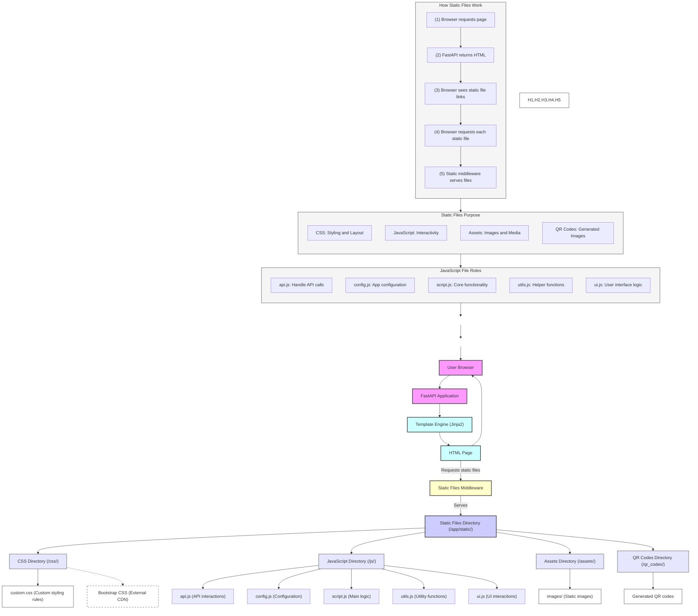

### Understanding Static Files in FastAPI

This diagram illustrates how static files work in our FastAPI application. Let's break it down for beginners:

#### What are Static Files?
Static files are files that don't change (remain "static") and are served directly to the browser. These include:
- CSS files (for styling)
- JavaScript files (for interactivity)
- Images (for visual content)
- Generated files (like QR codes in our case)

#### Directory Structure Explained
Our `/app/static/` directory contains:

1. **CSS Directory (`/css/`)**
   - `custom.css`: Our custom styling rules
   - We also use Bootstrap CSS (loaded from CDN) for consistent styling

2. **JavaScript Directory (`/js/`)**
   - `api.js`: Handles all API interactions with the backend
   - `config.js`: Contains application configuration
   - `script.js`: Main application logic
   - `utils.js`: Utility/helper functions
   - `ui.js`: User interface interactions

3. **Assets Directory (`/assets/`)**
   - `images/`: Static images used throughout the application

4. **QR Codes Directory (`/qr_codes/`)**
   - Stores generated QR code images

#### How It Works

1. **Initial Page Load**
   - User requests a page
   - FastAPI processes the request
   - Template engine (Jinja2) generates HTML
   - HTML is sent to the browser

2. **Static File Loading**
   - Browser reads HTML and finds links to static files
   - For each static file (CSS, JS, images):
     - Browser makes a new request
     - FastAPI's static middleware handles the request
     - File is served directly from the static directory

3. **File Types and Their Roles**
   - **CSS Files**: Control the appearance of the website
   - **JavaScript Files**: Add interactivity and functionality
   - **Images**: Provide visual content
   - **Generated Files**: Store dynamically created content (QR codes)

#### Best Practices
- Use `url_for('static', path='...')` in templates to link static files
- Keep files organized in appropriate subdirectories
- Use meaningful file names that indicate their purpose
- Minimize the number of static files to improve load times

This structure helps maintain a clean, organized, and efficient web application while making it easy to manage static content.