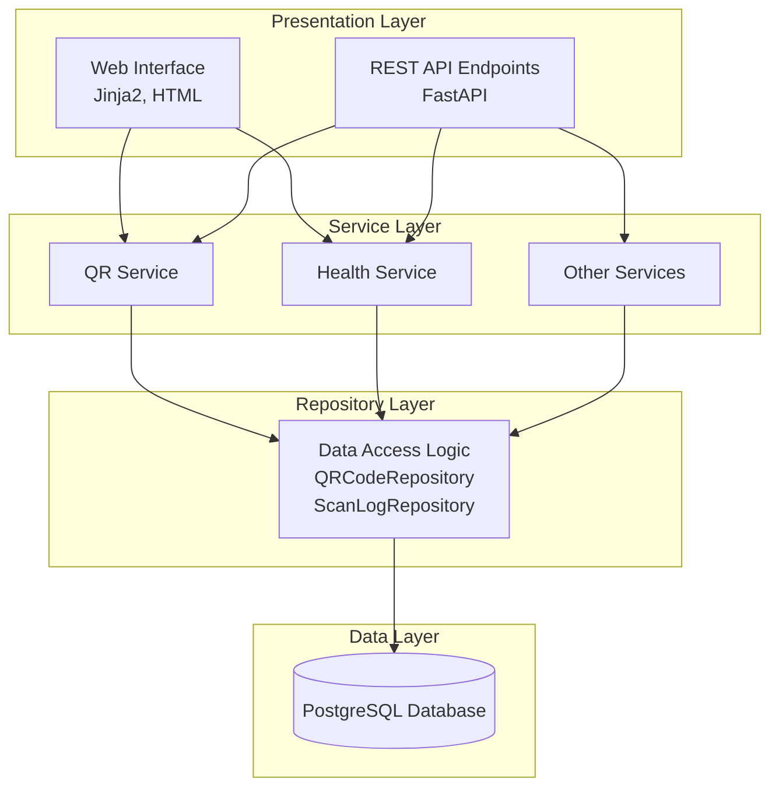
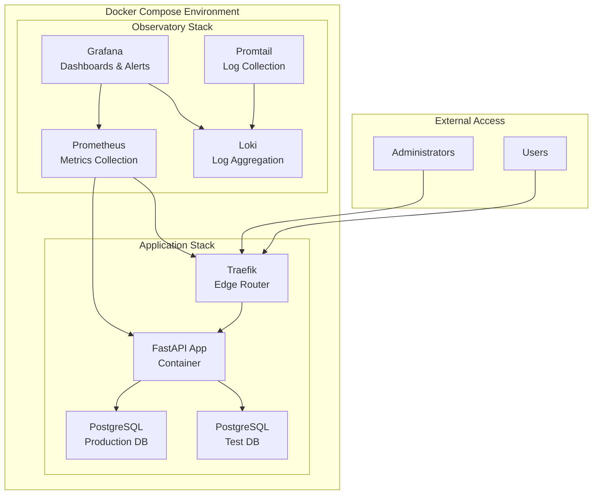
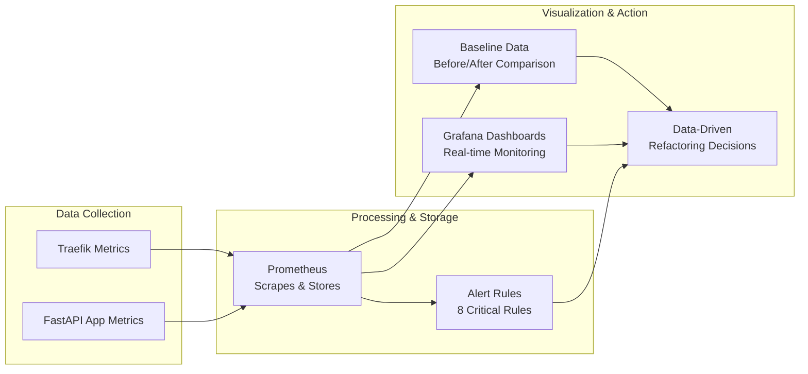

# System Patterns: QR Code Generator

## System Architecture

The QR Code Generator follows a layered architecture with clear separation of concerns:



### Infrastructure Architecture



## Key Technical Decisions

### 1. FastAPI Framework
- **Decision**: Use FastAPI as the web framework
- **Rationale**: Modern async support, automatic OpenAPI docs, type validation, dependency injection

### 2. Database Technology
- **Decision**: Use PostgreSQL as the primary database
- **Rationale**: Improved concurrency, better performance at scale, robust production features
- **Test Database**: Dedicated PostgreSQL test instance for isolation testing

### 3. Layered Architecture
- **Decision**: Clear separation between API endpoints, services, repositories, and models
- **Rationale**: Improved maintainability, testability, clear boundaries between application layers

### 4. Security Model
- **Decision**: Network-level controls rather than application-level authentication
- **Rationale**: Simplified architecture using Edge Gateway Pattern with Traefik as security boundary
- **Implementation**: IP allowlisting, basic authentication, path-based access control

### 5. Traefik as Edge Router
- **Decision**: Use Traefik for routing, security, and TLS termination
- **Rationale**: Automatic service discovery, Docker integration, dynamic configuration

### 6. Test Isolation Pattern
- **Decision**: Dedicated test database with transaction-based test isolation
- **Implementation**: Separate PostgreSQL container, transaction rollback per test, dynamic database URL selection

### 7. Observatory-First Monitoring Pattern
- **Decision**: Comprehensive observability infrastructure before architectural changes
- **Implementation**: Prometheus metrics collection, Grafana dashboards, comprehensive alerting
- **Rationale**: Transform high-risk refactoring into controlled, data-driven process

## Design Patterns in Use

### 1. Repository Pattern
- **Implementation**: `app/repositories/` with specialized classes for database access
- **Purpose**: Abstracts database operations from business logic
- **Key Concepts**: Generic `BaseRepository[ModelType]`, centralized data access, error handling

### 2. Service Pattern
- **Implementation**: `app/services/` containing business logic
- **Purpose**: Encapsulates business rules and orchestrates operations
- **Key Concepts**: Separation from HTTP layer, reusable across contexts

### 3. Dependency Injection
- **Implementation**: FastAPI dependency system with `Depends()`
- **Purpose**: Provides components with their dependencies
- **Key Concepts**: Typed dependencies using `Annotated`, type aliases in `app/types.py`

### 4. Lifespan Initialization Pattern
- **Implementation**: FastAPI's `@asynccontextmanager` for application lifecycle
- **Purpose**: Initialize services and dependencies during startup
- **Benefits**: Eliminates cold-start delays, structured startup/shutdown cycle

### 5. HTMX + Bootstrap Integration Pattern
- **Implementation**: Fragment-based architecture with partial page updates
- **Purpose**: Modern, interactive UI with minimal JavaScript
- **Key Concepts**: Server-rendered HTML fragments, Bootstrap-first styling, declarative interactions

### 6. Test Database Isolation Pattern
- **Implementation**: Dedicated test database with transaction-based isolation
- **Purpose**: Isolated, repeatable test environment without affecting production data
- **Key Concepts**: Separate PostgreSQL container, transaction rollback, parallel test execution

### 7. Observatory-First Refactoring Pattern
- **Implementation**: Comprehensive monitoring infrastructure established before code changes
- **Purpose**: Transform high-risk production refactoring into controlled, data-driven process
- **Key Concepts**: Prometheus metrics, Grafana dashboards, alert-driven monitoring, baseline comparison

## Component Relationships

### API Layer (`app/api/v1/endpoints/`)
- **Depends on**: Services, Repositories, Pydantic schemas
- **Responsibilities**: HTTP handling, input validation, routing, response formatting
- **Key Pattern**: Typed dependency injection using type aliases

### Service Layer (`app/services/`)
- **Depends on**: Repositories, Models
- **Responsibilities**: Business logic, orchestration, domain validation
- **Key Pattern**: Services receive repositories as dependencies

### Repository Layer (`app/repositories/`)
- **Depends on**: Models, Database connection
- **Responsibilities**: Data access, query construction, transaction management
- **Key Pattern**: Generic base repository with type parameters

### Data Models (`app/models/`)
- **Depends on**: SQLAlchemy Base
- **Responsibilities**: Database schema definition, ORM mapping

### Schema Models (`app/schemas/`)
- **Depends on**: Pydantic
- **Responsibilities**: API contract definition, validation, type conversions

## Critical Implementation Paths

### 1. QR Code Generation Flow
```
1. User request → API endpoint (/api/v1/qr/static or /api/v1/qr/dynamic)
2. Endpoint validates input using Pydantic model
3. Endpoint calls QRCodeService.create_static_qr() or create_dynamic_qr()
4. Service validates QR data, creates model instance
5. Service saves to database via repository
6. Response with created QR data or error
```

### 2. QR Code Scanning Flow (Dynamic QR)
```
1. User scans QR → Request to /r/{short_id}
2. Endpoint looks up short_id in database
3. Background task updates scan statistics
4. User is redirected to target URL
```

### 3. Security Model (Network-based)
```
1. Incoming request → Traefik edge router
2. Traefik identifies request source (IP) and path
3. For public paths (/r/): Rate limiting applied, forwarded to API
4. For admin paths: IP whitelist + basic auth applied
5. Application applies additional input validation
```

### 4. Test Database Flow
```
1. Test setup: Environment variables set TESTING_MODE=true
2. Test execution: Each test runs in its own transaction
3. Test teardown: Transaction rolled back, clean state maintained
4. Parallel execution: Multiple tests use separate connections
```

### 5. Observatory-First Monitoring Flow


## Security Model

### Traefik-Based Security
- IP allowlisting for administrative endpoints (primary security layer)
- Basic authentication for protected routes
- Path-based access controls through Traefik middleware
- Secure headers (HSTS, Content-Security-Policy, etc.)

### Network Isolation
- Docker network configuration restricts container communication
- Internal service communication separated from external access

### Domain-Based Access
- **Main application domain** (web.hccc.edu): External access via IP 130.156.44.52
- **Authentication domain** (auth.hccc.edu): External access via IP 130.156.44.53, prepared for Keycloak

### Application Security
- Input validation through Pydantic models
- Parameter sanitization and QR content validation
- CSRF protection for web forms
- Rate limiting on critical endpoints
- Redirect URL allowlist validation
- Image parameter validation and size limits

## UI Architecture Patterns

### Bootstrap-First Approach
- **Core Principles**: Native Bootstrap classes over custom CSS
- **Implementation**: Bootstrap 5 form structure, modal components, responsive grid system
- **Benefits**: Consistent styling, minimal custom CSS maintenance

### HTMX Integration
- **Core Patterns**: Partial updates with hx-get/hx-target, form submission with hx-post
- **Fragment Structure**: Standalone fragments for independent loading, component fragments for reuse
- **In-Page Editing**: Card-based forms that replace view context, clean separation of edit/view UI

### Template Organization
- **Directory Structure**: `/templates/pages/` for full pages, `/templates/fragments/` for partials
- **Naming Convention**: `resource_action.html` pattern across pages and fragments

## Time Series Data Patterns

### Aggregation Patterns
- **Hourly**: Last 24 hours for detailed recent activity
- **Weekly**: Last month for medium-term trends
- **Monthly**: Last year for long-term patterns

### Implementation
- Repository executes appropriate SQL query based on time range
- Data formatted as JSON for Chart.js visualization
- Alpine.js manages state and user interactions

## Testing Patterns

### Integration Tests First Strategy
- Focus on testing multiple components working together
- Use real database connections and dependencies
- Target 80-90% coverage through integration tests
- Supplement with unit tests for 100% coverage

### Test Database Architecture
- Dedicated PostgreSQL test service in Docker Compose
- Transaction-based isolation for deterministic testing
- Dynamic database URL selection based on environment
- Support for parallel test execution

## Performance Guidelines

### Database Optimization
- Use proper indexes on frequently queried columns
- Implement connection pooling
- Use background tasks for non-critical operations
- Batch database operations where possible

### QR Generation Optimization
- Cache frequently generated QR codes
- Use appropriate image formats for use case
- Optimize image sizes and quality settings
- Implement lazy loading for QR images

### Rate Limiting Strategy
- Different limits for QR redirects (classroom-friendly) vs API access
- Monitor for abuse patterns
- Implement IP-based restrictions where appropriate

## Security Considerations

### Input Validation
- Validate all user inputs with Pydantic models
- Sanitize QR code content and redirect URLs
- Check redirect URLs against allowlist
- Validate image parameters and sizes

### Observatory-First Monitoring and Alerting
- **Comprehensive Alert System**: 8 critical alert rules covering business, performance, and infrastructure
- **Business-Critical Monitoring**: QR redirect failure rate (>10%), API error rate (>5%), container health
- **Performance Monitoring**: API latency (>1s), performance regression (>500ms), baseline deviation (>150%)
- **Infrastructure Monitoring**: Memory usage (>90%), database issues, unusual traffic patterns
- **Alert Testing**: Automated validation via `scripts/test_alerts.sh`
- **Documentation**: Complete alert rationale in `docs/observatory-first-alerts.md`
- **Baseline Collection**: 1 week of performance data for before/after refactoring comparisons

*For detailed historical information and verbose examples, see docs/archive/memory-bank-archive_20250522_150324/*